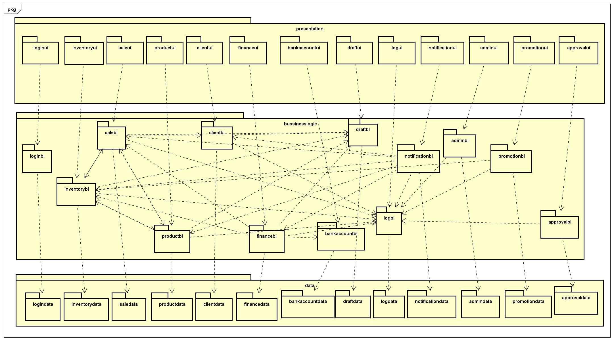
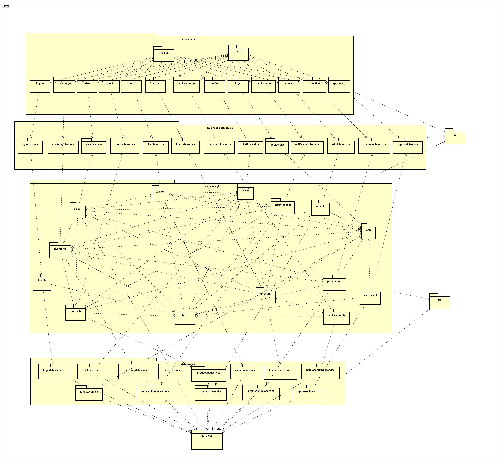
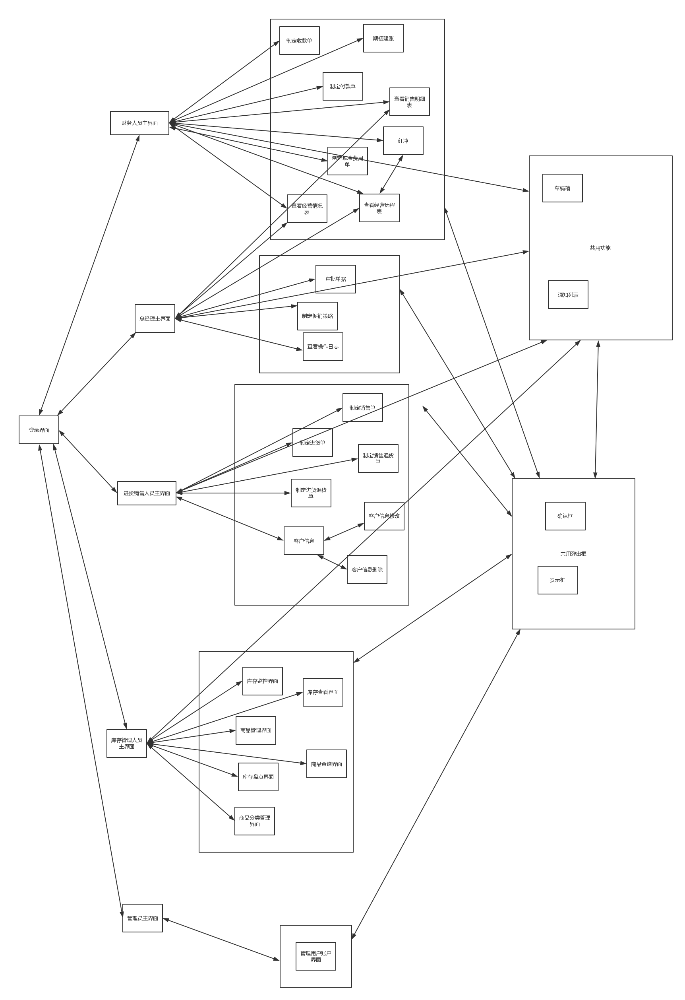

# 进销存系统 软件体系结构描述文档

By Trap x00
<!-- TOC -->

- [进销存系统 软件体系结构描述文档](#进销存系统-软件体系结构描述文档)
    - [0. 更新日志](#0-更新日志)
    - [1. 引言](#1-引言)
        - [1.1 编制目的](#11-编制目的)
    - [2. 产品概述](#2-产品概述)
    - [3. 逻辑视角](#3-逻辑视角)
    - [4. 组合视角](#4-组合视角)
        - [4.1 开发包图](#41-开发包图)
        - [4.2 运行时进程](#42-运行时进程)
        - [4.3 物理部署](#43-物理部署)
    - [5. 接口视角](#5-接口视角)
        - [5.1 模块的职责](#51-模块的职责)
        - [5.2 用户界面层的分解](#52-用户界面层的分解)
            - [5.2.1 用户界面层模块的职责](#521-用户界面层模块的职责)
            - [5.2.2 用户界面模块的接口规范](#522-用户界面模块的接口规范)
            - [5.2.3 用户界面模块设计原理](#523-用户界面模块设计原理)
        - [5.3 业务逻辑层的分解](#53-业务逻辑层的分解)
            - [5.3.1 业务逻辑层模块的职责](#531-业务逻辑层模块的职责)
            - [5.3.2 业务逻辑模块的接口规范](#532-业务逻辑模块的接口规范)
                - [bankaccountblservice的接口规范](#bankaccountblservice的接口规范)
                - [financeblservice的接口规范](#financeblservice的接口规范)
                - [commodityblservice的接口规范](#commodityblservice的接口规范)
                - [inventoryblservice的接口规范](#inventoryblservice的接口规范)
                - [adminblservice的接口定义](#adminblservice的接口定义)
                - [approvalblservice的接口规范](#approvalblservice的接口规范)
                - [promotionblservice的接口规范](#promotionblservice的接口规范)
                - [logblservice的接口规范](#logblservice的接口规范)
                - [clientblservice的接口规范](#clientblservice的接口规范)
                - [saleblservice的接口规范](#saleblservice的接口规范)
                - [loginblservice的接口规范](#loginblservice的接口规范)
                - [notificationblservice的接口规范](#notificationblservice的接口规范)
                - [draftblservice的接口规范](#draftblservice的接口规范)
        - [5.4 数据层的分解](#54-数据层的分解)
            - [5.4.1 数据层模块的职责](#541-数据层模块的职责)
            - [5.4.2 数据层模块的接口规范](#542-数据层模块的接口规范)
                - [bankaccountdataservice的接口规范](#bankaccountdataservice的接口规范)
                - [financedataservice的接口规范](#financedataservice的接口规范)
                - [commoditydataservice的接口规范](#commoditydataservice的接口规范)
                - [inventorydataservice的接口规范](#inventorydataservice的接口规范)
                - [admindataservice的接口定义](#admindataservice的接口定义)
                - [approvaldataservice的接口规范](#approvaldataservice的接口规范)
                - [promotiondataservice的接口规范](#promotiondataservice的接口规范)
                - [logdataservice的接口规范](#logdataservice的接口规范)
                - [clientdataservice的接口规范](#clientdataservice的接口规范)
                - [saledataservice的接口规范](#saledataservice的接口规范)
                - [logindataservice的接口规范](#logindataservice的接口规范)
                - [notificationdataservice的接口规范](#notificationdataservice的接口规范)
                - [draftdataservice的接口规范](#draftdataservice的接口规范)
    - [6. 信息视角](#6-信息视角)
        - [6.1 数据持久化对象](#61-数据持久化对象)
        - [6.2 文件格式](#62-文件格式)

<!-- /TOC -->

## 0. 更新日志

| 修改人员 | 日期         | 变更原因        | 版本号  |
| ---- | ---------- | ----------- | ---- |
| 陈俊达  | 2017/10/10 | 模板          | V0.0 |
| 陈俊达  | 2017/10/15 | 第一次作业草稿     | V0.1 |
| 张凌哲  | 2017/10/19 | 第二次作业整合     | V0.9 |
| 陈俊达  | 2017/10/20 | 第二次作业完善     | V1.0 |
| 陈俊达  | 2017/10/22 | 修改一些Po和接口定义 | V1.1 |
| 张美玲  | 2017/11/12 | 修改promotion | V1.2 |

## 1. 引言

### 1.1 编制目的

本报告详细完成对进销存系统的概要设计，达到指导详细设计和开发的目的，同时实现和测试人员及用户的沟通。

本报告面向开发人员、测试人员及最终用户编写，是了解系统的导航。

## 2. 产品概述

一民营企业专业从事灯具照明行业，是某灯具的南京地区总代理，主要在南京负责品牌的推广及项目的落地销售、分销的批发等工作，服务对象包括项目业主、施工单位、分销商、设计院、终端用户等。现公司规模扩大，企业业务量、办公场所、员工数量都发生增加，需要适应新的环境，从而提高效率和用户满意度。

##3. 逻辑视角

进销存系统中，我们选择了分层体系结构风格，将系统分为展示层、业务逻辑层和数据层三层能够很好地示意整个高层抽象。展示层包含GUI页面的实现，业务逻辑层包含业务逻辑处理的实现，数据层负责数据的持久化和访问。分层体系结构的逻辑视角和逻辑设计方案下图所示。




## 4. 组合视角

### 4.1 开发包图

进销存系统的最终开发包设计如下表所示。

| 开发（物理包）                 | 依赖的其他开发包                                 |
| ----------------------- | ---------------------------------------- |
| mainui                  | loginui, inventoryui, saleui, productui, clientui, financeui, bankaccountui, draftui, logui, notificationui, adminui, promotionui, approvalui |
| helpui                  |                                          |
| loginui                 | loginblservice, helpui, 界面类库包,vo         |
| loginblservice          | vo                                       |
| loginbl                 | loginblservice, blutil, logindataservice, po |
| logindataservice        | logindata, JavaRMI, po                   |
| logindata               | logindataservice, datautil,po            |
| inventoryui             | inventoryblservice, helpui, 界面类库包,vo     |
| inventoryblserivce      | vo                                       |
| inventorybl             | inventoryblservice, inventorydataservice, productbl,draftbl,logbl,blutil,po |
| inventorydataservice    | inventorydata, JavaRMI, po               |
| inventorydata           | inventorydataservice ,databaseutil, po   |
| productui               | productblservice, helpui, 界面类库包, vo      |
| productblservice        | vo                                       |
| productbl               | productblservice, productdataservice, draftbl, logbl, blutil, po |
| productdataservice      | productdata, JavaRMI, po                 |
| productdata             | productdataservice, databaseutil ,po     |
| saleui                  | saleblservice,  helpui, 界面类库包, vo        |
| saleblservice           | vo                                       |
| salebl                  | saleblservice, saledataservice, inventorybl, productble, clientble, draftbl, logbl, promotionbl, blutil, po |
| saledataservice         | saledata, JavaRMI, po                    |
| saledata                | saledataservice, databaseutil, po        |
| clientui                | clientblserivce, helpui, 界面类库包, vo       |
| clientblserivce         | vo                                       |
| clientbl                | clientblserivce, clientdataservice, draftbl, logbl, blutil, po |
| clientdataservice       | clientdata, JavaRMI, po                  |
| clientdata              | clientdataservice, databaseutil, po      |
| financeui               | financeblservice, helpui, 界面类库包, vo      |
| financeblservice        | vo                                       |
| financebl               | financeblservice, financedataservice, inventorybl, salebl, bankcountbl, draftbl, logbl, blutil, po |
| financedataservice      | financedata, JavaRMI, po                 |
| financedata             | financedataservice, databaseutil, po     |
| bankaccountui           | bankaccountblserivce, helpui, 界面类库包, vo  |
| bankaccountblserivce    | vo                                       |
| bankaccountbl           | bankaccountblserivce, bankaccountdataservice, blutil, po |
| bankaccountdataservice  | bankaccountdata, JavaRMI, po             |
| bankaccountdata         | bankaccountdataservice, databaseutil,po  |
| draftui                 | draftblserivce, helpui, 界面类库包, vo        |
| draftblserivce          | vo                                       |
| draftbl                 | draftblserivce, draftdataservice, blutil, po |
| draftdataservice        | draftdata,JavaRMI, po                    |
| draftdata               | draftdataservice, databaseutil, po       |
| logui                   | logblservice, helpui, 界面类库包, vo          |
| logblservice            | vo                                       |
| logbl                   | logblser, logdataservice, po             |
| logdataservice          | logdata, JavaRMI, po                     |
| logdata                 | logdataservice, databaseutil, po         |
| notificationui          | notificationblservice, 界面类库包, vo         |
| notificationblservice   | vo                                       |
| notificationbl          | notificationblservice, notificationdataservice, inventorybl, salebl, productbl, clientbl, financebl, logbl, blutil, po |
| notificationdataservice | notificationdata, JavaRMI, po            |
| notificationdata        | notificationdataservice, databaseutil, po |
| adminui                 | adminblserivce, helpui, 界面类库包, vo        |
| adminblserivce          | vo                                       |
| adminbl                 | adminblserivce, admindataservice, logbl, blutil, po |
| admindataservice        | admindata, JavaRMI, po                   |
| admindata               | admindataservice, databaseutil, po       |
| promotionui             | promotionblserivce, helpui, 界面类库包, vo    |
| promotionblserivce      | vo                                       |
| promotionbl             | promotionblserivce, promotiondataservice, inventorybl, logbl, blutil, po |
| promotiondataservice    | promotiondata, JavaRMI, po               |
| promotiondata           | promotiondataservice, databaseutil, po   |
| approvalui              | approvalblserivce, helpui, 界面类库包, vo     |
| approvalblserivce       | vo                                       |
| approvalbl              | approvalblserivce, approvaldataservice, logbl	,blutil,po |
| approvaldataservice     | approvaldata, JavaRMI, po                |
| approvaldata            | approvaldataservice, databaseutil, po    |
| vo                      |                                          |
| po                      |                                          |
| blutil                  |                                          |
| 界面类库包                   |                                          |
| JavaRMI                 |                                          |
| databaseutil            |                                          |

进销存系统开发包图如下。

客户端：



服务器端：


### 4.2 运行时进程

在进销存系统中，会有多个客户端进程和一个服务器端进程，其进程图如下图所示。结合部署图，客户端进程是在客户端机器上运行，服务器端进程是在服务器端机器上运行。


### 4.3 物理部署

进销存系统中客户端构件是放在客户端机器上，服务器端构件是放在服务器端机器上。在客户端节点上，还要部署RMIStub构件。由于Java RMI构建属于JDK的一部分。所以，在系统JDK环境已经设置好的情况下，不需要再独立部署。部署图如下图所示。


## 5. 接口视角

### 5.1 模块的职责

客户端模块和服务器模块分别如下图所示。


客户端各层和服务器端各层的职责分别如下表所示。

| 客户端层    | 职责                     |
| ------- | ---------------------- |
| 启动模块    | 负责初始化网络通信机制，启动用户界面     |
| 用户界面层   | 基于窗口的进销存管理系统客户端用户界面    |
| 业务逻辑层   | 对于用户界面的输入进行响应并进行业务处理逻辑 |
| 客户端网络模块 | 利用Java RMI机制查找RMI服务    |

| 服务器端层    | 职责                          |
| -------- | --------------------------- |
| 启动模块     | 负责初始化网络通信机制，启动用户界面          |
| 数据层      | 负责数据的持久化及数据访问接口             |
| 服务器端网络模块 | 利用Java RMI机制开启RMI服务，注册RMI服务 |


每一层只是使用下方直接接触的层。层与层之间仅仅是通过接口的调用来完成的。层之间调用的接口如下表所示。

| 接口                      | 服务调用房    | 服务提供方    |
| ----------------------- | -------- | -------- |
| bankaccountblservice    | 客户端展示层   | 客户端业务逻辑层 |
| financeblservice        | 客户端展示层   | 客户端业务逻辑层 |
| commodityblservice      | 客户端展示层   | 客户端业务逻辑层 |
| inventoryblservice      | 客户端展示层   | 客户端业务逻辑层 |
| userblservice           | 客户端展示层   | 客户端业务逻辑层 |
| approvalblservice       | 客户端展示层   | 客户端业务逻辑层 |
| promotionblservice      | 客户端展示层   | 客户端业务逻辑层 |
| logblservice            | 客户端展示层   | 客户端业务逻辑层 |
| clientblservice         | 客户端展示层   | 客户端业务逻辑层 |
| saleblservice           | 客户端展示层   | 客户端业务逻辑层 |
| loginblservice          | 客户端展示层   | 客户端业务逻辑层 |
| notificationblservice   | 客户端展示层   | 客户端业务逻辑层 |
| draftblservice          | 客户端展示层   | 客户端业务逻辑层 |
| bankaccountdataservice  | 客户端业务逻辑层 | 服务器端数据层  |
| financedataservice      | 客户端业务逻辑层 | 服务器端数据层  |
| commoditydataservice    | 客户端业务逻辑层 | 服务器端数据层  |
| inventorydataservice    | 客户端业务逻辑层 | 服务器端数据层  |
| userdataservice         | 客户端业务逻辑层 | 服务器端数据层  |
| approvaldataservice     | 客户端业务逻辑层 | 服务器端数据层  |
| promotiondataservice    | 客户端业务逻辑层 | 服务器端数据层  |
| logdataservice          | 客户端业务逻辑层 | 服务器端数据层  |
| clientdataservice       | 客户端业务逻辑层 | 服务器端数据层  |
| saledataservice         | 客户端业务逻辑层 | 服务器端数据层  |
| logindataservice        | 客户端业务逻辑层 | 服务器端数据层  |
| notificationdataservice | 客户端业务逻辑层 | 服务器端数据层  |
| draftdataservice        | 客户端业务逻辑层 | 服务器端数据层  |

借用用例18：制定付款单来说明层之间的调用，如下图所示。每一层之间都是由上一层依赖了一个接口（需接口），而下层实现这个接口（供接口）。financeblservice包提供了制定付款单界面所需要的所有业务逻辑功能，而financedataservice提供了对数据库的增、激活以及丢弃等操作。这样的实现就大大降低了层与层之间的耦合。


### 5.2 用户界面层的分解

系统存在33个用户界面，它们分别为登录界面、财务人员主界面、总经理主界面、进货销售人员主界面、库存管理人员主界面、管理员主界面、制定收款单、制定付款单、期初建账、银行账户管理、制定现金费用单、红冲、查看销售明细表、查看经营情况表、查看经营历程表、审批单据、制定促销策略、查看操作日志、制定销售单、制定进货单、制定销售退货单、制定进货退货单、管理客户信息、库存监控、库存查看、商品管理、库存盘点、商品分类管理、用户账户管理，以及共有功能：草稿箱、通知列表和共有弹出框：提示框和确认框。其用户界面之间的跳转如下图所示：




#### 5.2.1 用户界面层模块的职责

| 模块             | 职责           |
| -------------- | ------------ |
| mainui         | 管理界面之间的加载和关闭 |
| helpui         | 系统公用的界面      |
| loginui        | 系统的用户登录界面    |
| inventoryui    | 管理仓库的界面      |
| saleui         | 管理销售的界面      |
| productui      | 管理商品的界面      |
| clientui       | 管理客户的界面      |
| financeui      | 管理财务信息的界面    |
| bankaccountui  | 管理银行账户信息的页面  |
| draftui        | 管理草稿的界面      |
| logui          | 管理日志的界面      |
| notificationui | 管理通知的界面      |
| adminui        | 管理员的界面       |
| promotionui    | 总经理管理策略的界面   |
| approvalui     | 总经理批准单据的界面   |

#### 5.2.2 用户界面模块的接口规范

提供的接口

| 名称             | 语法                    | 前置条件  | 后置条件            |
| -------------- | --------------------- | ----- | --------------- |
| mainui         | `public void init();` | 无。    | 加载外边框等公用组件。     |
| helpui         | `public void init();` | 无。    | 加载公用弹出框等组件。     |
| loginui        | `public void init();` | 无。    | 加载登录框。          |
| inventoryui    | `public void init();` | 已经登录。 | 加载管理仓库的界面。      |
| saleui         | `public void init();` | 已经登录。 | 加载管理销售的界面。      |
| productui      | `public void init();` | 已经登录。 | 加载管理商品的界面。      |
| clientui       | `public void init();` | 已经登录。 | 加载管理客户的界面。      |
| financeui      | `public void init();` | 已经登录。 | 加载管理财务信息界面。     |
| bankaccountui  | `public void init();` | 已经登录。 | 加载管理银行账户信息的界面。  |
| draftui        | `public void init();` | 已经登录。 | 加载草稿箱界面。        |
| logui          | `public void init();` | 已经登录。 | 加载查看日志信息的界面。    |
| notificationui | `public void init();` | 已经登录。 | 加载通知界面。         |
| adminui        | `public void init();` | 已经登录。 | 加载管理员的管理界面。     |
| promotionui    | `public void init();` | 已经登录。 | 加载总经理管理促销策略的界面。 |
| approvalui     | `public void init();` | 已经登录。 | 加载管理员批准单据的界面。   |

需要的接口

同业务逻辑层提供的接口。

#### 5.2.3 用户界面模块设计原理

用户界面使用JavaFX来实现。


### 5.3 业务逻辑层的分解

#### 5.3.1 业务逻辑层模块的职责

| 模块                    | 职责                    |
| --------------------- | --------------------- |
| bankaccountblservice  | 负责实现商品分类与商品分类管理所需要的服务 |
| financeblservice      | 负责实现财务管理所需要的服务        |
| commodityblservice    | 负责实现商品管理所需要的服务        |
| inventoryblservice    | 负责实现商品仓库管理所需要的服务      |
| adminblservice        | 负责实现用户管理所需要的服务        |
| approvalblservice     | 负责实现总经理批准单据所需要的服务     |
| promotionblservice    | 负责实现总经理管理销售策略所需要的服务   |
| logblservice          | 负责实现管理日志所需要的服务        |
| clientblservice       | 负责实现客户管理所需要的服务        |
| saleblservice         | 负责实现销售管理所需要的服务        |
| loginblservice        | 负责实现用户登录所需要的服务        |
| notificationblservice | 负责实现管理通知所需要的服务        |
| draftblservice        | 负责实现管理草稿所需要的服务        |

#### 5.3.2 业务逻辑模块的接口规范

##### bankaccountblservice的接口规范

提供的接口

| 接口名称                                  | 语法                                       | 前置条件                  | 后置条件                   |
| ------------------------------------- | ---------------------------------------- | --------------------- | ---------------------- |
| BankAccountManagementBlService.add    | `public ResultMessage add(BankAccountVo newAccount);` | 新账户信息合法且无冲突，用户具有最高权限。 | 新银行账户信息已经添加，持久化信息已经保存。 |
| BankAccountManagementBlService.modify | `public ResultMessage modify(BankAccountVo newAccount);` | 新账户信息合法且无冲突，用户具有最高权限。 | 银行账户信息已经修改，持久化信息已经保存。  |
| BankAccountManagementBlService.query  | `public BankAccountVo[] query(BankAccountQueryVo query);` | 查询条件合法。               | 返回符合查询条件的数据。           |
| BankAccountManagementBlService.delete | `public ResultMessage delete(String id);` | 选择的账户合法，用户具有最高权限。     | 选定账户信息已经删除，持久化信息已经保存。  |

需要的接口

| 接口名称                                     | 服务名            |
| ---------------------------------------- | -------------- |
| `bankaccountdataservice.BankAccountManagementDataService.query(BankAccountQueryVo query);` | 根据ID和/或名称查询账户。 |
| `bankaccountdataservice.BankAccountManagementDataService.add(BankAccountPo account);` | 添加账户。          |
| `bankaccountdataservice.BankAccountManagementDataService.modify(BankAccountPo account);` | 修改账户信息。        |
| `bankaccountdataservice.BankAccountManagementDataService.delete(String id);` | 删除账户信息。        |

##### financeblservice的接口规范

提供的接口

| 接口名称                                     | 语法                                       | 前置条件                         | 后置条件                  |
| ---------------------------------------- | ---------------------------------------- | ---------------------------- | --------------------- |
| PaymentBillBlService.submit              | `public ResultMessage submit(PaymentBillVo bill);` | 单据所有属性有效。                    | 单据已经保存到数据库，持久化信息已经保存。 |
| PaymentBillBlService.saveAsDraft         | `public ResultMessage saveAsDraft(PaymentBillVo bill);` | 单据信息非空。                      | 保存草稿，持久化信息已经保存。       |
| PaymentBillBlService.getId               | `public String getId(); `                | 无。                           | 获得新单据的ID。             |
| ReceivalBillBlService.submit             | `public ResultMessage submit(ReceivalBillVo bill);` | 单据所有属性有效。                    | 单据已经保存到数据库，持久化信息已经保存。 |
| ReceivalBillBlService.saveAsDraft        | `public ResultMessage saveAsDraft(ReceivalBillVo bill);` | 单据信息非空。                      | 保存草稿，持久化信息已经保存。       |
| ReceivalBillBlService.getId              | `public String getId(); `                | 无。                           | 获得新单据的ID。             |
| CashBillBlService.submit                 | `public ResultMessage submit(CashBillVo bill);` | 单据所有属性有效。                    | 单据已经保存到数据库，持久化信息已经保存。 |
| CashBillBlService.saveAsDraft            | `public ResultMessage saveAsDraft(CashBillVo bill);` | 单据信息非空。                      | 保存草稿，持久化信息已经保存。       |
| CashBillBlService.getId                  | `public String getId(); `                | 无。                           | 获得新单据的ID。             |
| InitialEstablishmentBlService.submit     | `public ResultMessage submit(SystemSnapshotVo bill);` | 单据所有属性有效。                    | 单据已经保存到数据库，持久化信息已经保存。 |
| InitialEstablishmentBlService.saveAsDraft | `public ResultMessage saveAsDraft(SystemSnapshotVo bill);` | 单据信息非空。                      | 保存草稿，持久化信息已经保存。       |
| InitialEstablishmentBlService.autofill   | `public SystemSnapshotVo autofill();`    | 无。                           | 返回现有系统信息。             |
| SaleDetailBlService.query                | `public SaleDetailVo query(SaleDetailQueryVo query);` | 输入的query不为空。其中值为null的字段为不限制。 | 返回销售明细表。              |
| SaleDetailBlService.export               | `public ResultMessage export(SaleDetailVo detail);` | 表不为空且有效。                     | 导出单据。                 |
| TradeHistoryBlService.query              | `public TradeHistoryVo query(TradeHistoryQueryVo query);` | 输入的query不为空。其中值为null字段的为不限制。 | 返回符合条件的单据。            |
| TradeHistoryBlService.export             | `public ResultMessage export(TradeHistoryVo bills);` | bills参数不为空且有效。               | 导出报表。                 |
| TradeSituationBlService.query            | `public TradeSituationVo query(Date start, Date end);` | 输入时间段有效。                     | 返回时间段内的经营情况。          |
| TradeSituationBlService.export           | `public ResultMessage export(TradeSituationVo situation);` | 选定表格非空。                      | 导出报表。                 |


需要的接口

| 接口名称                                     | 服务名       |
| ---------------------------------------- | --------- |
| `financedataservice.PaymentBillDataService.submit(PaymentBillPo bill)` | 提交新单据。    |
| `financedataservice.PaymentBillDataService.activate(String id) ` | 使单据入账。    |
| `financedataservice.PaymentBillDataService.abandon(String id)` | 废弃单据。     |
| `financedataservice.PaymentBillDataService.getId()` | 获得新单据的ID。 |
| `financedataservice.PaymentBillDataService.query(PaymentBillQueryVo query)` | 查询付款单。    |
| `financedataservice.ReceivalBillDataService.submit(ReceivalBillPo bill)` | 提交新单据。    |
| `financedataservice.ReceivalBillDataService.activate(String id) ` | 使单据入账。    |
| `financedataservice.ReceivalBillDataService.abandon(String id)` | 废弃单据。     |
| `financedataservice.ReceivalBillDataService.getId()` | 获得新单据的ID。 |
| `financedataservice.ReceivalBillDataService.query(ReceivalBillQueryVo query)` | 查询收款单。    |
| `financedataservice.CashBillDataService.submit(CashBillPo bill)` | 提交新单据。    |
| `financedataservice.CashBillDataService.activate(String id)` | 使单据入账。    |
| `financedataservice.CashBillDataService.abandon(String id)` | 废弃单据。     |
| `financedataservice.CashBillDataService.getId()` | 获得新单据的ID。 |
| `financedataservice.CashBillDataService.query(CashBillQueryVo query)` | 查询现金费用单。  |
| `financedataservice.InitialEstablishmentDataService.submit(SystemSnapshotPo snapshot)` | 提交新账。     |
| `financedataservice.InitialEstablishmentDataService.abandon(String id)` | 删除草稿。     |
| `financedataservice.InitialEstablishmentDataService.getId()` | 获得新账的ID。  |
| `financedataservice.InitialEstablishmentDataService.query(SystemSnapshotQueryVo query)` | 查询单据。     |


#####commodityblservice的接口规范

提供的接口

| 接口名称                               | 语法                                       | 前置条件                 | 后置条件                  |
| ---------------------------------- | ---------------------------------------- | -------------------- | --------------------- |
| GoodsManagementBlService.add       | `public ResultMessage add(CommodityVo newCommodity);` | 商品输入合法。              | 添加新的商品，持久化更新涉及的对象的数据。 |
| GoodsManagementBlService.modify    | `public ResultMessage modify(CommodityVo updateCommodity);` | 商品信息修改输入合法。          | 修改商品，持久化更新涉及的对象的数据。   |
| GoodsManagementBlService.query     | `public CommodityVo[] query(String id, String name);` | 查询输入格式合法。            | 返回符合查询条件的数据。          |
| GoodsManagementBlService.delete    | `public ResultMessage delete(CommodityVo commodity);` | 商品信息输入合法。            | 删除该商品，持久化更新涉及的对象的数据。  |
| ProductManagementBlService.add     | `public ResultMessage add(CommoditySortVo newSort,CommoditySortVo parentSort);` | 商品分类信息输入合法，并且父类中无商品。 | 添加新的商品分类，持久化更对象的数据。   |
| ProductManagementBlService.modify  | `public ResultMessage modify(CommoditySortVo sort);` | 商品分类修改信息输入合法。        | 更改商品分类，持久化更新涉及的对象的数据。 |
| ProductManagementBlService.query   | `public CommoditySortVo[] query(String id, String name);` | 商品分类查询信息输入合法。        | 返回符合查询条件的数据。          |
| ProductManagementBlService.delete  | `public ResultMessage delete(CommoditySortVo sort);` | 商品分类删除信息输入合法。        | 删除商品分类，持久化更新涉及的对象的数据。 |
| ProductManagementBlService.display | ` public CommoditySortVo[] display();`   | 已经创建一个CommoditySort。 | 显示所有商品分类。             |
| ProductManagementBlService.display | `public CommoditySortVo[] dispaly(CommoditySortVo commoditySort);` | 该父类存在。               | 显示父类下的所有子类。           |


需要的接口

| 接口名称                                     | 服务名                 |
| ---------------------------------------- | ------------------- |
| `commoditydataservice.GoodsManagementDataService.query(String id, String name)` | 根据ID和/或名称查找单一持久化对象。 |
| `commoditydataservice.GoodsManagementDataService.add(CommodityPo commodity)` | 添加单一化持久对象。          |
| `commoditydataservice.GoodsManagementDataService.modify(CommodityPo updateCommodity)` | 修改添加单一化持久对象。        |
| `commoditydataservice.GoodsManagementDataService.delete(CommodityPo commodity)` | 删除单一化持久对象。          |
| `commoditydataservice.ProductManagementDataService.query(String id, String name)` | 根据ID和/或名称模糊化查询。     |
| `commoditydataservice.ProductManagementDataService.add(CommodityPo commodity)` | 添加单一持久化对象。          |
| `commoditydataservice.ProductManagementDataService.modify(CommodityPo updateCommodity)` | 修改单一持久化对象。          |
| `commoditydataservice.ProductManagementDataService.delete(CommodityPo commodity)` | 删除单一持久化对象爱那个。       |
| `logbl.LogBl.log(LogSeverity severity, String content)` | 记录日志。               |

##### inventoryblservice的接口规范

提供的接口

| 接口名称                                     | 语法                                       | 前置条件              | 后置条件                                     |
| ---------------------------------------- | ---------------------------------------- | ----------------- | ---------------------------------------- |
| InventoryCheckBlService.check            | `public InventoryViewVo check(Date beginTime, Date endTime);` | 日期输入合法。           | 完成在此时间段内的出／入库数量／金额，销售／进货数量／金额，以及库存合计的查看。 |
| InventoryCheckBlService.picture          | `public InventoryPictureVo picture();`   | 已经得到当日库存快照。       | 生成截至盘点时间的库存盘点。                           |
| InventoryCheckBlService.export           | `public ResultMessage export(File newfile);` | 已经完成库存盘点。         | 导出Excel到指定位置。                            |
| InventoryGiftBlService.sumbit            | `public InventoryGiftVo check(InventoryGiftVo inventoryGiftVo);` | 输入合法。             | 完成商品赠送提交赠送单，持久化更新涉及的对象的数据。               |
| InventoryWarningBlService.submit         | `public ResultMessage submit(InventoryBillVo bill);` | 单据所有属性有效。         | 单据已经保存到数据库，持久化信息已经保存。                    |
| InventoryWarningBlService.saveAsDraft    | `public ResultMessage saveAsDraft(InventoryBillVo bill);` | 单据信息非空。           | 保存草稿，持久化信息已经保存。                          |
| InventoryWarningBlService.resume         | `public InventoryBillVo resume();`       | 开始填写。             | 如果系统记录需要继续填写单据，那么返回值为继续填写的单据；反之为null。    |
| InventoryWarningBlService.modify         | `public ResultMessage modify(CommodityVo commodity，double modifyWarning);` | 该商品存在，且修改警戒值输入合法。 | 修改警戒值，持久化更新涉及的对象的数据。                     |
| InventoryWarningBlService.getCurrentBill | `public InventoryBillVo getCurrentBill();` | 现有单据存在。           | 返回现有单据。                                  |

| PurchaseBillBlService.submit             | `public ResultMessage submit(PurchaseBillVo purchaseBill);` | 表单数据输入格式正确。       | 持久化层新增表单信息。                              |
| PurchaseBillBlService.saveAsDraft        | `public ResultMessage saveAsDraft(PurchaseRefundBillVo purchaseRefundBill);` | 表单数据非空。           | 持久化层保存草稿信息。                              |
| PurchaseBillBlService.getId              | `public String getId(); `                | 无。                | 获得新单据的ID。                                |
| PurchaseRefundBillBlService.submit       | `public ResultMessage submit(PurchaseRefundBillVo purchaseRefundBill);` | 表单数据输入格式正确。       | 持久化层新增表单信息。                              |
| PurchaseRefundBillBlService.saveAsDraft  | `public ResultMessage saveAsDraft(PurchaseRefundBillVo purchaseRefundBill);` | 表单数据非空。           | 持久化层保存草稿信息。                              |
| PurchaseRefundBillBlService.getId        | `public String getId(); `                | 无。                | 获得新单据的ID。                                |

需要的接口

| 接口名称                                     | 服务名           |
| ---------------------------------------- | ------------- |
| `inventorydataservice.InventoryCheckDataService.check(Date beginTime, Date endTime)` | 提供时间段内库存变化。   |
| `inventorydataservice.InventoryCheckDataService.picture(Date time)` | 提供当日库存快照。     |
| `inventorydataservice.InventoryGiftDataService.getGift(Date time)` | 提供满足促销条件的赠送单。 |
| `inventorydataservice.InventoryWarningDataService.submit(InventoryBillPo bill)` | 提交新单据。        |
| `inventorydataservice.InventoryWarningDataService.modify(CommodityPo commodity，double ModifyWarning)` | 修改警戒值。        |
| `inventorydataservice.PurchaseBillDataService.submit(PurchaseBillPo purchaseBill)` | 提交表单。         |
| `inventorydataservice.PurchaseRefundBillDataService.submit(PurchaseRefundBillPo purchaseRefundBill)` | 提交表单。         |
| `draftbl.DraftManagement.saveAsDraft(PurchaseBillPo purchaseBill)` | 保存草稿。         |
| `draftbl.DraftManagement.saveAsDraft(InventoryBillVo bill)` | 保存草稿。         |
| `logbl.LogBl.log(LogSeverity severity, String content)` | 记录日志。         |
| `inventorydataservice.PurchaseBillDataService.getId();` | 获得新单据的ID。     |
| `inventorydataservice.PurchaseRefundBillDataService.getId();` | 获得新单据的ID。     |

##### adminblservice的接口定义

提供的接口

| 接口名称                           | 语法                                       | 前置条件                  | 后置条件                  |
| ------------------------------ | ---------------------------------------- | --------------------- | --------------------- |
| UserManagementBlService.add    | `public ResultMessage add(EmployeeVo account);` | 新账户信息合法且无冲突，用户具有最高权限。 | 新账户信息已经添加，持久化信息已经保存。  |
| UserManagementBlService.modify | `public ResultMessage modify(EmployeeVo account);` | 新账户信息合法且无冲突，用户具有最高权限。 | 账户信息已经修改，持久化信息已经保存。   |
| UserManagementBlService.query  | `public UserAccoutVo[] query(UserAccoutQueryVo query);` | 查询条件合法。               | 返回符合查询条件的数据。          |
| UserManagementBlService.delete | `public ResultMessage delete(EmployeeVo account);` | 选择的账户合法，用户具有最高权限。     | 选定账户信息已经删除，持久化信息已经保存。 |
| UserManagementBlService.getId  | `public String getId();`                 | 无。                    | 返回当前账户ID。             |

需要的接口

| 接口名称                                     | 服务名            |
| ---------------------------------------- | -------------- |
| `admindataservice.UserManagementDataService.query(UserAccountQuery query)` | 根据ID和/或名称查询账户。 |
| `admindataservice.UserManagementDataService.add(EmployeePo account)` | 添加账户。          |
| `admindataservice.UserManagementDataService.modify(EmployeePo account)` | 修改账户信息。        |
| `admindataservice.UserManagementDataService.delete(EmployeePo account)` | 删除账户信息。        |
| `admindataservice.UserManagementDataService.getId()` | 返回当前账户ID。      |
| `logbl.LogBl.log(LogSeverity severity, String content)` | 记录日志。          |

##### approvalblservice的接口规范

提供的接口

| 接口名称                  | 语法                                       | 前置条件          | 后置条件                  |
| --------------------- | ---------------------------------------- | ------------- | --------------------- |
| AuditBlService.query  | `public ResultMessage  show (BillQueryVo query);` | 有处于提交状态的单据单据。 | 返回符合条件的单据。            |
| AuditBlService.reject | `public ResultMessage reject(BillVo bill);` | 用户已经查看了单据内容。  | 拒绝通过审批，持久化更新涉及的对象的数据。 |
| AuditBlService.pass   | `public ResultMessage pass(BillVo bill);` | 用户已经查看了单据内容。  | 通过审批，持久化更新涉及的对象的数据。   |

需要的接口

| 接口名称                                     | 服务名          |
| ---------------------------------------- | ------------ |
| `approvaldataservice.AuditDataService.query(BillQueryVo query)` | 得到待审批的持久化对象。 |
| `approvaldataservice.AuditDataService.reject(BillPo bill)` | 拒绝通过审批。      |
| `approvaldataservice.AuditDataService.pass(BillPo bill)` | 通过审批。        |
| `logbl.Log.log(LogSeverity severity, String content)` | 记录日志。        |

##### promotionblservice的接口规范

提供的接口

| 接口名称                                     | 语法                                       | 前置条件                | 后置条件               |
| ---------------------------------------- | ---------------------------------------- | ------------------- | ------------------ |
| ComSalePromotionBlService.submit         | `public ResultMessage submit(ComSalePromotionVo promotion);` | 促销策略所有属性有效。         | 持久化信息已经保存。         |
| ComSalePromotionBlService.saveAsDraft    | `public ResultMessage saveAsDraft(ComSalePromotionVo promotion);` | 促销策略信息非空。           | 保存草稿。              |
| ComSalePromotionBlService.queryPromotion | `public ComSalePromotionVo[] queryPromotion(PromotionQueryVo query);` | 输入的query不为空，筛选条件有效。 | 返回符合条件的促销策略。       |
| ComSalePromotionBlService.delete         | `public ResultMessage delete(ComSalePromotionVo promotion);` | 选择删除促销策略。           | 返回删除是否成功，持久信息已经保存。 |
| ComSalePromotionBlService.getId          | `public String getId();`                 | 无。                  | 返回当前促销策略ID。        |
| ClientPromotionBlService.submit          | `public ResultMessage submit(ClientPromotionVo promotion);` | 促销策略所有属性有效。         | 持久化信息已经保存。         |
| ClientPromotionBlService.saveAsDraft     | `public ResultMessage saveAsDraft(ClientPromotionVo promotion);` | 促销策略信息非空。           | 保存草稿。              |
| ClientPromotionBlService.queryPromotion  | `public ClientPromotionVo[] queryPromotion(PromotionQueryVo query);` | 输入的query不为空，筛选条件有效。 | 返回符合条件的促销策略。       |
| ClientPromotionBlService.delete          | `public ResultMessage delete(ClientPromotionVo promotion);` | 选择删除促销策略。           | 返回删除是否成功，持久信息已经保存。 |
| ClientPromotionBlService.getId           | `public String getId();`                 | 无。                  | 返回当前促销策略ID。        |
| TotalPricePromotionBlService.submit      | `public ResultMessage submit(TotalPricePromotionVo promotion);` | 促销策略所有属性有效。         | 持久化信息已经保存。         |
| TotalPricePromotionBlService.saveAsDraft | `public ResultMessage saveAsDraft(TotalPricePromotionVo promotion);` | 促销策略信息非空。           | 保存草稿。              |
| TotalPricePromotionBlService.queryPromotion | `public TotalPricePromotionVo[] queryPromotion(PromotionQueryVo query);` | 输入的query不为空，筛选条件有效。 | 返回符合条件的促销策略。       |
| TotalPricePromotionBlService.delete      | `public ResultMessage delete(TotalPricePromotionVo promotion);` | 选择删除促销策略。           | 返回删除是否成功，持久信息已经保存。 |
| TotalPricePromotionBlService.getId       | `public String getId();`                 | 无。                  | 返回当前促销策略ID。        |

需要的接口

| 接口名称                                     | 服务名        |
| ---------------------------------------- | ---------- |
| `promotiondataservice.ComSalePromotionDataService.submit(ComSalePromotionPo promotion)` | 提交新促销策略。   |
| `promotiondataservice.ComSalePromotionDataService.queryPromotion(PromotionQueryVo query)` | 查找促销策略。    |
| `promotiondataservice.ComSalePromotionDataService.delete(ComSalePromotionPo promotion)` | 删除单一持久化对象。 |
| `promtiondataservice.ComSalePromotionDataService.getId()` | 当前促销策略ID。  |
| `draftbl.DraftManagement.saveAsDraft(ComSalePromotionVo promotion)` | 保存草稿。      |
| `promotiondataservice.ClientPromotionDataService.submit(ClientPromotionPo promotion)` | 提交新促销策略。   |
| `promotiondataservice.ClientPromotionDataService.queryPromotion(PromotionQueryVo query)` | 查找促销策略。    |
| `promotiondataservice.ClientPromotionDataService.delete(ClientPromotionPo promotion)` | 删除单一持久化对象。 |
| `promtiondataservice.ClientPromotionDataService.getId()` | 当前促销策略ID。  |
| `draftbl.DraftManagement.saveAsDraft(ClientPromotionVo promotion)` | 保存草稿。      |
| `promotiondataservice.TotalPricePromotionDataService.submit(TotalPricePromotionPo promotion)` | 提交新促销策略。   |
| `promotiondataservice.TotalPricePromotionDataService.queryPromotion(PromotionQueryVo query)` | 查找促销策略。    |
| `promotiondataservice.TotalPricePromotionDataService.delete(TotalPricePromotionPo promotion)` | 删除单一持久化对象。 |
| `draftbl.DraftManagement.saveAsDraft(TotalPricePromotionVo promotion)` | 保存草稿。      |
| `promotiondataservice.TotalPricePromotionDataService.submit(TotalPricePromotionPo promotion)` | 提交新促销策略。   |
| `logblservice.Log.log(LogSeverity severity, String content)` | 记录日志。      |

##### logblservice的接口规范

提供的接口

| 接口名称                            | 语法                                       | 前置条件           | 后置条件    |
| ------------------------------- | ---------------------------------------- | -------------- | ------- |
| logblservice.LogBlService.query | `public LogVo[] query(LogQueryVo query);` | 用户已经登录，具有最高权限。 | 返回操作日志。 |

需要的接口

| 接口名称                                     | 服务名           |
| ---------------------------------------- | ------------- |
| `logdataservice.LogDataService.query(Date date, LogSeverity severity, String content) ` | 得到持久化的操作日志对象。 |
| `logdataservice.LogDataService.log(LogSeverity severity, String content)` | 记录日志。         |

##### clientblservice的接口规范

提供的接口

| 接口名称                                  | 语法                                       | 前置条件        | 后置条件         |
| ------------------------------------- | ---------------------------------------- | ----------- | ------------ |
| ClientManagementBlService.query       | `public ClientVo[] query(String query);` | 查询条件合法。     | 返回符合条件的客户信息。 |
| ClientManagementBlService.saveAsDraft | `public ResultMessage saveAsDraft(ClientVo client);` | 客户信息非空。     | 持久化层保存草稿信息。  |
| ClientManagementBlService.modify      | `public ResultMessage modify(ClientVo client);` | 表单数据输入格式正确。 | 持久化层更新客户信息。  |
| ClientManagementBlService.add         | `public ResultMessage add(ClientVo client);` | 表单数据输入格式正确。 | 持久化层新增客户信息。  |
| ClientManagementBlService.getId       | `public String getId(); `                | 无。          | 获得新客户的ID。    |
| ClientManagementBlService.delete      | `public ResultMessage delete(String[] id);` | 删除列表非空。     | 持久化层更新客户信息。  |

需要的接口

| 接口名称                                     | 服务名           |
| ---------------------------------------- | ------------- |
| `clientdataservice.ClientManagementDataService.query(String query)` | 根据查询条件查询客户信息。 |
| `draftbl.DraftManagement.saveAsDraft(ClientPo client)` | 保存客户草稿。       |
| `clientdataservice.ClientManagementDataService.modify(ClientPo client) ` | 修改客户信息。       |
| `clientdataservice.ClientManagementDataService.add(ClientPo client)` | 添加客户。         |
| `clientdataservice.ClientManagementDataService.delete(String[] id)` | 删除客户信息。       |
| `logbl.Log.log(LogSeverity severity, String content)` | 记录日志。         |
| `clientdataservice.ClientDataService.getId();` | 获得新客户的ID。     |

##### saleblservice的接口规范

提供的接口

| 接口名称                                | 语法                                       | 前置条件        | 后置条件        |
| ----------------------------------- | ---------------------------------------- | ----------- | ----------- |
| SaleBillBlService.submit            | `public ResultMessage[] submit(SaleBillVo saleBill);` | 表单数据输入格式正确。 | 持久化层新增表单信息。 |
| SaleBillBlService.saveAsDraft       | `public ResultMessage saveAsDraft(SaleBillVo saleBill);` | 用户已经点击保存草稿。 | 持久化层保存草稿信息。 |
| SaleBillBlService.getId             | `public String getId(); `                | 无。          | 获得新单据的ID。   |
| SaleRefundBillBlService.submit      | `public ResultMessage[] submit(SaleRefundBillVo saleRefundBill);` | 表单数据输入格式正确。 | 持久化层新增表单信息。 |
| SaleRefundBillBlService.saveAsDraft | `public ResultMessage saveAsDraft(SaleRefundBillVo saleRefundBill);` | 用户已经点击保存草稿。 | 持久化层保存草稿信息。 |
| SaleBillRefundBlService.getId       | `public String getId(); `                | 无。          | 获得新单据的ID。   |

需要的接口

| 接口名称                                     | 服务名       |
| ---------------------------------------- | --------- |
| `saleblservice.SaleBill.submit(SaleBillPo saleBill)` | 提交表单。     |
| `draftbl.DraftManagement.saveAsDraft(SaleBillPo saleBill)` | 保存草稿。     |
| `saleblservice.SaleRefundBill.submit(SaleRefundBillPo saleRefundBill)` | 提交表单。     |
| `draftbl.DraftManagement.saveAsDraft(SaleRefundBillPo saleRefundBill)` | 保存草稿。     |
| `logbl.Log.log(LogSeverity severity, String content)` | 记录日志。     |
| `saledataservice.SaleBillDataService.getId();` | 获得新单据的ID。 |
| `saledataservice.SaleRefundBillDataService.getId();` | 获得新单据的ID。 |

##### loginblservice的接口规范

提供的接口

| 接口名称                                | 语法                                       | 前置条件 | 后置条件          |
| ----------------------------------- | ---------------------------------------- | ---- | ------------- |
| loginblservice.LoginBlService.login | `public EmployeeVo login(String username, String password);` | 无。   | 系统已经登录或者登录失败。 |

需要的接口

| 接口名称                                     | 服务名  |
| ---------------------------------------- | ---- |
| `logindataservice.LoginDataService.login(String username, String password)` | 登录。  |

##### notificationblservice的接口规范

提供的接口

| 接口名称                                     | 语法                                       | 前置条件                      | 后置条件                         |
| ---------------------------------------- | ---------------------------------------- | ------------------------- | ---------------------------- |
| notificationblservice.NotificationBlService.update | `public NotificationVo[] update(NotificationQueryVo query);` | 无。                        | 返回当前用户已有的通知。                 |
| notificationblservice.NotificationBlService.acknowledge | `public ResultMessage acknowledge(NotificationVo notification);` | 参数notification有效非null。    | 删除已有的通知，进行单据入账的操作，持久化信息已经保存。 |
| notificationblservice.NotificationBlService.abandon | `public ResultMessage abandon(NotificationVo notification);` | notification为已经审批结束的单据通知。 | 单据被标记为废弃，持久化信息已经保存。          |

需要的接口

| 接口名称                                     | 服务名   |
| ---------------------------------------- | ----- |
| `notificationdataservice.NotificationDataService.update(NotificationQueryVo query)` | 更新通知。 |
| `notificationdataservice.NotificationDataService.addNotification(NotificationVo notification)` | 增加通知。 |
| `notificationdataservice.NotificationDataService.acknowledge(NotificationPo notification)` | 已读通知。 |

##### draftblservice的接口规范

提供的接口

| 接口名称                                 | 语法                                       | 前置条件           | 后置条件             |
| ------------------------------------ | ---------------------------------------- | -------------- | ---------------- |
| draftblservice.DraftBlService.update | `public DraftVo[] update(DraftQueryVo query);` | 无。             | 获得当前用户已经保存的草稿。   |
| draftblservice.DraftBlService.delete | `public ResultMessage delete(Draftable bill);` | 选择的单据有效并状态是草稿。 | 将草稿删除，持久化信息已经保存。 |

需要的接口

| 接口名称                                     | 服务名   |
| ---------------------------------------- | ----- |
| `draftdataservice.DraftManagementDataService.update(DraftQueryVo query)` | 更新草稿。 |
| `draftdataservice.DraftManagementDataService.delete(String draftId)` | 删除草稿。 |
| `draftdataservice.DraftManagementDataService.add(Draftable draftId, String saverId)` | 增加草稿。 |

### 5.4 数据层的分解

数据层主要给业务逻辑层提供数据访问服务，包括对于持久化数据的增、删、改、查。持久化数据保存到SQLite数据库。

#### 5.4.1 数据层模块的职责

| 模块                      | 职责            |
| ----------------------- | ------------- |
| bankaccountdataservice  | 提供账户的增删改查操作   |
| financedataservice      | 提供财务的增删改查操作   |
| commoditydataservice    | 提供商品的增删改查操作   |
| inventorydataservice    | 提供库存的增删改查操作   |
| admindataservice        | 提供用户信息的增删改查操作 |
| approvaldataservice     | 提供改变单据审批状态的操作 |
| promotiondataservice    | 提供促销策略的增删改查操作 |
| logdataservice          | 提供日志的增加和查看操作  |
| clientdataservice       | 提供客户信息的增删改查操作 |
| saledataservice         | 提供销售的增删改查操作   |
| logindataservice        | 提供登录信息的验证操作   |
| notificationdataservice | 提供通知的增删改查操作   |
| draftblservice          | 提供草稿的增删改查操作   |

#### 5.4.2 数据层模块的接口规范

##### bankaccountdataservice的接口规范

提供的接口

| 接口名称                                    | 语法                                       | 前置条件         | 后置条件                             |
| --------------------------------------- | ---------------------------------------- | ------------ | -------------------------------- |
| BankAccountManagementDataService.query  | `public BankAccountPo[] query(BankAccountQueryVo query);` | 查询条件合法。      | 返回满足条件的银行账户Po。某一项为null的意思是此项无限制。 |
| BankAccountManagementDataService.add    | `public ResultMessage add(BankAccountPo account);` | 新账户信息合法且无冲突。 | 新银行账户信息已经添加，持久化信息已经保存。           |
| BankAccountManagementDataService.modify | `public ResultMessage modify(BankAccountPo account) ` | 新账户信息合法且无冲突。 | 银行账户信息已经修改，持久化信息已经保存。            |
| BankAccountManagementDataService.delete | `public ResultMessage delete(String id);` | 新账户信息合法且无冲突。 | 选定账户信息已经删除，持久化信息已经保存。            |

##### financedataservice的接口规范

提供的接口

| 接口名称                                    | 语法                                       | 前置条件             | 后置条件                                  |
| --------------------------------------- | ---------------------------------------- | ---------------- | ------------------------------------- |
| ReceivalBillDataService.submit          | `public ResultMessage submit(ReceivalBillPo bill);` | 单据所有属性有效。        | 提交新单据。                                |
| ReceivalBillDataService.activate        | `public ResultMessage activate(String id);` | 单据有效且状态为审批通过。    | 系统修改对应银行账户和客户信息，修改单据状态为已入账，持久化信息已经保存。 |
| ReceivalBillDataService.abandon         | `public ResultMessage abandon(String id);` | 单据有效且状态为审批完成。    | 系统修改单据状态为已经废弃，持久化信息已经保存。              |
| ReceivalBillDataService.query           | `public ReceivalBillPo[] query(ReceivalBillQueryVo query);` | 输入查询条件有效。        | 返回符合筛选条件的付款单。                         |
| ReceivalBillDataService.getId           | `public String getId();`                 | 无。               | 返回下一张单据的ID。                           |
| CashBillDataService.submit              | `public ResultMessage submit(CashBillPo bill);` | 用户已经登录，单据所有属性有效。 | 提交新单据。                                |
| CashBillDataService.activate            | `public ResultMessage activate(String id);` | 单据有效且状态为审批通过。    | 系统修改对应银行账户和客户信息，修改单据状态为已入账，持久化信息已经保存。 |
| CashBillDataService.abandon             | `public ResultMessage abandon(String id);` | 单据有效且状态为审批完成。    | 系统修改单据状态为已经废弃，持久化信息已经保存。              |
| CashBillDataService.query               | `public CashBillPo[] query(CashBillQueryVo query);` | 输入查询条件有效。        | 返回符合筛选条件的现金费用单。                       |
| CashBillDataService.getId               | `public String getId();`                 | 无。               | 返回下一张单据的ID。                           |
| PaymentBillDataService.submit           | `public ResultMessage submit(PaymentBillPo bill);` | 用户已经登录，单据所有属性有效。 | 提交新单据。                                |
| PaymentBillDataService.activate         | `public ResultMessage activate(String id);` | 单据有效且状态为审批通过。    | 系统修改对应银行账户和客户信息，修改单据状态为已入账，持久化信息已经保存。 |
| PaymentBillDataService.abandon          | `public ResultMessage abandon(String id);` | 单据有效且状态为审批完成。    | 系统修改单据状态为已经废弃，持久化信息已经保存。              |
| PaymentBillDataService.query            | `public PaymentBillPo[] query(PaymentBillQueryVo query);` | 输入查询条件有效。        | 返回符合筛选条件的收款单。                         |
| PaymentBillDataService.getId            | `public String getId();`                 | 无。               | 返回下一张单据的ID。                           |
| InitialEstablishmentDataService.submit  | `public ResultMessage submit(SystemSnapshotPo snapshot);` | 账有效且状态为审批通过。     | 账单独被保存，持久化数据已保存。                      |
| InitialEstablishmentDataService.abandon | `public ResultMessage abandon(String id);` | 账有效且状态为草稿。       | 系统记录需要继续填写账。                          |
| InitialEstablishmentDataService.getId   | `public String getId();`                 | 无。               | 返回下一张单据的ID。                           |

##### commoditydataservice的接口规范

提供的接口

| 接口名称                                    | 语法                                       | 前置条件          | 后置条件         |
| --------------------------------------- | ---------------------------------------- | ------------- | ------------ |
| GoodsManagementDataService.add          | `public ResultMessage add(CommodityPo newCommodity);` | 同样的po在数据中不存在。 | 增加一条po数据。    |
| GoodsManagementDataService.modify       | `public ResultMessage modify(CommodityPo updateCommodity);` | 同样的po在数据中存。   | 更新po。        |
| GoodsManagementDataService.query        | `public CommodityPo[] query(String id, String name);` | 查询输入格式合法。     | 返回符合查询条件的数据。 |
| GoodsManagementDataService.delete       | `public ResultMessage delete(CommodityPo commodity);` | 同样的po在数据中存在。  | 删除po。        |
| GoodsManagementDataService.init         | `public void init();`                    | 无。            | 初始化持久数据。     |
| ProductManagementDataService.add        | `public ResultMessage add(CommoditySortPo newCSort,CommoditySortPo parentSort);` | 同样的po在数据中不存在。 | 增加一条po数据。    |
| ProductManagementDataService.modify     | `public ResultMessage modify(CommoditySortPo  CSort);` | 同样的po在数据中存在。  | 更新po。        |
| ProductManagementDataService.query      | `public CommoditySortPo[] query(String id, String name);` | 无 。           | 返回符合查询条件的数据。 |
| ProductManagementDataService.delete     | `public ResultMessage delete(CommoditySortPo  CSort);` | 同样的po在数据中存在   | 删除Po 。       |
| ProductManagementDataService.display    | ` public CommoditySortPo[] display();`   | 无。            | 返回所有商品分类。    |
| ProductManagementDataService.display    | `public CommoditySortPo[] dispaly(CommoditySortPo commoditySort);` | 同样的po在数据中存在。  | 返回父类下的所有子类。  |
| ProductManagementDataService.initiation | `public void init();`                    | 无。            | 初始化持久数据。     |

##### inventorydataservice的接口规范

提供的接口

| 接口名称                                    | 语法                                       | 前置条件          | 后置条件                                     |
| --------------------------------------- | ---------------------------------------- | ------------- | ---------------------------------------- |
| InventoryCheckDataService.check         | `public InventoryViewPo submit(Date beginTime, Date endTime);` | 当天有库存进出且输入有效。 | 返回对应的InventoryViewPo。                    |
| InventoryCheckDataService.picture       | `public InventoryPicturePo submit(Date time);` | 当天有库存快照。      | 返回对应的库存快照InventoryPicturePo。             |
| InventoryCheckDataService.init          | `public void init();`                    | 无。            | 初始化持久数据。                                 |
| InventoryGiftDataService.getGift        | `public InventoryGiftPo getGift(Date time);` | 输入有效          | 若存在则返回符合条件的InventoryGiftPo，否则返回NULL。     |
| InventoryGiftDataService.init           | `public void init();`                    | 无。            | 初始化持久数据。                                 |
| InventoryWarningDataService.submit      | `public ResultMessage submit(InventoryBillPo bill);` | 单据属性有效。       | 提交新单据，返回提交是否成功。                          |
| InventoryWarningDataService.modify      | `public ResultMessage modify(CommodityPo commodity，double ModifyWarning);` | 同样的po在数据中存在   | 更新po,修改警戒值。                              |
| InventoryWarningDataService.getAlarm    | `public InventoryBillPo[] getAlarmByIds(String... ids);` | 输入有效。         | 返回InventoryBillPo对象集合，若ID为空或者null，返回空数组。 |
| InventoryWarningDataService.getOverflow | ` public InventoryBillPo[] getOverflowByids(String... ids);` | 输入有效。         | 返回InventoryBillPo对象集合，若ID为空或者null，返回空数组。 |
| InventoryWarningDataService.getLoss     | `public InventoryBillPo[] getLossByids(String... ids);` | 输入有效。         | 返回InventoryBillPo对象集合，若ID为空或者null，返回空数组。 |
| InventoryWarningDataService.init        | `public void init();`                    | 无。            | 初始化持久数据。                                 |
| PurchaseBillDataService.activate | `public ResultMessage activate(String id);` | 单据有效且状态为审批通过。    | 系统修改对应库存信息和客户信息，修改单据状态为已入账，持久化信息已经保存。 |
| PurchaseBillDataService.abandon  | `public ResultMessage abandon(String id);` | 单据有效且状态为审批完成。    | 系统修改单据状态为已经废弃，持久化信息已经保存。              |
| PurchaseBillDataService.query    | `public PurchaseBillPo[] query(PurchaseBillQueryVo query);` | 输入查询条件有效。        | 返回符合筛选条件的进货单。                         |
| PurchaseBillDataService.submit          | `public ResultMessage submit(PurchaseBillPo purchaseBill);` | 表单数据输入格式正确。   | 持久化层新增表单信息。                              |
| PurchaseBillDataService.getId     | `public String getId();`                 | 无。            | 持久化层新单据的ID。                              |
| PurchaseRefundBillDataService.activate | `public ResultMessage activate(String id);` | 单据有效且状态为审批通过。    | 系统修改对应库存信息和客户信息，修改单据状态为已入账，持久化信息已经保存。 |
| PurchaseRefundBillDataService.abandon  | `public ResultMessage abandon(String id);` | 单据有效且状态为审批完成。    | 系统修改单据状态为已经废弃，持久化信息已经保存。              |
| PurchaseRefundBillDataService.query    | `public PurchaseRefundBillPo[] query(PurchaseRefundBillQueryVo query);` | 输入查询条件有效。        | 返回符合筛选条件的进货退货单。                         |
| PurchaseRefundBillDataService.submit    | `public ResultMessage submit(PurchaseRefundBillPo purchaseRefundBill);` | 表单数据输入格式正确。   | 持久化层新增表单信息。                              |
| PurchaseRefundBillDataService.getId     | `public String getId();`                 | 无。            | 持久化层新单据的ID。                              |

##### admindataservice的接口定义

提供的接口

| 接口名称                             | 语法                                       | 前置条件         | 后置条件                           |
| -------------------------------- | ---------------------------------------- | ------------ | ------------------------------ |
| UserManagementDataService.query  | `public UserAccoutPo[] query(UserAccountQuery query);` | 查询条件合法。      | 返回满足条件的账户Po。某一项为null的意思是此项无限制。 |
| UserManagementDataService.add    | `public ResultMessage add(EmployeePo account);` | 新账户信息合法且无冲突。 | 新账户信息已经添加，持久化信息已经保存。           |
| UserManagementDataService.modify | `public ResultMessage modify(EmployeePo account) ` | 新账户信息合法且无冲突。 | 账户信息已经修改，持久化信息已经保存。            |
| UserManagementDataService.delete | `public ResultMessage delete(EmployeePo account);` | 新账户信息合法且无冲突。 | 选定账户信息已经删除，持久化信息已经保存。          |
| UserManagementDataService.getId  | `public String getId();`                 | 无。           | 返回当前职员ID。                      |

##### approvaldataservice的接口规范

提供的接口

| 接口名称                    | 语法                                       | 前置条件              | 后置条件            |
| ----------------------- | ---------------------------------------- | ----------------- | --------------- |
| AuditDataService.query  | `public BillVo[] query(BillQueryVo query);` | po中存在处于提交状态的单据数据。 | 返回待审批单据。        |
| AuditDataService.reject | `public ResultMessage reject(BillPo bill);` | 无。                | 修改并保存单据持久化对象数据。 |
| AuditDataService.pass   | `public ResultMessage pass(BillPo bill);` | 无。                | 修改并保存单据持久化对象数据。 |

##### promotiondataservice的接口规范

提供的接口

| 接口名称                                     | 语法                                       | 前置条件                   | 后置条件                   |
| ---------------------------------------- | ---------------------------------------- | ---------------------- | ---------------------- |
| ComSalePromotionDataService.submit       | `public ResultMessage submit(ComSalePromotionPo promotion);` | 所有属性有效，与已有促销策略不产生冲突。   | 持久化信息已经保存。             |
| ComSalePromotionDataService.queryPromotion | `public ComSalePromotionPo[] queryPromotion(PromotionQueryVo query);` | 输入有效，其中值为null的字段表示无限制。 | 返回符合筛选条件的促销策略数组。       |
| ComSalePromotionDataService.delete       | `public ResultMessage delete(ComSalePromotionPo promotion);` | 无。                     | 系统修改促销策略状态，更新并保存持久化信息。 |
| ComSalePromotionDataService.getId        | `public String getId();`                 | 无。                     | 返回当前促销策略ID。            |
| ClientPromotionDataService.submit        | `public ResultMessage submit(ClientPromotionPo promotion);` | 所有属性有效，与已有促销策略不产生冲突。   | 持久化信息已经保存。             |
| ClientPromotionDataService.queryPromotion | `public ClientPromotionPo[] queryPromotion(PromotionQueryVo query);` | 输入有效，其中值为null的字段表示无限制。 | 返回符合筛选条件的促销策略数组。       |
| ClientPromotionDataService.delete        | `public ResultMessage delete(ClientPromotionPo promotion);` | 无。                     | 系统修改促销策略状态，更新并保存持久化信息。 |
| ClientPromotionDataService.getId         | `public String getId();`                 | 无。                     | 返回当前促销策略ID。            |
| TotalPricePromotionDataService.submit    | `public ResultMessage submit(TotalPricePromotionPo promotion);` | 所有属性有效，与已有促销策略不产生冲突。   | 持久化信息已经保存。             |
| TotalPricePromotionDataService.queryPromotion | `public TotalPricePromotionPo[] queryPromotion(PromotionQueryVo query);` | 输入有效，其中值为null的字段表示无限制。 | 返回符合筛选条件的促销策略数组。       |
| TotalPricePromotionDataService.delete    | `public ResultMessage delete(TotalPricePromotionPo promotion);` | 无。                     | 系统修改促销策略状态，更新并保存持久化信息。 |
| TotalPricePromotionDataService.getId     | `public String getId();`                 | 无。                     | 返回当前促销策略ID。            |


##### logdataservice的接口规范

提供的接口

| 接口名称                                | 语法                                       | 前置条件       | 后置条件            |
| ----------------------------------- | ---------------------------------------- | ---------- | --------------- |
| logdataservice.LogDataService.query | `public LogPo[] query(LogQueryVo query);` | 无。         | 返回符合条件的日志。      |
| logdataservice.LogDataService.log   | `public ResultMessage log(LogSeverity severity, String content);` | content非空。 | 日志保存，持久化信息已经保存。 |

##### clientdataservice的接口规范

提供的接口

| 接口名称                               | 语法                                       | 前置条件        | 后置条件         |
| ---------------------------------- | ---------------------------------------- | ----------- | ------------ |
| ClientManagementDataService.query  | `public ClientPo[] query(String query);` | 查询条件合法。     | 返回符合条件的用户信息。 |
| ClientManagementDataService.modify | `public ResultMessage saveAsDraft(ClientPo client);` | 表单数据输入格式正确。 | 持久化层更新客户信息。  |
| ClientManagementDataService.add    | `public ResultMessage add(ClientPo client);` | 表单数据输入格式正确。 | 持久化层新增客户信息。  |
| ClientManagementDataService.delete | `public ResultMessage delete(String[] id);` | 删除列表非空。     | 持久化层更新客户信息。  |
| ClientManagementDataService.getId  | `public String getId();`                 | 无。          | 返回新的客户ID。    |

##### saledataservice的接口规范

提供的接口

| 接口名称                             | 语法                                       | 前置条件        | 后置条件        |
| -------------------------------- | ---------------------------------------- | ----------- | ----------- |
| SaleBillDataService.activate | `public ResultMessage activate(String id);` | 单据有效且状态为审批通过。    | 系统修改对应库存信息和客户信息，修改单据状态为已入账，持久化信息已经保存。 |
| SaleBillDataService.abandon  | `public ResultMessage abandon(String id);` | 单据有效且状态为审批完成。    | 系统修改单据状态为已经废弃，持久化信息已经保存。              |
| SaleBillDataService.query    | `public SaleBillPo[] query(SaleBillQueryVo query);` | 输入查询条件有效。        | 返回符合筛选条件的销售单。                         |
| SaleBillDataService.submit       | `public ResultMessage submit(SaleBillPo saleBill);` | 表单数据输入格式正确。 | 持久化层新增表单信息。 |
| SaleBillDataService.getId        | `public String getId();`                 | 无。          | 持久化层新单据的ID。 |
| SaleRefundBillDataService.activate | `public ResultMessage activate(String id);` | 单据有效且状态为审批通过。    | 系统修改对应库存信息和客户信息，修改单据状态为已入账，持久化信息已经保存。 |
| SaleRefundBillDataService.abandon  | `public ResultMessage abandon(String id);` | 单据有效且状态为审批完成。    | 系统修改单据状态为已经废弃，持久化信息已经保存。              |
| SaleRefundBillDataService.query    | `public SaleRefundBillDataService[] query(SaleRefundBillQueryVo query);` | 输入查询条件有效。        | 返回符合筛选条件的销售退货单。                         |
| SaleRefundBillDataService.submit | `public ResultMessage submit(SaleRefundBillPo saleRefundBill);` | 表单数据输入格式正确。 | 持久化层新增表单信息。 |
| SaleRefundBillDataService.getId  | `public String getId();`                 | 无。          | 持久化层新单据的ID。 |

##### logindataservice的接口规范

提供的接口

| 接口名称                   | 语法                                       | 前置条件 | 后置条件          |
| ---------------------- | ---------------------------------------- | ---- | ------------- |
| LoginDataService.login | `public EmployeePo login(String username, String password);` | 无。   | 系统已经登录或者登录失败。 |

##### notificationdataservice的接口规范

提供的接口

| 接口名称                                     | 语法                                       | 前置条件                   | 后置条件               |
| ---------------------------------------- | ---------------------------------------- | ---------------------- | ------------------ |
| notificationdataservice.NotificationDataService.add | `public ResultMessage addNotification(NotificationPo notification);` | notification有效。        | 将新通知写入数据库。         |
| notificationdataservice.NotificationDataService.update | `public NotificationPo[] update(NotificationQueryVo query);` | 无。                     | 返回符合条件已有的通知。       |
| notificationdataservice.NotificationDataService.acknowledge | `public ResultMessage acknowledge(NotificationPo notification);` | 参数notification有效非null。 | 删除已有的通知，持久化信息已经保存。 |

##### draftdataservice的接口规范

提供的接口

| 接口名称                                     | 语法                                       | 前置条件           | 后置条件             |
| ---------------------------------------- | ---------------------------------------- | -------------- | ---------------- |
| draftdataservice.DraftDataService.update | `public DraftPo[] update(DraftQueryVo query);` | 条件有效。          | 获得当前用户已经保存的草稿。   |
| draftdataservice.DraftDataService.add    | `public ResultMessage add(Draftable draft, String saverId);` | 单据有效。          | 保存草稿，持久化信息已经保存。  |
| draftdataservice.DraftDataService.delete | `public ResultMessage delete(String draftId);` | 选择的单据有效并状态是草稿。 | 将草稿删除，持久化信息已经保存。 |

## 6. 信息视角

### 6.1 数据持久化对象

系统的Po类就是对应的相关的实体类。

```java
class InvetoryStaffPo extends EmployeePo {
}
```

```java
class CommodityPo {//商品
  String id;//型号+名称生成
  String name;
  String type;
  double amount;
  Date productionDate;//生产日期
  String batch;//批次
  String batchNo;//批号
  double purchasePrice;//进价
  double recentPurchasePrice;//最近进价
  double retailPrice;//售价
  double recentRetailPrice;//最近售价
  double warningValue;//警戒值
}
```


```java
class CommoditySortPo{//商品分类
  String id;
  String name;
  String[] commodityIdList;
  String preId;//父类
  String[] nextId; //子类
}
```
```java
class InventoryDetailBillPo extends InventoryBillPo{//报损报溢报警
  String id;//单据编号
  String operatorId;//操作员编号
  String[] commodityIdList;//商品
  double[] amounts;//报损/报溢/报警数量
  Date time;
}
```

```java
enum InventoryBillType{
  Loss,Overflow,Warning//单据类型
}
```

```java
class InventoryBillPo extends BillPo{
  InventoryBillTypePo inventoryBillType;
}
```

```java
class InventoryPicturePo {
//名称，型号，库存数量，库存均价，批次，批号，出厂日期
  Date time;
  CommodityPo[] items;
}
```

```java
class InventoryViewPo {
  Date time;
  double inventoryAmount;//入库数量
  double inventoryMoney;//入库金额
  double outOfInventoryAmount;//出库数量
  double outOfInVentoryMoney;//出库金额
  double sum;//合计
  double inSoldPrice;//最近进价
  double outSoldPrice;//最近售价
}
```


```java
class InventoryGiftPo{
   Date time;
   String id;
   PromotionCommodity[] gifts;
}
```

```java
class ClientPo {
    String id;
    ClientType clientType;
    int clientLevel;
    String name;
    String phone;
    String address;
    String zipCode;
    String email;
    double receivableQuota;
    double payableQuota;
    String defaultOperatorId;
}
```

```java
enum ClientType {
    Supplier,
    Retailer
}
```

```java
class SaleStaffPo extends EmployeePo {
    SaleStaffType saleStaffType;
}
```

```java
enum SaleStaffType {
    President,
    Staff
}
```

```java
class SaleBillBasePo extends BillPo {
    SaleBillType saleBillType;
}
```

```java
enum SaleBillType {
    Sale,
    SaleRefund
}
```

```java
class SaleBillPo extends SaleBillBasePo {
    String supplier;
    String defaultOperatorId;
    String operatorId;
    int repository;
    CommodityItem[] commodityList;
    double originTotal;
    double minusProfits;
    double token;
    double ultiTotal;
    String comment;
}
```

```java
class SaleRefundBillPo extends SaleBillBasePo {
    String supplier;
    String defaultOperatorId;
    String operatorId;
    int repository;
    CommodityItem[] commodityList;
    double originTotal;
    double minusProfits;
    double token;
    double ultiTotal;
    String comment;
}
```

```java
class PurchaseBillBasePo extends BillPo {
    PurchaseBillType purchaseBillType;
}
```

```java
enum PurchaseBillType {
    Purchase,
    PurchaseRefund
}
```

```java
class PurchaseBillPo extends PurchaseBillBasePo {
    String supplier;
    int repository;
    String operatorId;
    String comment;
    double total;
    CommodityItem[] commodityList;
}
```

```java
class PurchaseRefundBillPo extends PurchaseBillBasePo {
    String supplier;
    int repository;
    String operatorId;
    String comment;
    double total;
    CommodityItem[] commodityList;
}
```

```java
class FinancialStaffPo extends EmployeePo {  
}
```

```java
class BankAccountPo {
    String id;
    String name;
    double amount;
    Date createTime;
}
```

```java
class FinancialBillPo extends BillPo {
    FinancialBillType financialBillType;
}
```

```java
class ReceivalPaymentBillPoBase extends FinancialBillPo {
    String id; //收款单格式是SKD-yyyyMMDD-00001，付款单格式是FKD-yyyyMMDD-00001
    String clientId; 
    String operatorId;
    Transcation[] transcations;
    double total;
}
```

```java
enum FinancialBillType {
    ReceivalBill,
    PaymentBill,
    CashBill,
}
```

```java
class ReceivalBillPo extends ReceivalPaymentBillPoBase {
}
```

```java
class Transcation {
    String accountId;
    double total;
    String comment;
}
```

```java
class PaymentBillPo extends ReceivalPaymentBillPoBase {
}
```

```java
class CashBillPo extends FinancialBillPo {
    String id;//格式是XJFYD-yyyyMMDD-00001
    String operatorId;
    String accountId;
    CashBillItem[] items;
}
```

```java
class CashBillItem {
    String id; //格式是XJFYDX-yyyyMMDD-XJFYDID-00001
    String name;
    double amount;
    String comment;
}
```

```java
class SystemSnapshotPo { //账
    //存储一次不修改
    CommodityVo[] commodities;
    ClientVo[] clients;
    BankAccountVo[] bankAccounts;
}
```

```java
class ManagerStaffPo extends EmployeePo{

}
```

```java
class PromotionPoBase{
  String id;
  PromotionType type;
  String startDate;
  String endDate; 
  PromotionState state;
}
```

```java
 enum PromotionType{
   CommodityOnSale,//组合商品降价
   TotalPriceGift,//满额赠送礼品
   TotalPriceCoupon,//满额赠送代金券
   ClientGift,//客户赠送礼品
   ClientCoupon,//客户赠送代金券
   ClientOnSale;//客户价格这让
}
```

```java
enum PromotionState{
   Draft,
   Waiting,
   Active,
   Overdue,
   Abondoned
}
```

```java
class PromotionCommodity{
    String id;
    String commodityId;
    double amount;
}
```

```java
class CommodityOnSalePo extends PromotionPoBase{
    PromotionCommodity[] commodityOnSale;
    double onSalePrice;
}
```

```java
class TotalPriceGiftPo extends PromotionPoBase{
    PromotionCommodity[] gifts;
    double totalPrice;
}
```

```java
class TotalPriceCouponPo extends PromotionPoBase{
    double couponPrice;
    double totalPrice;
}
```

```java
class ClientGiftPo extends PromotionPoBase{
    int clientLevel;
    PromotionCommodity[] gifts;
}
```

```java
class ClientCouponPo extends PromotionPoBase{
    int clientLevel;
    double couponPrice;
}
```

```java
class ClientOnSalePo extends PromotionPoBase{
    int clientLevel;
    double onSalePrice;
}
```

```java
class AdminPo extends EmpolyeePo{
}
```

```java
class UserAccountPo{
    String id;
    String name;
    String accountName;
    String password;
    boolean hasRoot;
    AccountState state;
}
```

```java
enum UserAccountState{
    Using,
    Abondoned
}
```

```java
class BillPo {
    BillType billType;
    String id;
    Date date;
    BillState state;
}
```

```java
enum BillType {
    InventoryBill, //库存类单据
    StockBill, //进货类单据
    SaleBill, //销售类单据
    FinanceBill, //财务类单据

}
```

```java
enum BillState {
    Draft,
    WaitingForApproval,
    Rejected,
    Approved,
    Abandoned
}
```

```java
class EmployeePo {
    String name;
    String id;
    Date workSince;
    String username;
    String password;
    EmployeePosition position;
}
```

```java
enum EmployeePosition{
    InventoryStaff,
    SaleStaff,
    FinanceStaff,
    Manager,
    Admin
}
```

```java
class NotificationPo {
    String id;
    Date date;
    String senderId;
    String receiverId;
    NotificationType type;
}
```

```java
enum NotificationType{
    BillApproval,
    Others
}
```

```java
class BillApprovalNotificationPo extends NotificationPo {
    String billId;
}
```

```java
class BillApprovalNotificationVo {
    String id;
    Date date;
    NotificationType type;
    BillVo bill;
}
```

```java
class OtherNotificationPo extends NotificationPo {
    String content;
}
```

```java
class DraftPo {
    Date saveTime;
    int id;
    String saverId;
    String draftId;
    String billTypePoClassName;
}
```

```java
class LogPo {
    Date date;
    LogSeverity severity;
    String content;
}
```

```java
enum LogSeverity{
    Info,
    Success,
    Warning,
    Failure
}
```

```java
enum ClientModificationFlag{
    RECEIVABLE,
    PAYABLE
}
```

```java
class CommodityItem{
    String commodityId;
    double number;
}
```

### 6.2 文件格式

保存到SQLite数据库。