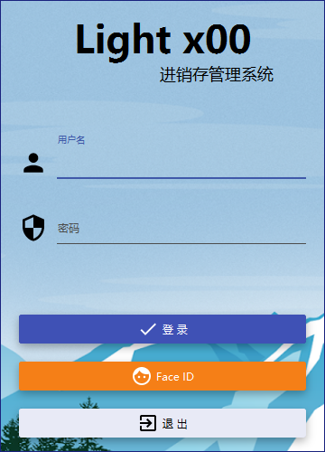
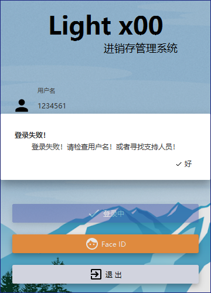
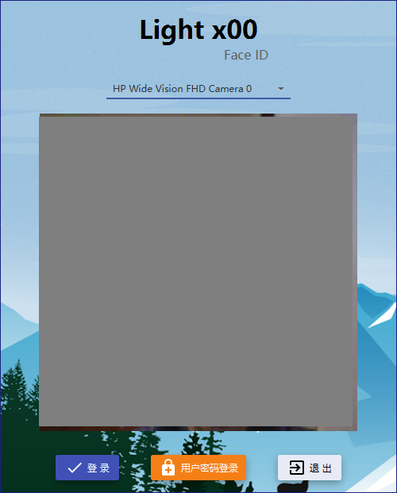
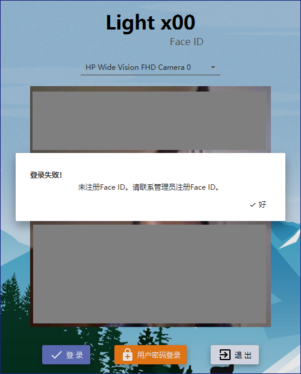
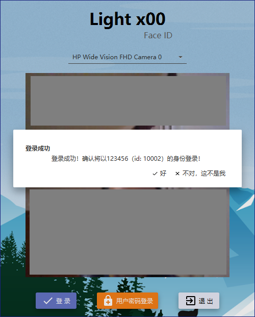
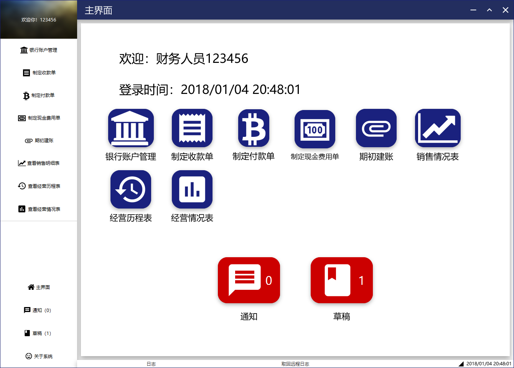

# Light x00 用户文档

## 0. 更新日志

| 修改日期 | 修改员 | 版本 | 变更原因 |
| -- | --- | -- | --- |
| 2018/1/3 | 陈俊达 | V0.1 | 第一版 |

## 1. 引言

本文档是Light x00灯具进销存系统的用户文档，旨在帮助本系统的使用者快速上手本套系统。

## 2. 操作规程

### 2.1 软件安装和运行

服务器端：

1. 在服务器机器上配置好JDK 1.8。

2. 将`Lightx00.Server-all.jar`文件放在空目录下，并在此目录下运行命令`java -jar Lightx00.Server-all.jar`，当日志打出`Initialization Done`时即服务器初始化完毕。直接运行jar文件也是可以接受的，但是将不会有任何GUI或者Console显示，不推荐这样运行程序。

3. 服务器将会自动在jar目录下生成默认`config.json`文件和`database.db`文件。前者为一些功能参数的配置文件，请根据实际情况进行修改。后者为数据库文件。这两个文件一旦被删除或者重命名，系统将会使用默认配置文件进行替换。

客户端：

1. 在客户端机器上配置好JDK 1.8。
2. 运行`Lightx00.Client-all.jar`文件即可。

### 2.2 登录和导航

#### 2.2.1 登录

##### 2.2.1.1 用户密码登录

当服务器和客户端都启动完毕并成功连接时，在客户端将会显示出登录界面。在这里输入用户名和密码。

如果服务器连接失败，将会显示如下提示信息，点击确定后客户端将自动退出。请连接服务器后再尝试连接。

如果用户名和密码无效，将会弹出登录失败的信息。

##### 2.2.1.2 Face ID登录

在登录界面点击**Face ID**可以进入Face ID登录界面。

可以的下拉栏中选择不同的相机。点击**登录**进行登录。点击**用户密码登录**可以退回传统的用户密码登录界面。

若登录失败，将会弹出错误信息。

登录成功将会弹出登录成功提示。

点击**好**将会以提示的用户来登录，点击**不对，这不是我**将会关闭弹出框，继续尝试登录。

#### 2.2.2 导航

登录成功后，将会进入对应人员的功能主界面。不同人员的功能主界面大同小异，所有下面以财务人员为例。

主界面左边为**功能列表**，显示当前用户所有可以使用的功能。点击某个按钮将会在右侧**功能界面**显示功能的具体信息。

主界面右边的为**功能界面**，显示每个功能的具体信息。

主界面下方为**状态栏**，从左到右依次为：

1. 日志，点击进入日志界面
2. 远程日志，点击进入远程日志界面
3. 当前时间

登录后，以及点击左侧下方**主界面**按钮后，**功能界面**将会进入**人员功能主界面**，即如图。

人员功能主界面上从上到下依次为如下信息：

1. 欢迎语
2. 本次登录时间
3. 功能按钮（和左侧**功能列表**里一一对应）
4. 通知和草稿计数

草稿和通知计数为联动的，将在以下时候更新：

1. 进入**人员功能主界面**
2. 在通知和草稿界面刷新
3. 处理一条通知或者草稿

### 2.3 用例操作

#### 2.3.1 。。。

## 2.4 常见问题 

