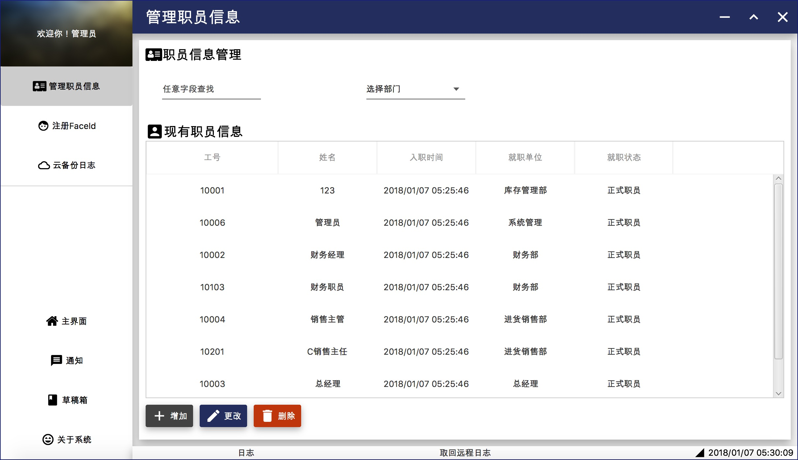
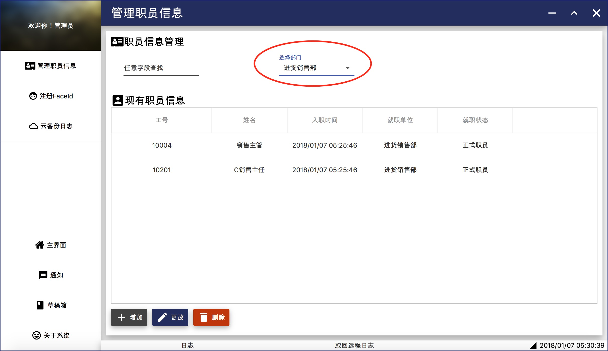
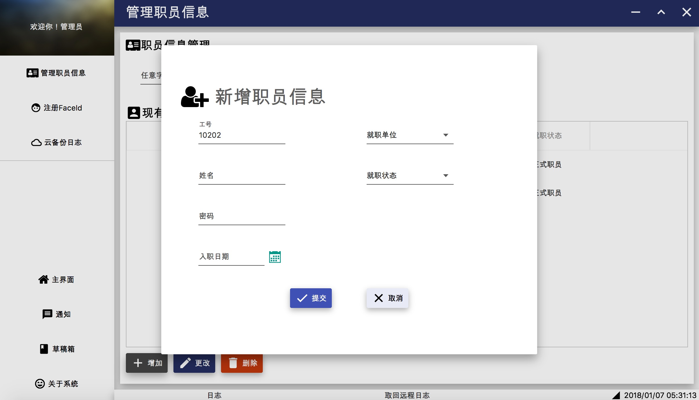
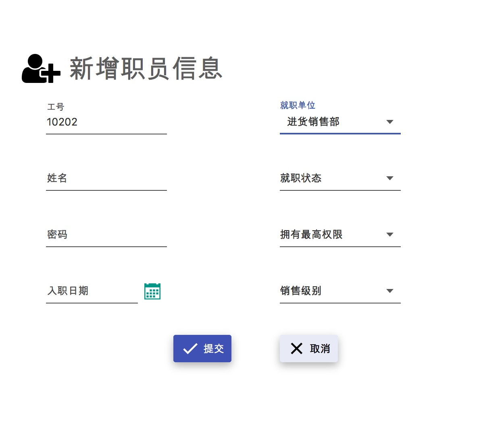

#### 管理用户账户

管理员登录后，点击左侧的**管理职员信息**功能按钮或者主界面的**管理职员信息**按钮，进入管理职员信息界面。

要搜索姓名、工号、状态、单位可以直接输入关键字进行模糊查找。

要直接筛选单位可以在下拉菜单里选择。

点击**增加**按钮，增加一条新的职员信息。

关于职员信息，只有进货销售人员和财务人员有最高权限选择，只有进货销售人员有销售等级选择。

用户选择就职单位后，会显示相应分级信息。

要修改某职员信息，如职位调动、实习生转正式职员、正式职员离职等等，选中要修改的信息，点击**更改**按钮。

要删除某错误填写的职员信息，点击**删除**按钮。

####  人脸识别登录

点击左侧的**FaceID注册**功能按钮或者主界面的**FaceID注册**按钮，进入人脸识别登录界面。

要注册某职员的FaceID信息，先选择职员，再点击**注册**按钮。

#### 云备份日志

点击左侧的**云备份日志**功能按钮或者主界面的**云备份日志**按钮，系统自动将本地日志清空，备份到云盘。

