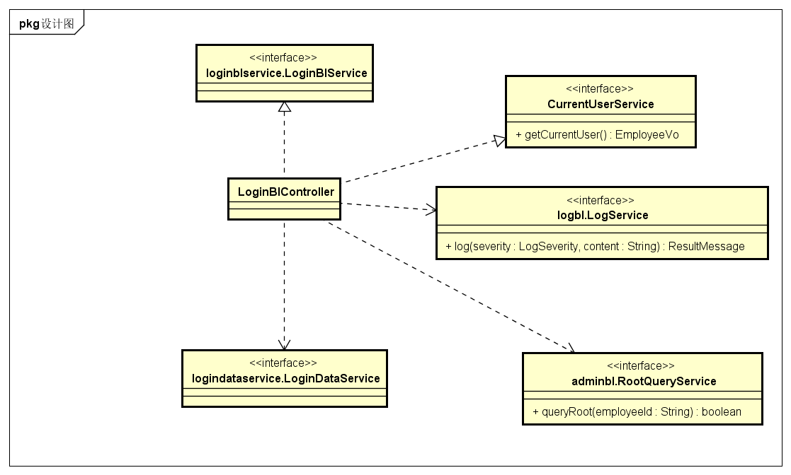
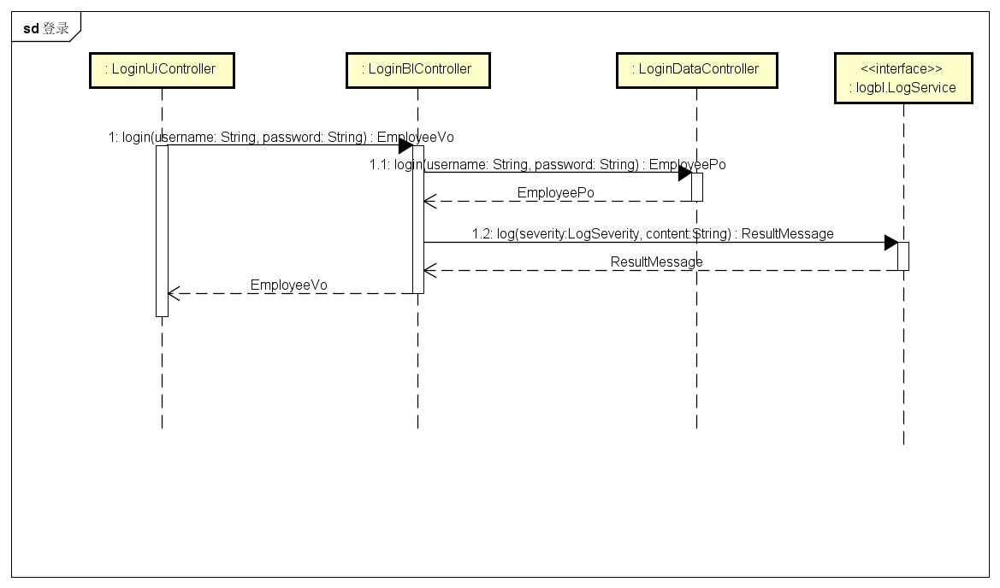
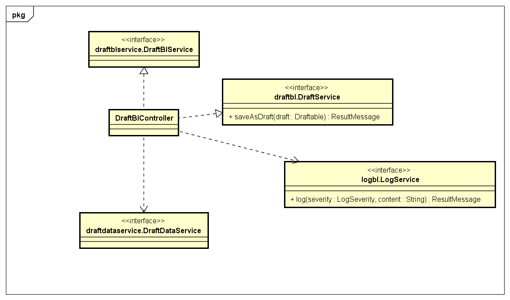
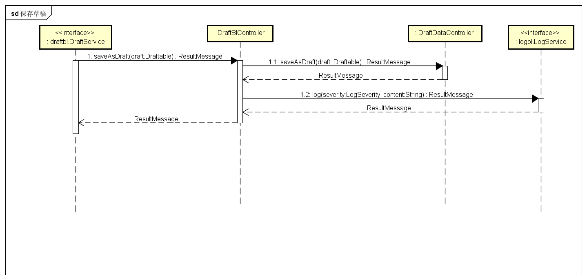
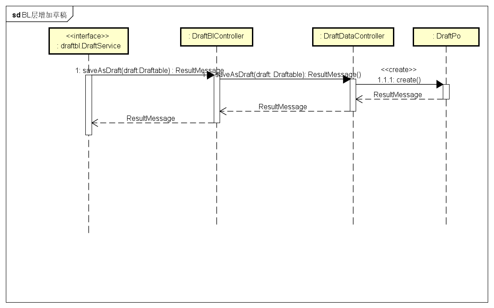
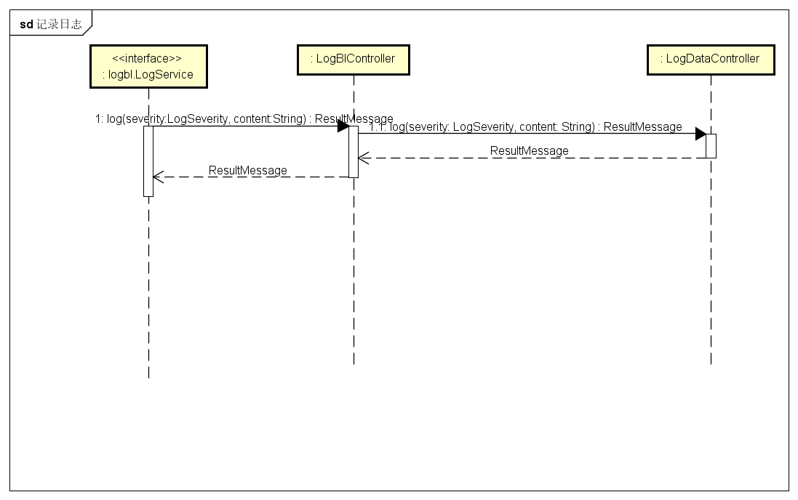
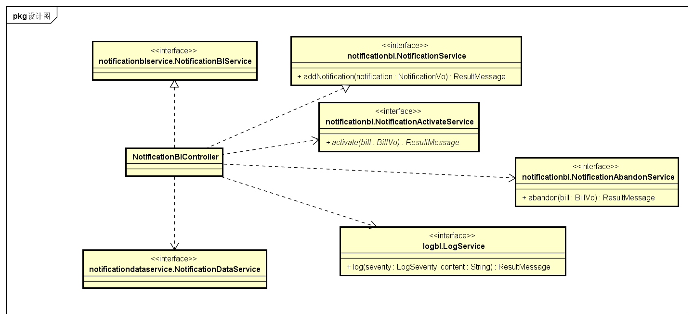
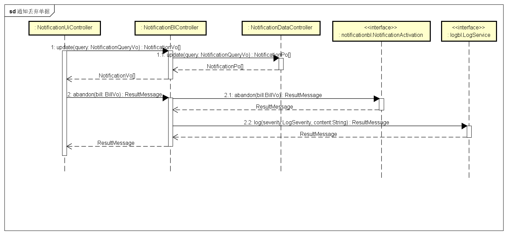

### 2.2.1 loginbl包

#### 2.2.1.1 概述

loginbl包负责登录功能的业务逻辑实现代码。具体功能需求和非功能需求可参见需求规格说明文档和体系结构设计文档。

#### 2.2.1.2 整体架构

此包为业务逻辑层的一部分，它负责业务逻辑的实现。它实现了loginui包所需要的loginblservice的所有接口，并依赖logindataservice包与data层进行交互。它还需要LogService包来实现记录日志的行为。

#### 2.2.1.3 设计

##### 2.2.1.3.1 设计图

##### 2.2.1.3.2 各个类的职责

| 类名 | 职责 |
|-----|-------|
| LoginBlController | 负责处理登录的功能。|

##### 2.2.1.3.3 内部类的接口规范

**LoginBlController**

提供的接口

| 接口名称 | 语法   | 前置条件 | 后置条件 |
| ---- | ---- | ---- | ---- |
| loginblservice.LoginBlService.login | `public EmployeeVo login(String username, String password);` | 无。| 系统已经登录或者登录失败。|

需要的接口

| 接口名称 | 服务名 |
| ------- | ------| 
| `logindataservice.LoginDataService.login(String username, String password)` | 登录。|
| `logbl.LogService.log(LogSeverity severity, String content);` | 记录日志。 |

##### 2.2.1.3.4 业务逻辑层的动态模型

下图是登录过程中的顺序图。

### 2.2.8 draftbl包

#### 2.2.8.1 概述

draftbl包包括了草稿功能的业务逻辑实现代码。具体功能需求和肺功能需求可参见需求规格说明文档和体系结构说明文档。

#### 2.2.8.2 整体架构

此包为业务逻辑层的一个部分，它负责业务逻辑的实现。它实现了draftui包所需要的draftblservice的所有接口，并依赖draftdataservice包与data层进行交互。它还需要LogService来实现记录日志的行为。它还提供DraftService接口以便其他单据类实现保存草稿功能。

#### 2.2.8.3 设计

##### 2.2.8.3.1 设计图

##### 2.2.8.3.2 各个类的职责

| 类名 | 职责 |
|-----|-------|
| DraftBlController | 负责草稿实现相关的功能。|

##### 2.2.8.3.3 内部类的接口规范

**DraftBlController**

提供的接口

| 接口名称 | 语法 | 前置条件 | 后置条件 |
| ------  | ---- | ------- | ------- | 
| draftblservice.DraftBlService.update | `public Draftable[] update(DraftQueryVo query);` | 无。| 获得当前用户已经保存的草稿。|
| draftblservice.DraftBlService.delete | `public ResultMessage delete(Draftable bill);` | 选择的单据有效并状态是草稿。| 将草稿删除，持久化信息已经保存。|

需要的接口

| 接口名称 | 服务名 |
| ------- | ------| 
| `draftdataservice.DraftDataService.update(DraftQueryVo query)` | 更新草稿。|
| `draftdataservice.DraftDataService.delete(Draftable bill)` | 删除草稿。|

##### 2.2.8.3.4 业务逻辑层的动态模型

下图是继续填写草稿例子中的顺序图。

下图是保存草稿的接口实现的顺序图。

下图是删除草稿的顺序图。

下图是BL层公开的增加草稿的接口实现的顺序图。

### 2.2.9 logbl包

#### 2.2.9.1 概述

logbl包包括了日志功能的业务逻辑实现代码。具体功能需求和肺功能需求可参见需求规格说明文档和体系结构说明文档。

#### 2.2.9.2 整体架构

此包为业务逻辑层的一个部分，它负责业务逻辑的实现。它实现了logui包所需要的logblservice的所有接口，并依赖logdataservice包与data层进行交互。它提供了LogService接口来实现记录日志的行为。

#### 2.2.9.3 设计

##### 2.2.9.3.1 设计图

##### 2.2.9.3.2 各个类的职责

| 类名 | 职责 |
|-----|-------|
| LogBlController | 负责日志相关的业务逻辑实现代码。|

##### 2.2.9.3.3 内部类的接口规范

**LogBlController**

提供的接口

| 接口名称 | 语法   | 前置条件 | 后置条件 |
| ---- | ---- | ---- | ---- |
| logbl.LogService.log | `public ResultMessage log(LogSeverity severity, String content);` | content非空。 | 日志保存，持久化信息已经保存。|
| logblservice.LogBlService.queryLog | `public LogVo[] query(LogQueryVo query);` | 无。| 返回符合条件的日志。|

需要的接口

| 接口名称 | 服务名 |
| ------- | ------| 
| `logdataservice.LogDataService.query(LogQueryVo query)` | 查询日志。|
| `logdataservice.LogDataService.log(LogSeverity severity, String content)` | 记录日志。|

##### 2.2.9.3.4 业务逻辑层的动态模型

下图是查看日志的顺序图。

下图是记录日志的接口实现图。

### 2.2.10 notificationbl包

#### 2.2.10.1 概述

notificationbl包负责登录功能的业务逻辑实现代码。具体功能需求和非功能需求可参见需求规格说明文档和体系结构设计文档。

#### 2.2.10.2 整体架构

此包为业务逻辑层的一个部分，它负责业务逻辑的实现。它实现了notificationui包所需要的notificationblservice接口。它还需要NotificationActivation接口以实现单据入账和丢弃的操作，以及LogService进行记录日志的操作。

#### 2.2.10.3 设计

##### 2.2.10.3.1 设计图

##### 2.2.10.3.2 各个类的职责

| 类名 | 职责 |
|-----|-------|
| NotificationBlController | 负责通知相关功能的业务逻辑实现。|

##### 2.2.10.3.3 内部类的接口规范

提供的接口

| 接口名称 | 语法   | 前置条件 | 后置条件 |
| ---- | ---- | ---- | ---- |
| notificationblservice.NotificationBlService.update | `public NotificationVo[] update(NotificationQueryVo query);` | 无。| 返回当前用户已有的通知。 |
| notificationblservice.NotificationBlService.acknowledge | `public ResultMessage acknowledge(NotificationVo notification);` | 参数notification有效非null。| 删除已有的通知，持久化信息已经保存。|
| notificationblservice.NotificationBlService.abandon | `public ResultMessage abandon(NotificationVo notification);` | notification为已经审批结束的单据通知。| 单据被标记为废弃，持久化信息已经保存。|
| NotificationService.addNotification | `public ResultMessage addNotification(NotificationVo notification)` | notification有效。 | 增加通知。|

需要的接口

| 接口名称 | 服务名 |
| ------- | ------| 
| `notificationdataservice.NotificationDataService.update(NotificationQueryVo query)` | 更新通知。|
| `notificationdataservice.NotificationDataService.addNotification(NotificationVo notification)` | 增加通知。|
| `notificationdataservice.NotificationDataService.acknowledge(NotificationPo notification)` | 已读通知。|
| `logbl.LogService.log(LogSeverity severity, String content)` | 记录日志。 |
| `NotificationActivation.activate(BillVo bill)` | 入账单据。|
| `NotificationActivation.abandon(BillVo bill)` | 丢弃单据。|

##### 2.2.10.3.4 业务逻辑层的动态模型

下图是已读通知的顺序图。

下图是丢弃单据的顺序图。

下图是修改单据的顺序图。

