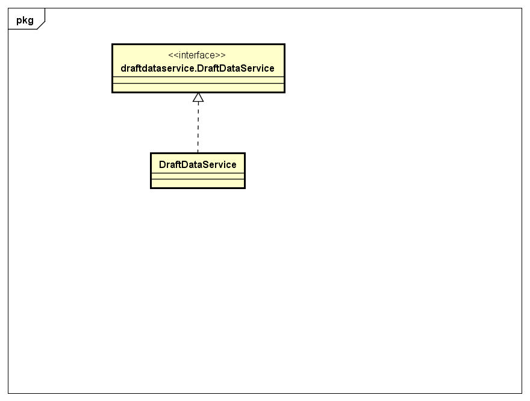
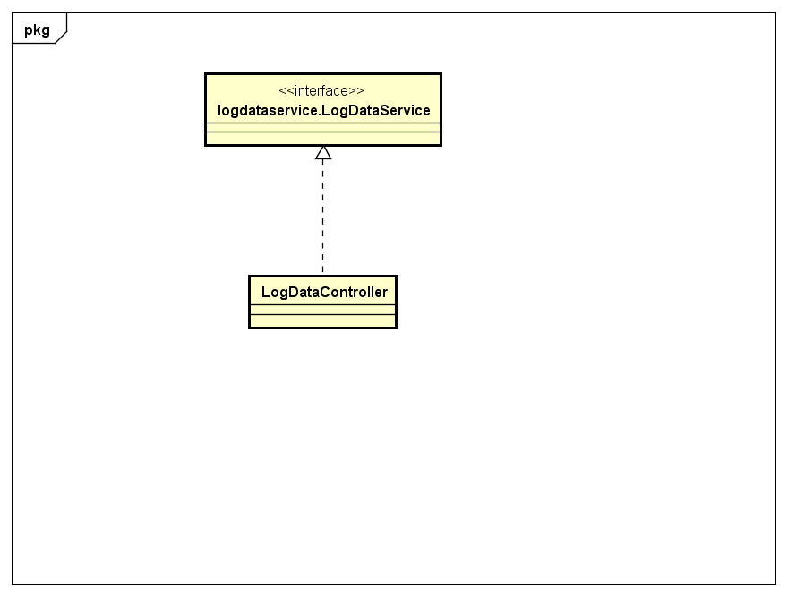
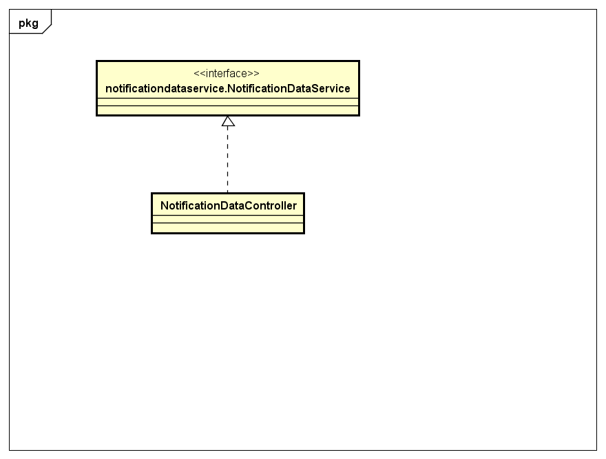

### 2.3.1 logindata包

#### 2.3.1.1 概述

logindata包负责登录相关的数据操作。具体功能需求和非功能需求可参见需求规格说明文档和体系结构设计文档。

#### 2.3.1.2 整体架构

此包为数据层的一部分，负责登录的数据操作。它实现了logindataservice的所有接口。

#### 2.3.1.3 设计

##### 2.3.1.3.1 设计图

##### 2.3.1.3.2 各个类的职责

| 类名 | 职责 | 
| ----| ----- |
| LoginDataController | 负责登录相关的数据操作。|

##### 2.3.1.3.3 内部类的接口规范

提供的接口

| 接口名称 | 语法   | 前置条件 | 后置条件 |
| ---- | ---- | ---- | ---- |
| logindataservice.LoginDataService.login | `public ResultMessage login(String username, String password);` | 无。| 系统已经登录或者登录失败。|

### 2.3.8 draftdata包

#### 2.3.8.1 概述

draftdata包负责草稿相关的数据操作。具体功能需求和非功能需求可参见需求规格说明文档和体系结构设计文档。

#### 2.3.8.2 整体架构

此包为数据层的一部分，负责草稿相关的数据操作。它实现了draftdataservice的所有接口。

#### 2.3.8.3 设计

##### 2.3.8.3.1 设计图

##### 2.3.8.3.2 各个类的职责

| 类名 | 职责 | 
| ----| ----- |
| DraftDataController | 负责草稿相关的数据操作。|

##### 2.3.8.3.3 内部类的接口规范

提供的接口

| 接口名称 | 语法 | 前置条件 | 后置条件 |
| ------  | ---- | ------- | ------- | 
| draftdataservice.DraftDataService.update | `public BillVo[] update(DraftQueryVo query);` | 条件有效。| 获得当前用户已经保存的草稿。|
| draftdataservice.DraftDataService.saveAsDraft | `public ResultMessage saveAsDraft(Draftable draft);` | 单据有效。| 保存草稿，持久化信息已经保存。|
| draftdataservice.DraftDataService.delete | `public ResultMessage delete(BillVo bill);` | 选择的单据有效并状态是草稿。| 将草稿删除，持久化信息已经保存。|

### 2.3.9 logdata包

#### 2.3.9.1 概述

logdata包负责日志相关的数据操作。具体功能需求和非功能需求可参见需求规格说明文档和体系结构设计文档。

#### 2.3.9.2 整体架构

此包为数据层的一部分，负责日志相关的数据操作。它实现了logdataservice的所有接口。

#### 2.3.9.3 设计

##### 2.3.9.3.1 设计图

##### 2.3.9.3.2 各个类的职责

| 类名 | 职责 | 
| ----| ----- |
| LogDataController | 负责日志相关的数据操作。|

##### 2.3.9.3.3 内部类的接口规范

提供的接口

| 接口名称 | 语法   | 前置条件 | 后置条件 |
| ---- | ---- | ---- | ---- |
| logdataservice.LogDataService.query | `public LogPo[] query(LogQueryVo query);` | 无。| 返回符合条件的日志。|
| logdataservice.LogDataService.log | `public ResultMessage log(LogSeverity severity, String content);` | content非空。 | 日志保存，持久化信息已经保存。|

### 2.3.10 notificationdata包

#### 2.3.10.1 概述

notificationdata包负责通知相关的数据操作。具体功能需求和非功能需求可参见需求规格说明文档和体系结构设计文档。

#### 2.3.10.2 整体架构

此包为数据层的一部分，负责通知相关的数据操作。它实现了notificationdataservice的所有接口。

#### 2.3.10.3 设计

##### 2.3.10.3.1 设计图

##### 2.3.10.3.2 各个类的职责

| 类名 | 职责 | 
| ----| ----- |
| NotificatioDataController | 负责日志相关的数据操作。|

##### 2.3.10.3.3 内部类的接口规范

提供的接口

| 接口名称 | 语法   | 前置条件 | 后置条件 |
| ---- | ---- | ---- | ---- |
| notificationdataservice.NotificationDataService.add | `public ResultMessage addNotification(NotificationPo notification);` | notification有效。| 将新通知写入数据库。|
| notificationdataservice.NotificationDataService.update | `public NotificationPo[] update(NotificationQueryVo query);` | 无。| 返回符合条件已有的通知。 |
| notificationdataservice.NotificationDataService.acknowledge | `public ResultMessage acknowledge(NotificationPo notification);` | 参数notification有效非null。| 删除已有的通知，持久化信息已经保存。|