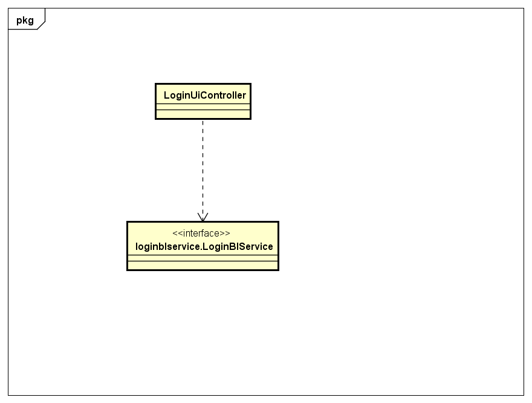
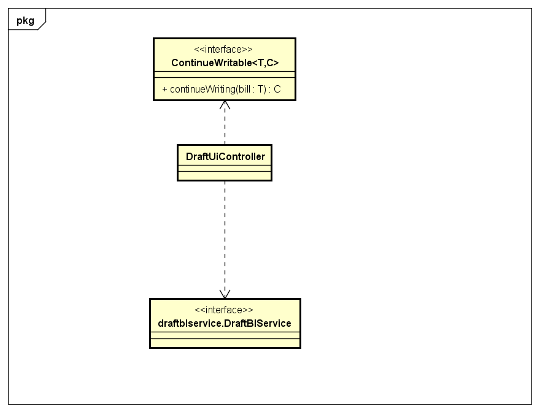
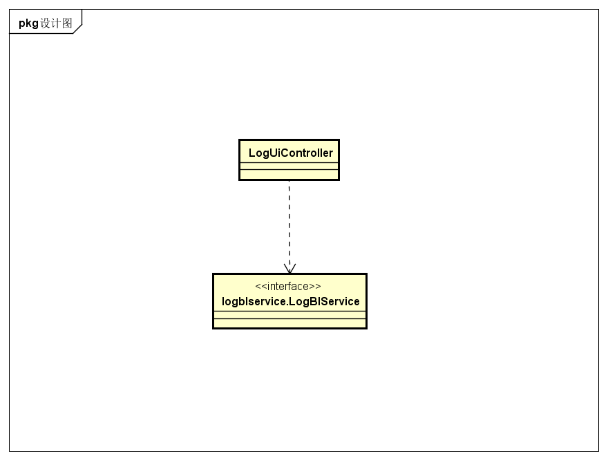
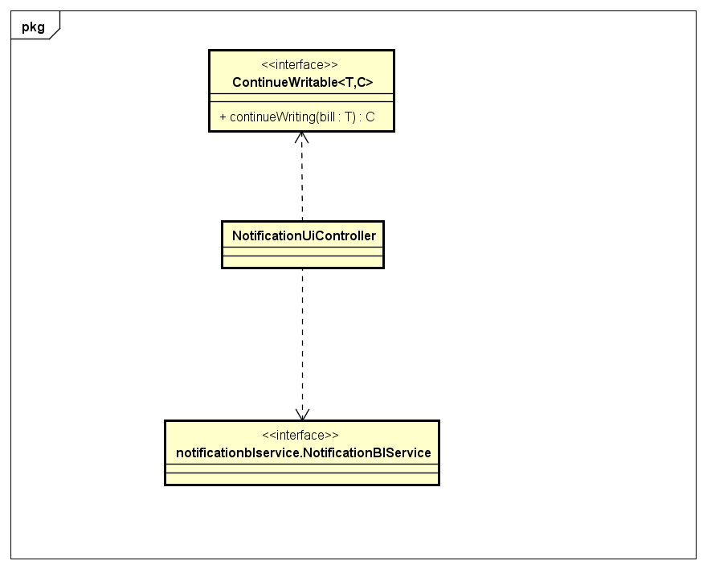

### 2.1.1 loginui包

#### 2.1.1.1 概述

loginui包负责系统登录的用例的UI界面以及响应控制代码。具体功能需求和非功能需求可参见需求规格说明文档和体系结构设计文档。

#### 2.1.1.2 整体架构

此包为展示层的一部分，它负责用户登录过程中展示信息以及与用户的交互。它依赖它对应的loginblservice包与bl层进行交互。

#### 2.1.1.3 设计

##### 2.1.1.3.1 设计图

##### 2.1.1.3.2 各个类的职责

| 类名 | 职责 |
|-----| -----|
| LoginUiController | 负责登录界面的展示和功能。|

##### 2.1.1.3.3 内部类的接口规范

**LoginUiController**

需要的接口

| 接口名称                                     | 服务名          |
| ---------------------------------------- | ------------ |
| `loginblservice.LoginBlService.login(String username, String password)` | 登录。|

### 2.1.8 draftui包

#### 2.1.8.1 概述

draftui包负责草稿箱功能的UI界面以及响应控制代码。具体功能需求和非功能需求可参见需求规格说明文档和体系结构设计文档。

#### 2.1.8.2 整体架构

此包为展示层的一部分，它负责草稿箱的功能与实现。它依赖它对应的draftblservice与bl层交互以管理草稿数据，也需要其他填写单据UI包的支持以实现继续填写的功能。

#### 2.1.8.3 设计

#### 2.1.8.3.1 设计图

##### 2.1.8.3.2 各个类的职责

| 类名 | 职责 |
|-----| -----|
| DraftUiController | 负责草稿界面的展示和功能。|

##### 2.1.8.3.3 内部类的接口规范

**DraftUiController**

需要的接口

| 接口名称                                     | 服务名          |
| ---------------------------------------- | ------------ |
| `draftblservice.DraftBlService.update()` | 获得当前用户所有单据。|
| `draftblservice.DraftBlService.delete(Draftable draft)` | 删除选中单据。|
| `ContinueWritable.continueWriting(T draft)` | 继续填写所选单据。| 

### 2.1.9 logui包

#### 2.1.9.1 概述

logui包负责查看日志的UI界面以及相应控制代码。具体功能需求和非功能需求可参见需求规格说明文档和体系结构设计文档。

#### 2.1.9.2 整体架构

此包为展示层的一部分，它负责草稿箱的功能和实现。它依赖它对应的logblservice与bl层交互以获得日志信息。

#### 2.1.9.3 设计

##### 2.1.9.3.1 设计图

##### 2.1.9.3.2 各个类的职责

| 类名 | 职责 |
|-----| -----|
| LogUiController | 负责日志界面的展示和功能。|

##### 2.1.9.3.3 内部类的接口规范

**LogUiController**

需要的接口

| 接口名称                                     | 服务名          |
| ---------------------------------------- | ------------ |
| `logblservice.LogBlService.query(LogQueryVo query)` | 查询日志。|

### 2.1.10 notificationui包

#### 2.1.10.1 概念

notificationui包负责通知功能的UI界面以及相应控制代码。具体功能需求和肺功能需求可参见需求规格说明文档和体系结构设计文档。

#### 2.1.10.2 整体架构

此包为展示层的一部分，它负责通知的功能和实现。它依赖它对应的notificationblservice层与bl层交互以进行响应操作。同时也需要其他填写单据UI包的支持以实现继续填写的功能。

#### 2.1.10.3 设计

##### 2.1.10.3.1 设计图

##### 2.1.10.3.2 各个类的职责

| 类名 | 职责 |
| ---- | ----| 
| NotificationUiController | 负责通知界面的展示和功能。|

##### 2.1.10.3.3 内部类的接口规范

**NotificationUiController**

需要的接口

| 接口名称                                     | 服务名          |
| ---------------------------------------- | ------------ |
| `notificationblservice.Notification.update()` | 更新通知。|
| `notificationblservice.Notification.acknowledge(NotificationVo notification)` | 已读通知。|
| `notificationblservice.Notification.abandon(NotificationVo notification)` | 丢弃单据通知。|
| `ContinueWritable.continueWriting(T draft)` | 继续填写所选单据。| 

