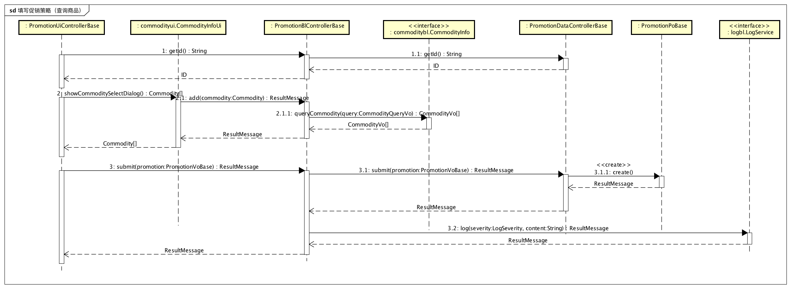
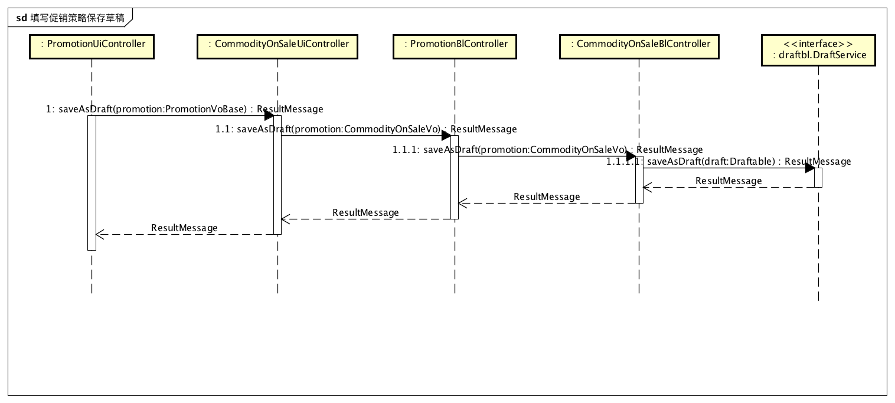

### 2.2.12 promotionbl包

#### 2.2.12.1 概述

promtionbl包负责总经理制定促销策略（包括组合商品降价、满额赠送商品、满额赠送代金券、客户赠送礼品、客户赠送代金券以及客户价格这让）用例的业务逻辑实现代码。具体功能需求和非功能需求可参见需求规格说明文档和体系结构设计文档。

#### 2.2.12.2 整体结构

此包为业务逻辑层的一部分，它负责业务逻辑的实现。它实现了promtionui包所需要的promotionblservice所有接口，并依赖对应的promotiondataservice包与data层进行交互。由于销售行为需要依赖促销策略，它还需要实现PromotionInfo接口。

#### 2.2.12.3 设计

##### 2.2.12.3.1 设计图

##### 2.2.12.3.2 各个类的职责

| 类名                           | 职责                      |
| ---------------------------- | ----------------------- |
| PromotionBlController        | 负责管理以下具体促销策略控制器。        |
| CommodityOnSaleBlController  | 负责管理填写组合商品降价促销策略的功能实现。  |
| TotalPriceCouponBlController | 负责管理填写满额赠送代金券促销策略的功能实现。 |
| TotalPriceGiftBlController   | 负责管理填写满额赠送礼品促销策略的功能实现。  |
| ClientCouponBlController     | 负责管理填写客户赠送代金券促销策略的功能实现。 |
| ClientGiftBlController       | 负责管理填写客户赠送礼品促销策略的功能实现。  |
| ClientOnSaleBlController     | 负责管理填写客户价格折让促销策略的功能实现。  |

##### 2.2.12.3.3 内部类的接口规范

**PromotionBlController**

提供的接口

| 接口名称                                     | 语法                                       | 前置条件                                | 后置条件                    |
| ---------------------------------------- | ---------------------------------------- | ----------------------------------- | ----------------------- |
| PromotionManagementBlService.submit      | `public ResultMessage submit(PromotionVoBase newPromotion);` | 促销策略所有属性有效。                         | 持久化促销策略信息已经保存。          |
| PromotionManagementBlService.saveAsDraft | `public ResultMessage saveAsDraft(PromotionVoBase promotion);` | 促销策略信息非空。                           | 保存草稿，持久化信息已经保存。         |
| PromotionManagementBlService.queryPromotion | `public PromotionVOBase[] queryPromotion(PromotionQueryVo query);` | 输入的query不为空，其中值为null字段的为不限制，筛选条件有效。 | 返回符合条件的促销策略。            |
| PromotionManagementBlService.delete      | `public ResultMessage delete(PromotionVoBase promotion);` | 选择删除促销策略。                           | 返回删除是否成功，持久化更新涉及的对象的数据。 |
| PromotionManagementBlService.getId       | `public String getId();`                 | 新建促销策略。                             | 返回当前促销策略的ID。            |
| promotionbl.PromotionInfo                | `public PromotionVoBase[] queryPromotion(SaleBillVo saleBill);` | 产生销售行为。                             | 返回可用的促销策略。              |

需要的接口

| 接口名称                                     | 服务名              |
| ---------------------------------------- | ---------------- |
| `promotiondataservice.PromotionManagementDataService.submit(PromotionVoBase promotion)` | 提交新促销策略。         |
| `promotiondataservice.PromotionManagementDataService.queryPromotion(PromotionQueryVo query)` | 根据不同的筛选条件查找促销策略。 |
| `promotiondataservice.PromotionManagementDataService.delete(PromotionVoBase promotion)` | 删除单一持久化对象。       |
| `promotiondataservice.PromotionManagementDataService.getId()` | 返回当前促销策略ID。      |
| `draftbl.DraftService.saveAsDraft(PromotionVoBase promotion)` | 保存草稿。            |
| `logbl.LogService.log(LogSeverity severity, String content)` | 记录日志。            |

**CommodityOnSaleBlController**

提供的接口

| 接口名称                                     | 语法                                       | 前置条件                                | 后置条件                    |
| ---------------------------------------- | ---------------------------------------- | ----------------------------------- | ----------------------- |
| PromotionManagementBlService.submit      | `public ResultMessage submit(CommodityOnSaleVo newPromotion);` | 促销策略所有属性有效。                         | 持久化促销策略信息已经保存。          |
| PromotionManagementBlService.saveAsDraft | `public ResultMessage saveAsDraft(CommodityOnSaleVo promotion);` | 促销策略信息非空。                           | 保存草稿，持久化信息已经保存。         |
| PromotionManagementBlService.queryPromotion | `public CommodityOnSaleVo[] queryPromotion(PromotionQueryVo query);` | 输入的query不为空，其中值为null字段的为不限制，筛选条件有效。 | 返回符合条件的促销策略。            |
| PromotionManagementBlService.delete      | `public ResultMessage delete(CommodityOnSaleVo promotion);` | 选择删除促销策略。                           | 返回删除是否成功，持久化更新涉及的对象的数据。 |
| PromotionManagementBlService.getId       | `public String getId();`                 | 新建促销策略。                             | 返回当前促销策略的ID。            |
| PromotionInfo.queryPromotion             | `public PromotionVoBase[] queryPromotion(SaleBillVo saleBill);` | 产生销售行为。                             | 返回可用的促销策略。              |

需要的接口

| 接口名称                                     | 服务名              |
| ---------------------------------------- | ---------------- |
| `promotiondataservice.PromotionManagementDataService.submit(CommodityOnSaleVo promotion)` | 提交新促销策略。         |
| `promotiondataservice.PromotionManagementDataService.queryPromotion(PromotionQueryVo query)` | 根据不同的筛选条件查找促销策略。 |
| `promotiondataservice.PromotionManagementDataService.delete(CommodityOnSaleVo promotion)` | 删除单一持久化对象。       |
| `promotiondataservice.PromotionManagementDataService.getId()` | 返回当前促销策略ID。      |
| `draftbl.DraftService.saveAsDraft(CommodityOnSaleVo promotion)` | 保存草稿。            |
| `logbl.LogService.log(LogSeverity severity, String content)` | 记录日志。            |

**TotalPriceCouponBlController**

提供的接口

| 接口名称                                     | 语法                                       | 前置条件                                | 后置条件                    |
| ---------------------------------------- | ---------------------------------------- | ----------------------------------- | ----------------------- |
| PromotionManagementBlService.submit      | `public ResultMessage submit(TotalPriceCouponVo newPromotion);` | 促销策略所有属性有效。                         | 持久化促销策略信息已经保存。          |
| PromotionManagementBlService.saveAsDraft | `public ResultMessage saveAsDraft(TotalPriceCouponVo promotion);` | 促销策略信息非空。                           | 保存草稿，持久化信息已经保存。         |
| PromotionManagementBlService.queryPromotion | `public TotalPriceCouponVo[] queryPromotion(PromotionQueryVo query);` | 输入的query不为空，其中值为null字段的为不限制，筛选条件有效。 | 返回符合条件的促销策略。            |
| PromotionManagementBlService.delete      | `public ResultMessage delete(TotalPriceCouponVo promotion);` | 选择删除促销策略。                           | 返回删除是否成功，持久化更新涉及的对象的数据。 |
| PromotionManagementBlService.getId       | `public String getId();`                 | 新建促销策略。                             | 返回当前促销策略的ID。            |
| PromotionInfo.queryPromotion             | `public PromotionVoBase[] queryPromotion(SaleBillVo saleBill);` | 产生销售行为。                             | 返回可用的促销策略。              |

需要的接口

| 接口名称                                     | 服务名              |
| ---------------------------------------- | ---------------- |
| `promotiondataservice.PromotionManagementDataService.submit(TotalPriceCouponVo promotion)` | 提交新促销策略。         |
| `promotiondataservice.PromotionManagementDataService.queryPromotion(PromotionQueryVo query)` | 根据不同的筛选条件查找促销策略。 |
| `promotiondataservice.PromotionManagementDataService.delete(TotalPriceCouponVo promotion)` | 删除单一持久化对象。       |
| `promotiondataservice.PromotionManagementDataService.getId()` | 返回当前促销策略ID       |
| `draftbl.DraftService.saveAsDraft(TotalPriceCouponVo promotion)` | 保存草稿。            |
| `logbl.LogService.log(LogSeverity severity, String content)` | 记录日志。            |

**TotalPriceGiftBlController**

提供的接口

| 接口名称                                     | 语法                                       | 前置条件                                | 后置条件                    |
| ---------------------------------------- | ---------------------------------------- | ----------------------------------- | ----------------------- |
| PromotionManagementBlService.submit      | `public ResultMessage submit(TotalPriceGiftVo newPromotion);` | 促销策略所有属性有效。                         | 持久化促销策略信息已经保存。          |
| PromotionManagementBlService.saveAsDraft | `public ResultMessage saveAsDraft(TotalPriceGiftVo promotion);` | 促销策略信息非空。                           | 保存草稿，持久化信息已经保存。         |
| PromotionManagementBlService.queryPromotion | `public TotalPriceGiftVo[] queryPromotion(PromotionQueryVo query);` | 输入的query不为空，其中值为null字段的为不限制，筛选条件有效。 | 返回符合条件的促销策略。            |
| PromotionManagementBlService.delete      | `public ResultMessage delete(TotalPriceGiftVo promotion);` | 选择删除促销策略。                           | 返回删除是否成功，持久化更新涉及的对象的数据。 |
| PromotionManagementBlService.getId       | `public String getId();`                 | 新建促销策略。                             | 返回当前促销策略的ID。            |
| PromotionInfo.queryPromotion             | `public PromotionVoBase[] queryPromotion(SaleBillVo saleBill);` | 产生销售行为。                             | 返回可用的促销策略。              |

需要的接口

| 接口名称                                     | 服务名              |
| ---------------------------------------- | ---------------- |
| `promotiondataservice.PromotionManagementDataService.submit(TotalPriceGiftVo promotion)` | 提交新促销策略。         |
| `promotiondataservice.PromotionManagementDataService.queryPromotion(PromotionQueryVo query)` | 根据不同的筛选条件查找促销策略。 |
| `promotiondataservice.PromotionManagementDataService.delete(TotalPriceGiftVo promotion)` | 删除单一持久化对象。       |
| `promotiondataservice.PromotionManagementDataService.getId()` | 返回当前促销策略ID       |
| `draftbl.DraftService.saveAsDraft(TotalPriceGiftVo promotion)` | 保存草稿。            |
| `logbl.LogService.log(LogSeverity severity, String content)` | 记录日志。            |

**ClientCouponBlController**

提供的接口

| 接口名称                                     | 语法                                       | 前置条件                                | 后置条件                    |
| ---------------------------------------- | ---------------------------------------- | ----------------------------------- | ----------------------- |
| PromotionManagementBlService.submit      | `public ResultMessage submit(ClientCouponVo newPromotion);` | 促销策略所有属性有效。                         | 持久化促销策略信息已经保存。          |
| PromotionManagementBlService.saveAsDraft | `public ResultMessage saveAsDraft(ClientCouponVo promotion);` | 促销策略信息非空。                           | 保存草稿，持久化信息已经保存。         |
| PromotionManagementBlService.queryPromotion | `public ClientCouponV[] queryPromotion(PromotionQueryVo query);` | 输入的query不为空，其中值为null字段的为不限制，筛选条件有效。 | 返回符合条件的促销策略。            |
| PromotionManagementBlService.delete      | `public ResultMessage delete(ClientCouponVo promotion);` | 选择删除促销策略。                           | 返回删除是否成功，持久化更新涉及的对象的数据。 |
| PromotionManagementBlService.getId       | `public String getId();`                 | 新建促销策略。                             | 返回当前促销策略的ID。            |
| PromotionInfo.queryPromotion             | `public PromotionVoBase[] queryPromotion(SaleBillVo saleBill);` | 产生销售行为。                             | 返回可用的促销策略。              |

需要的接口

| 接口名称                                     | 服务名              |
| ---------------------------------------- | ---------------- |
| `promotiondataservice.PromotionManagementDataService.submit(ClientCouponVo promotion)` | 提交新促销策略。         |
| `promotiondataservice.PromotionManagementDataService.queryPromotion(PromotionQueryVo query)` | 根据不同的筛选条件查找促销策略。 |
| `promotiondataservice.PromotionManagementDataService.delete(ClientCouponVo promotion)` | 删除单一持久化对象。       |
| `promotiondataservice.PromotionManagementDataService.getId()` | 返回当前促销策略ID       |
| `draftbl.DraftService.saveAsDraft(ClientCouponVo promotion)` | 保存草稿。            |
| `logbl.LogService.log(LogSeverity severity, String content)` | 记录日志。            |

**ClientGiftBlController**

提供的接口

| 接口名称                                     | 语法                                       | 前置条件                                | 后置条件                    |
| ---------------------------------------- | ---------------------------------------- | ----------------------------------- | ----------------------- |
| PromotionManagementBlService.submit      | `public ResultMessage submit(ClientGiftVo newPromotion);` | 促销策略所有属性有效。                         | 持久化促销策略信息已经保存。          |
| PromotionManagementBlService.saveAsDraft | `public ResultMessage saveAsDraft(ClientGiftVo promotion);` | 促销策略信息非空。                           | 保存草稿，持久化信息已经保存。         |
| PromotionManagementBlService.queryPromotion | `public ClientGiftVo[] queryPromotion(PromotionQueryVo query);` | 输入的query不为空，其中值为null字段的为不限制，筛选条件有效。 | 返回符合条件的促销策略。            |
| PromotionManagementBlService.delete      | `public ResultMessage delete(ClientGiftVo promotion);` | 选择删除促销策略。                           | 返回删除是否成功，持久化更新涉及的对象的数据。 |
| PromotionManagementBlService.getId       | `public String getId();`                 | 新建促销策略。                             | 返回当前促销策略的ID。            |
| PromotionInfo.queryPromotion             | `public PromotionVoBase[] queryPromotion(SaleBillVo saleBill);` | 产生销售行为。                             | 返回可用的促销策略。              |

需要的接口

| 接口名称                                     | 服务名              |
| ---------------------------------------- | ---------------- |
| `promotiondataservice.PromotionManagementDataService.submit(ClientGiftVo promotion)` | 提交新促销策略。         |
| `promotiondataservice.PromotionManagementDataService.queryPromotion(PromotionQueryVo query)` | 根据不同的筛选条件查找促销策略。 |
| `promotiondataservice.PromotionManagementDataService.delete(ClientGiftVo promotion)` | 删除单一持久化对象。       |
| `promotiondataservice.PromotionManagementDataService.getId()` | 返回当前促销策略ID       |
| `draftbl.DraftService.saveAsDraft(ClientGiftVo promotion)` | 保存草稿。            |
| `logbl.LogService.log(LogSeverity severity, String content)` | 记录日志。            |

**ClientOnSaleBlController**

提供的接口

| 接口名称                                     | 语法                                       | 前置条件                                | 后置条件                    |
| ---------------------------------------- | ---------------------------------------- | ----------------------------------- | ----------------------- |
| PromotionManagementBlService.submit      | `public ResultMessage submit(ClientOnSaleVo newPromotion);` | 促销策略所有属性有效。                         | 持久化促销策略信息已经保存。          |
| PromotionManagementBlService.saveAsDraft | `public ResultMessage saveAsDraft(ClientOnSaleVo promotion);` | 促销策略信息非空。                           | 保存草稿，持久化信息已经保存。         |
| PromotionManagementBlService.queryPromotion | `public ClientOnSaleVo[] queryPromotion(PromotionQueryVo query);` | 输入的query不为空，其中值为null字段的为不限制，筛选条件有效。 | 返回符合条件的促销策略。            |
| PromotionManagementBlService.delete      | `public ResultMessage delete(ClientOnSaleVo promotion);` | 选择删除促销策略。                           | 返回删除是否成功，持久化更新涉及的对象的数据。 |
| PromotionManagementBlService.getId       | `public String getId();`                 | 新建促销策略。                             | 返回当前促销策略的ID。            |
| PromotionInfo.queryPromotion             | `public PromotionVoBase[] queryPromotion(SaleBillVo saleBill);` | 产生销售行为。                             | 返回可用的促销策略。              |

需要的接口

| 接口名称                                     | 服务名              |
| ---------------------------------------- | ---------------- |
| `promotiondataservice.PromotionManagementDataService.submit(ClientOnSaleVo promotion)` | 提交新促销策略。         |
| `promotiondataservice.PromotionManagementDataService.queryPromotion(PromotionQueryVo query)` | 根据不同的筛选条件查找促销策略。 |
| `promotiondataservice.PromotionManagementDataService.delete(ClientOnSaleVo promotion)` | 删除单一持久化对象。       |
| `promotiondataservice.PromotionManagementDataService.getId()` | 返回当前促销策略ID       |
| `draftbl.DraftService.saveAsDraft(ClientOnSaleVo promotion)` | 保存草稿。            |
| `logbl.LogService.log(LogSeverity severity, String content)` | 记录日志。            |

##### 2.2.12.3.4 业务逻辑层的动态模型

下图为填写用户赠送代金券促销策略（不需要查询商品）时的顺序图，用户价格折让、满额赠送代金券促销策略的顺序图参见此图。

下图为填写组合商品降价促销策略（需要查询商品）时的顺序图，客户赠送礼品，满额赠送礼品促销策略的顺序图参见此图。

下图为填写组合商品降价促销策略时被中断保存草稿的顺序图，其他促销策略顺序图参见此图。

下图是查询（筛选）组合商品降价促销策略的顺序图，其他促销策略顺序图参见此图。

下图是删除组合商品降价促销策略的顺序图，其他促销策略顺序图参见此图。

由于本包会对销售行为提供查询销售可用的促销策略接口，此功能实现顺序图如下

### 2.2.13 approvalbl包

#### 2.2.13.1 概述

approvalbl包负责总经理审批单据用例的业务逻辑实现代码。具体功能需求和非功能需求可参见需求规格说明文档和体系结构设计文档。

#### 2.2.13.2 整体架构

此包为业务逻辑层的一部分，它负责业务逻辑的实现。它实现了approvalui包所需要的approvalblservice的所有接口，并依赖approvaldataservice包与data层进行交互。

#### 2.2.13.3 设计

##### 2.2.13.3.1 设计图

##### 2.2.13.3.2 各个类的职责

| 类名                | 职责                |
| ----------------- | ----------------- |
| AuditBlController | 负责管理审批单据界面的展示和功能。 |

##### 2.2.13.3.3 内部类的接口规范

**AuditBlController**

提供的接口

| 接口名称                           | 语法                                       | 前置条件          | 后置条件                  |
| ------------------------------ | ---------------------------------------- | ------------- | --------------------- |
| AuditBlService.query           | `public ResultMessage query (BillQueryVO query);` | 有处于提交状态的单据单据。 | 返回符合条件的单据。            |
| AuditBlService.reject          | `public ResultMessage reject(BillVO bill);` | 用户已经查看了单据内容。  | 拒绝通过审批，持久化更新涉及的对象的数据。 |
| AuditBlService.pass            | `public ResultMessage pass(BillVO bill);` | 用户已经查看了单据内容。  | 通过审批，持久化更新涉及的对象的数据。   |
| ApprovalRequest.requestMessage | `public ResultMessage requestMessage(BillVo bill);` | 用户提交了单据。      | 保存单据并返回保存结果。          |

需要的接口

| 接口名称                                     | 服务名          |
| ---------------------------------------- | ------------ |
| `approvaldataservice.AuditDataService.query(BillQueryVo query)` | 得到待审批的持久化对象。 |
| `approvaldataservice.AuditDataService.reject(BillVo bill)` | 拒绝通过审批。      |
| `approvaldataservice.AuditDataService.pass(BillVo bill)` | 通过审批。        |
| `approvaldataservice.ApprovalRequest(BillVo bill)` | 保存提交的单据。     |
| `notificationbl.NotificationService.addNotification(NotificationVo notification);` | 新增一条通知。      |
| `logbl.LogService.log(LogSeverity severity, String content)` | 记录日志。        |

##### 2.2.13.3.4 业务逻辑层的动态模型

下图是审批通过的顺序图

下图是审批不通过的顺序图

由于本包对外提供申请提交接口，此功能实现顺序图如下

