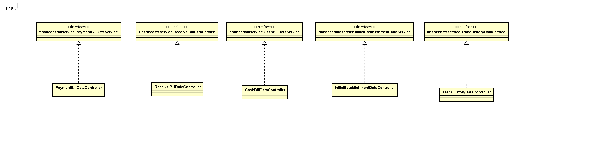
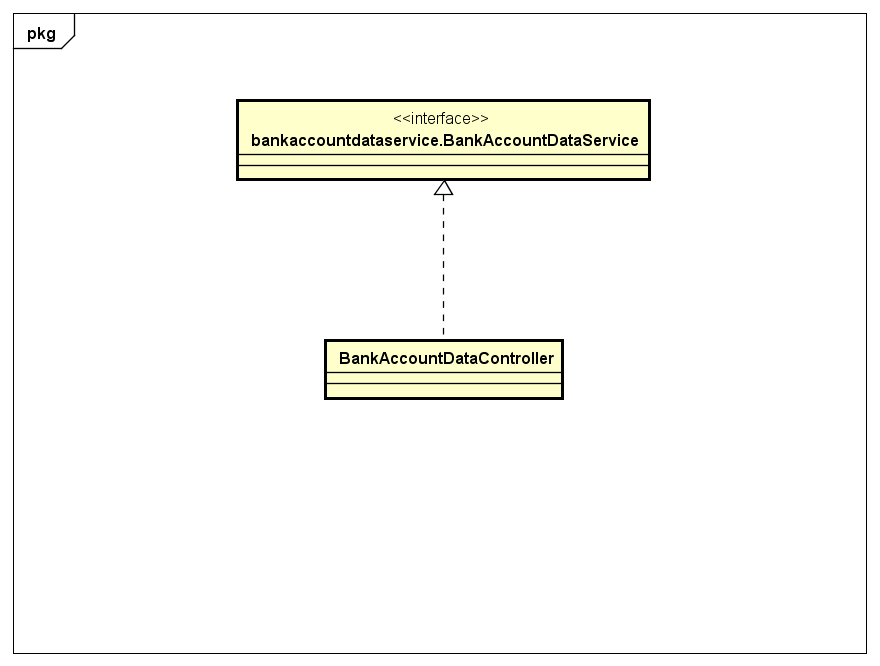

### 2.3.6 financedata包

#### 2.3.6.1 概述

financedata包负责财务人员除了银行账户管理外的用例（制定收款单、制定付款单、制定现金费用单、查看经营情况表、查看经营历程表、查看销售情况表、红冲以及期初建账）的数据操作。具体功能需求和非功能需求可参见需求规格说明文档和体系结构设计文档。

#### 2.3.6.2 整体架构

此包为数据层的一部分，负责财务人员除了银行账户管理外的用例（制定收款单、制定付款单、制定现金费用单、查看经营情况表、查看经营历程表、查看销售情况表、红冲以及期初建账）的数据操作。它实现了financedataservice的所有接口。

#### 2.3.6.3 设计

##### 2.3.6.3.1 设计图

##### 2.3.6.3.2 各个类的职责

| 类名 | 职责 |
| -----| -----|
| PaymentBillDataController | 负责付款单的数据管理。|
| ReceivalBillDataController | 负责收款单的数据管理。|
| CashBillDataController | 负责现金费用单的数据管理。|
| InitialEstablishmentDataController | 负责期初账的数据管理。|
| TradeHistoryDataController | 负责查询财务单据的数据管理。|

##### 2.3.6.3.3 各个类的内部接口

**PaymentBillDataController**

提供的接口

| 接口名称                                     | 语法                                       | 前置条件             | 后置条件                                  |
| ---------------------------------------- | ---------------------------------------- | ---------------- | ------------------------------------- |
| PaymentBillDataService.submit    | `public ResultMessage submit(PaymentBillPo bill);` | 用户已经登录，单据所有属性有效。 | 提交新单据。                                |
| PaymentBillDataService.query     | `public PaymentBillPo[] query(PaymentBillQueryVo query);` | 输入查询条件有效。| 返回符合筛选条件的收款单。|
| PaymentBillDataService.getId     | `public String getId();` | 无。|返回下一张单据的ID。|
| PaymentBillDataService.activate  | `public ResultMessage activate(String id);` | 单据有效且状态为审批通过。    | 系统修改对应银行账户和客户信息，修改单据状态为已入账，持久化信息已经保存。 |
| PaymentBillDataService.abandon   | `public ResultMessage abandon(String id);` | 单据有效且状态为审批完成。    | 系统修改单据状态为已经废弃，持久化信息已经保存。              |

**ReceivalBillDataController**

提供的接口

| 接口名称                                     | 语法                                       | 前置条件             | 后置条件                                  |
| ---------------------------------------- | ---------------------------------------- | ---------------- | ------------------------------------- |
| ReceivalBillDataService.submit       | `public ResultMessage submit(ReceivalBillPo bill);` | 用户已经登录，单据所有属性有效。 | 提交新单据。                                |
| ReceivalBillDataService.activate     | `public ResultMessage activate(String id);` | 单据有效且状态为审批通过。    | 系统修改对应银行账户和客户信息，修改单据状态为已入账，持久化信息已经保存。 |
| ReceivalBillDataService.abandon      | `public ResultMessage abandon(String id);` | 单据有效且状态为审批完成。    | 系统修改单据状态为已经废弃，持久化信息已经保存。              |
| ReceivalBillDataService.query    | `public ReceivalBillPo[] query(ReceivalBillQueryVo query);` | 输入查询条件有效。| 返回符合筛选条件的付款单。|
| ReceivalBillDataService.getId    | `public String getId();` | 无。|返回下一张单据的ID。|

**CashBillDataController**

提供的接口

| 接口名称                                     | 语法                                       | 前置条件             | 后置条件                                  |
| ---------------------------------------- | ---------------------------------------- | ---------------- | ------------------------------------- |
| CashBillDataService.submit       | `public ResultMessage submit(CashBillPo bill);` | 用户已经登录，单据所有属性有效。 | 提交新单据。                                |
| CashBillDataService.activate     | `public ResultMessage activate(String id);` | 单据有效且状态为审批通过。    | 系统修改对应银行账户和客户信息，修改单据状态为已入账，持久化信息已经保存。 |
| CashBillDataService.abandon      | `public ResultMessage abandon(String id);` | 单据有效且状态为审批完成。    | 系统修改单据状态为已经废弃，持久化信息已经保存。              |
| CashBillDataService.query        | `public CashBillPo[] query(CashBillQueryVo query);` | 输入查询条件有效。| 返回符合筛选条件的现金费用单。|
| CashBillDataService.getId        | `public String getId();` | 无。|返回下一张单据的ID。|

**InitialEstablishmentDataController**

提供的接口

| 接口名称                                     | 语法                                       | 前置条件             | 后置条件                                  |
| ---------------------------------------- | ---------------------------------------- | ---------------- | ------------------------------------- |
| InitialEstablishmentDataService.submit | `public ResultMessage submit(SystemSnapshotPo snapshot);` | 账有效且状态为审批通过。     | 账单独被保存，持久化数据已保存。                      |
| InitialEstablishmentDataService.abandon | `public ResultMessage abandon(String id);` | 账有效且状态为草稿。       | 系统记录需要继续填写账。                          |
| InitialEstablishmentDataService.getId | `public String getId();` | 无。| 返回下一个单据的ID。|

**TradeHistoryDataController**

提供的接口

| 接口名称                                     | 语法                                       | 前置条件             | 后置条件                                  |
| ---------------------------------------- | ---------------------------------------- | ---------------- | ------------------------------------- |
| TradeHistoryDataService.query    | `public FinanceBillVo[] query(FinanceBillQueryVo query);` | 输入有效。            | 返回符合条件的商品销售记录，若某一属性为null则为无限制。        |

### 2.3.7 bankaccountbl包

#### 2.3.7.1 概述

financedata包负责银行账户管理的数据操作。具体功能需求和非功能需求可参见需求规格说明文档和体系结构设计文档。

#### 2.3.7.2 整体架构

此包为数据层的一个部分，负责银行账户管理的数据操作。它实现了dataservice层的所有接口。

#### 2.3.7.3 设计

##### 2.3.7.3.1 设计图

##### 2.3.7.3.2 各个类的职责

| 类名 | 职责 |
|-----| -----|
| BankAccountDataController | 负责实管理银行账户的数据操作。|

##### 2.3.7.3.3 内部类的接口规范

**BankAccountDataController**

提供的接口

| 接口名称                                     | 语法                                       | 前置条件         | 后置条件                             |
| ---------------------------------------- | ---------------------------------------- | ------------ | -------------------------------- |
| BankAccountManagementDataService.query | `public BankAccountPo[] query(BankAccountQueryVo query);` | 查询条件合法。      | 返回满足条件的银行账户Po。某一项为null的意思是此项无限制。 |
| BankAccountManagementDataService.add | `public ResultMessage add(BankAccountPo account);` | 新账户信息合法且无冲突。 | 新银行账户信息已经添加，持久化信息已经保存。           |
| BankAccountManagementDataService.modify | `public ResultMessage modify(BankAccountPo account) ` | 新账户信息合法且无冲突。 | 银行账户信息已经修改，持久化信息已经保存。            |
| BankAccountManagementDataService.delete | `public ResultMessage delete(BankAccountPo account);` | 新账户信息合法且无冲突。 | 选定账户信息已经删除，持久化信息已经保存。            |