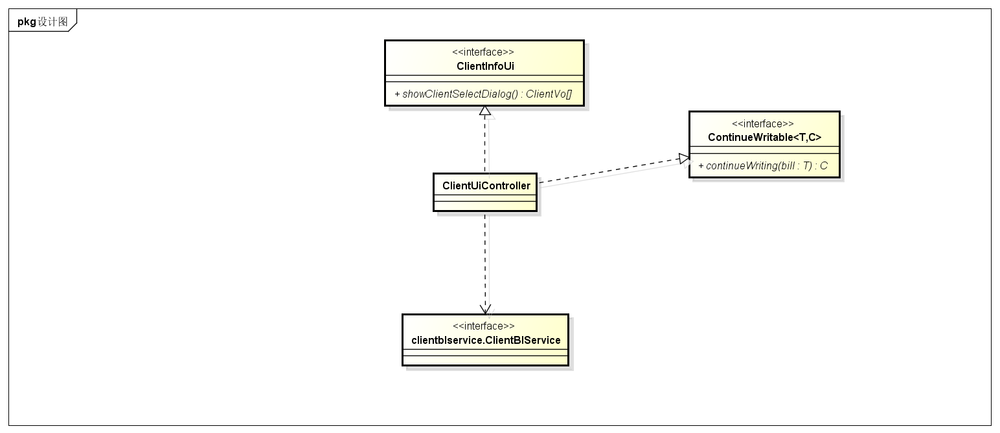
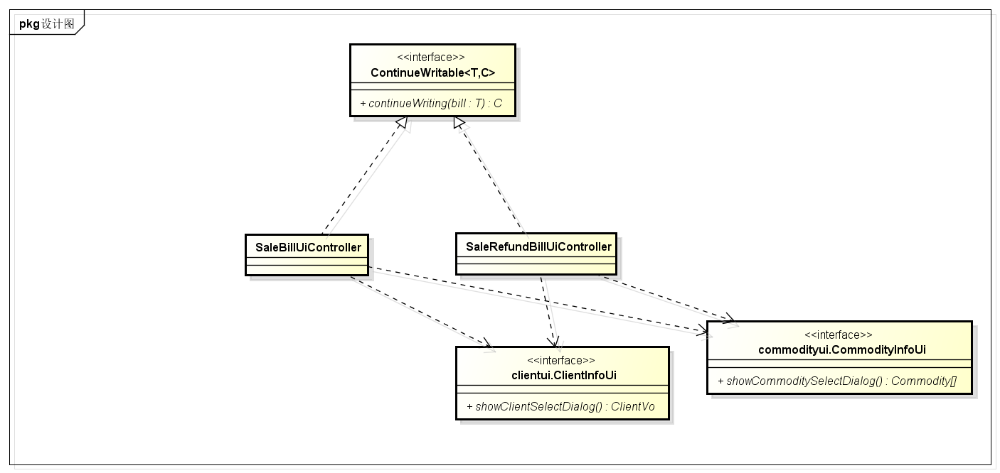

### 2.1.6 clientui包

#### 2.1.6.1 概述

clientui包负责进货销售人员管理客户的用例的UI界面以及响应控制代码。具体功能需求和非功能需求可参见需求规格说明文档和体系结构设计文档。

#### 2.1.6.2 整体结构

此包为展示层的一部分，它负责展示信息以及与用户的交互。它依赖它对应的clientblservice包与bl层进行交互。由于它有填写信息的用例，为了实现草稿箱、通知功能，它还需要实现ContinueWritable接口。

#### 2.1.6.3 设计

##### 2.1.6.3.1 设计图

clientui模块的设计如图

##### 2.1.6.3.2 各个类的职责

| 类名                 | 职责              |
| ------------------ | --------------- |
| ClientUiController | 负责管理客户界面的展示和功能。 |

##### 2.1.6.3.3 内部类的接口规范

**ClientUiController**

提供的接口

| 接口名称                                | 语法                                       | 前置条件        | 后置条件                           |
| ----------------------------------- | ---------------------------------------- | ----------- | ------------------------------ |
| ContinueWritable.continueWriting    | `public ClientUiController continueWriting(ClientVo bill);` | 需要继续填写客户信息。 | 初始化传入客户信息的内容。                  |
| ClientInfoUi.showClientSelectDialog | `public ClientVo showClientSelectDialog();` | 需要选择客户。     | 初始化一个选择客户对话框（包括模糊搜索功能和所有客户信息）。 |

需要的接口

| 接口名称                                     | 服务名       |
| ---------------------------------------- | --------- |
| `clientblservice.ClientBlService.query(String query);` | 查询客户。     |
| `clientblservice.ClientBlService.saveAsDraft(ClientVo client);` | 保存草稿      |
| `clientblservice.ClientBlService.getId(); ` | 提供新客户的ID。 |
| `clientblservice.ClientBlService.add(ClientVo client);` | 添加客户。     |
| `clientblservice.ClientBlService.delete(ClientVo[] client);` | 客户非空。     |

##### 2.1.6.3.4 展示层的动态模型

如下图所示的状态图描述了ClientVo对象的生存期间的状态序列、引起转移的事件，以及因转移而伴随的动作。
随着getId的方法被UI调用，ClientVo自动填入新的ID，进入正在填写状态，如果填写完成，就可以i进入审查状态，当审查完成后提交，ClientVo就可以进入被提交状态。

### 2.1.6 saleui包

#### 2.1.6.1 概述

saleui包负责进货销售人员与销售相关的用例（制定销售单、制定销售退货单）的UI界面以及响应控制代码。具体功能需求和非功能需求可参见需求规格说明文档和体系结构设计文档。

#### 2.1.6.2 整体结构

此包为展示层的一部分，它负责展示信息以及与用户的交互。它依赖它对应的saleblservice包与bl层进行交互。由于它有填写信息的用例，为了实现草稿箱、通知以及红冲功能，它还需要实现ContinueWritable接口。

#### 2.1.6.3 设计

##### 2.1.6.3.1 设计图

saleui模块的设计如图

##### 2.1.6.3.2 各个类的职责

| 类名                         | 职责                 |
| -------------------------- | ------------------ |
| SaleBillUiController       | 负责制定销售单界面的展示和功能。   |
| SaleRefundBillUiController | 负责制定销售退货单界面的展示和功能。 |

##### 2.1.6.3.3 内部类的接口规范

**SaleBillUiController**

提供的接口

| 接口名称                             | 语法                                       | 前置条件        | 后置条件        |
| -------------------------------- | ---------------------------------------- | ----------- | ----------- |
| ContinueWritable.continueWriting | `public SaleBillUiController continueWriting(SaleBillVo bill);` | 需要继续填写单据信息。 | 初始化传入单据的内容。 |

需要的接口

| 接口名称                                     | 服务名        |
| ---------------------------------------- | ---------- |
| `clientui.ClientInfoUi.showClientSelectDialog() ` | 选择客户。      |
| `commodity.CommodityInfoUi.showCommoditySelectDialog() ` | 选择商品。      |
| `salebl.SaleBillBlService.submit(SaleBillVO saleBill);` | 提交表单。      |
| `salebl.SaleBillBlService.saveAsDraft(SaleBillVO saleBill);` | 保存草稿。      |
| `salebl.SaleBillBlService.getId(); `     | 提供新单据的ID。  |
| `promotionbl.getPromotion(SaleBillVo saleBill); ` | 提供可用的销售策略。 |

**SaleRefundBillUiController**

提供的接口

| 接口名称                             | 语法                                       | 前置条件        | 后置条件        |
| -------------------------------- | ---------------------------------------- | ----------- | ----------- |
| ContinueWritable.continueWriting | `public SaleRefundBillUiController continueWriting(SaleRefundBillVo bill);` | 需要继续填写单据信息。 | 初始化传入单据的内容。 |

需要的接口

| 接口名称                                     | 服务名       |
| ---------------------------------------- | --------- |
| `clientui.ClientInfoUi.showClientSelectDialog() ` | 选择客户。     |
| `commodity.CommodityInfoUi.showCommoditySelectDialog() ` | 选择商品。     |
| `salebl.SaleRefundBillBlService.submit(SaleRefundBillVO saleRefundBill);` | 提交表单。     |
| `salebl.SaleRefundBillBlService.saveAsDraft(saleRefundBill saleBill);` | 保存草稿。     |
| `salebl.SaleRefundBillBlService.getId(); ` | 提供新单据的ID。 |

##### 2.1.6.3.4 展示层的动态模型

下图为填写销售单时的SaleBillVo对象的状态图。

下图为填写销售退货单时的SaleRefundBillVo对象的状态图。

### 2.1.6 inventorybl包

#### 2.1.6.1 概述

inventorybl包负责与库存相关的用例（制定进货单、制定进货退货单）的UI界面以及响应控制代码。具体功能需求和非功能需求可参见需求规格说明文档和体系结构设计文档。

#### 2.1.6.2 整体结构

此包为展示层的一部分，它负责展示信息以及与用户的交互。它依赖它对应的inventoryblservice包与bl层进行交互。由于它有填写信息的用例，为了实现草稿箱、通知以及红冲功能，它还需要实现ContinueWritable接口。

#### 2.1.6.3 设计

##### 2.1.6.3.1 设计图

##### 2.1.6.3.2 各个类的职责

| 类名                             | 职责                 |
| ------------------------------ | ------------------ |
| PurchaseBillUiController       | 负责制定进货单界面的展示和功能。   |
| PurchaseRefundBillUiController | 负责制定进货退货单界面的展示和功能。 |

##### 2.1.6.3.3 内部类的接口规范

**PurchaseBillUiController**

提供的接口

| 接口名称                             | 语法                                       | 前置条件        | 后置条件        |
| -------------------------------- | ---------------------------------------- | ----------- | ----------- |
| ContinueWritable.continueWriting | `public PurchaseBillUiController continueWriting(PurchaseBillVo bill);` | 需要继续填写单据信息。 | 初始化传入单据的内容。 |

需要的接口

| 接口名称                                     | 服务名       |
| ---------------------------------------- | --------- |
| `clientui.ClientInfoUi.showClientSelectDialog() ` | 选择客户。     |
| `commodity.CommodityInfoUi.showCommoditySelectDialog() ` | 选择商品。     |
| `inventorybl.PurchaseBillBlService.submit(PurchaseBillVo purchaseBill);` | 提交表单。     |
| `inventorybl.PurchaseBillBlService.saveAsDraft(PurchaseBillVo purchaseBill);` | 保存草稿。     |
| `inventorybl.PurchaseBillBlService.getId(); ` | 提供新单据的ID。 |

**PurchaseRefundBillUiController**

提供的接口

| 接口名称                             | 语法                                       | 前置条件        | 后置条件        |
| -------------------------------- | ---------------------------------------- | ----------- | ----------- |
| ContinueWritable.continueWriting | `public PurchaseRefundBillUiController continueWriting(PurchaseRefundBillUiController bill);` | 需要继续填写单据信息。 | 初始化传入单据的内容。 |

需要的接口

| 接口名称                                     | 服务名       |
| ---------------------------------------- | --------- |
| `clientui.ClientInfoUi.showClientSelectDialog() ` | 选择客户。     |
| `commodity.CommodityInfoUi.showCommoditySelectDialog() ` | 选择商品。     |
| `inventorybl.PurchaseRefundBillBlService.submit(PurchaseRefundBillVo purchaseBill);` | 提交表单。     |
| `inventorybl.PurchaseRefundBillBlService.saveAsDraft(PurchaseRefundBillVo purchaseBill);` | 保存草稿。     |
| `inventorybl.PurchaseRefundBillBlService.getId(); ` | 提供新单据的ID。 |

##### 2.1.6.3.4 展示层的动态模型

下图为填写进货单时的PurchaseBillVo对象的状态图。

下图为填写进货退货单时的PurchaseRefundBillVo对象的状态图。

