# Light x00 详细设计文档
By Trap x00

<!-- TOC -->

- [Light x00 详细设计文档](#light-x00-详细设计文档)
- [0. 更新日志](#0-更新日志)
- [1. 引言](#1-引言)
    - [1.1 编制目的](#11-编制目的)
    - [1.2 产品概述](#12-产品概述)
    - [1.3 体系结构设计概述](#13-体系结构设计概述)
- [2.结构视角](#2结构视角)
    - [2.1 展示层的分解](#21-展示层的分解)
        - [2.1.1 loginui包](#211-loginui包)
            - [2.1.1.1 概述](#2111-概述)
            - [2.1.1.2 整体架构](#2112-整体架构)
            - [2.1.1.3 设计](#2113-设计)
                - [2.1.1.3.1 设计图](#21131-设计图)
                - [2.1.1.3.2 各个类的职责](#21132-各个类的职责)
                - [2.1.1.3.3 内部类的接口规范](#21133-内部类的接口规范)
        - [2.1.2 inventoryui包](#212-inventoryui包)
            - [2.1.2.1 概述](#2121-概述)
            - [2.1.2.2 整体结构](#2122-整体结构)
            - [2.1.2.3 设计](#2123-设计)
                - [2.1.2.3.1 设计图](#21231-设计图)
                - [2.1.2.3.2 各个类的职责](#21232-各个类的职责)
                - [2.1.2.3.3 内部类的接口规范](#21233-内部类的接口规范)
                - [2.1.6.3.4 展示层的动态模型](#21634-展示层的动态模型)
        - [2.1.3 saleui包](#213-saleui包)
            - [2.1.3.1 概述](#2131-概述)
            - [2.1.3.2 整体结构](#2132-整体结构)
            - [2.1.3.3 设计](#2133-设计)
                - [2.1.3.3.1 设计图](#21331-设计图)
                - [2.1.3.3.2 各个类的职责](#21332-各个类的职责)
                - [2.1.3.3.3 内部类的接口规范](#21333-内部类的接口规范)
                - [2.1.3.3.4 展示层的动态模型](#21334-展示层的动态模型)
        - [2.1.4 commodityui包](#214-commodityui包)
            - [2.1.4.1 概述](#2141-概述)
            - [2.1.4.2 整体结构](#2142-整体结构)
            - [2.1.4.3 设计](#2143-设计)
                - [2.1.4.3.1 设计图](#21431-设计图)
                - [2.1.4.3.2 各个类的职责](#21432-各个类的职责)
                - [2.1.4.3.3 内部类的接口规范](#21433-内部类的接口规范)
        - [2.1.5 clientui包](#215-clientui包)
            - [2.1.5.1 概述](#2151-概述)
            - [2.1.5.2 整体结构](#2152-整体结构)
            - [2.1.5.3 设计](#2153-设计)
                - [2.1.5.3.1 设计图](#21531-设计图)
                - [2.1.5.3.2 各个类的职责](#21532-各个类的职责)
                - [2.1.5.3.3 内部类的接口规范](#21533-内部类的接口规范)
                - [2.1.5.3.4 展示层的动态模型](#21534-展示层的动态模型)
        - [2.1.6 financeui包](#216-financeui包)
            - [2.1.6.1 概述](#2161-概述)
            - [2.1.6.2 整体结构](#2162-整体结构)
            - [2.1.6.3 设计](#2163-设计)
                - [2.1.6.3.1 设计图](#21631-设计图)
                - [2.1.6.3.2 各个类的职责](#21632-各个类的职责)
                - [2.1.6.3.3 内部类的接口规范](#21633-内部类的接口规范)
                - [2.1.6.3.4 展示层的动态模型](#21634-展示层的动态模型-1)
        - [2.1.7 bankaccountui包](#217-bankaccountui包)
            - [2.1.7.1 概述](#2171-概述)
            - [2.1.7.2 整体结构](#2172-整体结构)
            - [2.1.7.3 设计](#2173-设计)
                - [2.1.7.3.1 设计图](#21731-设计图)
                - [2.1.7.3.2 各个类的职责](#21732-各个类的职责)
                - [2.1.7.3.3 内部类的接口规范](#21733-内部类的接口规范)
        - [2.1.8 draftui包](#218-draftui包)
            - [2.1.8.1 概述](#2181-概述)
            - [2.1.8.2 整体架构](#2182-整体架构)
            - [2.1.8.3 设计](#2183-设计)
                - [2.1.8.3.1 设计图](#21831-设计图)
                - [2.1.8.3.2 各个类的职责](#21832-各个类的职责)
                - [2.1.8.3.3 内部类的接口规范](#21833-内部类的接口规范)
        - [2.1.9 logui包](#219-logui包)
            - [2.1.9.1 概述](#2191-概述)
            - [2.1.9.2 整体架构](#2192-整体架构)
            - [2.1.9.3 设计](#2193-设计)
                - [2.1.9.3.1 设计图](#21931-设计图)
                - [2.1.9.3.2 各个类的职责](#21932-各个类的职责)
                - [2.1.9.3.3 内部类的接口规范](#21933-内部类的接口规范)
        - [2.1.10 notificationui包](#2110-notificationui包)
            - [2.1.10.1 概念](#21101-概念)
            - [2.1.10.2 整体架构](#21102-整体架构)
            - [2.1.10.3 设计](#21103-设计)
                - [2.1.10.3.1 设计图](#211031-设计图)
                - [2.1.10.3.2 各个类的职责](#211032-各个类的职责)
                - [2.1.10.3.3 内部类的接口规范](#211033-内部类的接口规范)
        - [2.1.11 adminui包](#2111-adminui包)
            - [2.1.11.1 概述](#21111-概述)
            - [2.1.11.2 整体架构](#21112-整体架构)
            - [2.1.11.3 设计](#21113-设计)
                - [2.1.11.3.1 设计图](#211131-设计图)
                - [2.1.11.3.2 各个类的职责](#211132-各个类的职责)
                - [2.1.11.3.3 内部类的接口规范](#211133-内部类的接口规范)
        - [2.1.12 promotionui包](#2112-promotionui包)
            - [2.1.12.1 概述](#21121-概述)
            - [2.1.12.2 整体架构](#21122-整体架构)
            - [2.1.12.3 设计](#21123-设计)
                - [2.1.12.3.1 设计图](#211231-设计图)
                - [2.1.12.3.2 各个类的职责](#211232-各个类的职责)
                - [2.1.12.3.3 内部类的接口规范](#211233-内部类的接口规范)
        - [2.1.13 approvalui包](#2113-approvalui包)
            - [2.1.13.1 概述](#21131-概述)
            - [2.1.13.2 整体架构](#21132-整体架构)
            - [2.1.13.3 设计](#21133-设计)
                - [2.1.13.3.1 设计图](#211331-设计图)
                - [2.1.13.3.2 各个类的职责](#211332-各个类的职责)
                - [2.2.13.3.3 内部类的接口规范](#221333-内部类的接口规范)
    - [2.2 业务逻辑层的分解](#22-业务逻辑层的分解)
        - [2.2.1 loginbl包](#221-loginbl包)
            - [2.2.1.1 概述](#2211-概述)
            - [2.2.1.2 整体架构](#2212-整体架构)
            - [2.2.1.3 设计](#2213-设计)
                - [2.2.1.3.1 设计图](#22131-设计图)
                - [2.2.1.3.2 各个类的职责](#22132-各个类的职责)
                - [2.2.1.3.3 内部类的接口规范](#22133-内部类的接口规范)
                - [2.2.1.3.4 业务逻辑层的动态模型](#22134-业务逻辑层的动态模型)
        - [2.2.2 inventorybl包](#222-inventorybl包)
            - [2.2.2.1 概述](#2221-概述)
            - [2.2.2.2 整体架构](#2222-整体架构)
            - [2.2.2.3 设计](#2223-设计)
                - [2.2.2.3.1 设计图](#22231-设计图)
                - [2.2.2.3.2 各个类的职责](#22232-各个类的职责)
                - [2.2.2.3.3 内部类的接口规范](#22233-内部类的接口规范)
                - [2.2.6.3.4  业务逻辑层的动态模型](#22634--业务逻辑层的动态模型)
        - [2.2.3 salebl包](#223-salebl包)
            - [2.2.3.1 概述](#2231-概述)
            - [2.2.3.2 整体架构](#2232-整体架构)
            - [2.2.3.3 设计](#2233-设计)
                - [2.2.3.3.1 设计图](#22331-设计图)
                - [2.2.3.3.2 各个类的职责](#22332-各个类的职责)
                - [2.2.3.3.3 内部类的接口规范](#22333-内部类的接口规范)
                - [2.2.3.3.4  业务逻辑层的动态模型](#22334--业务逻辑层的动态模型)
        - [2.2.4 commoditybl包](#224-commoditybl包)
            - [2.2.4.1 概述](#2241-概述)
            - [2.2.4.2 整体架构](#2242-整体架构)
            - [2.2.4.3 设计](#2243-设计)
                - [2.2.4.3.1 设计图](#22431-设计图)
                - [2.2.4.3.2 各个类的职责](#22432-各个类的职责)
                - [2.2.4.3.3 内部类的接口规范](#22433-内部类的接口规范)
        - [2.2.5 clientbl包](#225-clientbl包)
            - [2.2.5.1 概述](#2251-概述)
            - [2.2.5.2 整体架构](#2252-整体架构)
            - [2.2.5.3 设计](#2253-设计)
                - [2.2.5.3.1 设计图](#22531-设计图)
                - [2.2.5.3.2 各个类的职责](#22532-各个类的职责)
                - [2.2.5.3.3 内部类的接口规范](#22533-内部类的接口规范)
                - [2.2.5.3.4  业务逻辑层的动态模型](#22534--业务逻辑层的动态模型)
        - [2.2.6 financebl包](#226-financebl包)
            - [2.2.6.1 概述](#2261-概述)
            - [2.2.6.2 整体架构](#2262-整体架构)
            - [2.2.6.3 设计](#2263-设计)
                - [2.2.6.3.1 设计图](#22631-设计图)
                - [2.2.6.3.2 各个类的职责](#22632-各个类的职责)
                - [2.2.6.3.3 内部类的接口规范](#22633-内部类的接口规范)
                - [2.2.6.3.4 业务逻辑层的动态模型](#22634-业务逻辑层的动态模型)
        - [2.2.7 bankaccountbl包](#227-bankaccountbl包)
            - [2.2.7.1 概述](#2271-概述)
            - [2.2.7.2 整体架构](#2272-整体架构)
            - [2.2.7.3 设计](#2273-设计)
                - [2.2.7.3.1 设计图](#22731-设计图)
                - [2.2.7.3.2 各个类的职责](#22732-各个类的职责)
                - [2.2.7.3.3 内部类的接口规范](#22733-内部类的接口规范)
                - [2.2.7.3.4 业务逻辑层的动态模型](#22734-业务逻辑层的动态模型)
        - [2.2.8 draftbl包](#228-draftbl包)
            - [2.2.8.1 概述](#2281-概述)
            - [2.2.8.2 整体架构](#2282-整体架构)
            - [2.2.8.3 设计](#2283-设计)
                - [2.2.8.3.1 设计图](#22831-设计图)
                - [2.2.8.3.2 各个类的职责](#22832-各个类的职责)
                - [2.2.8.3.3 内部类的接口规范](#22833-内部类的接口规范)
                - [2.2.8.3.4 业务逻辑层的动态模型](#22834-业务逻辑层的动态模型)
        - [2.2.9 logbl包](#229-logbl包)
            - [2.2.9.1 概述](#2291-概述)
            - [2.2.9.2 整体架构](#2292-整体架构)
            - [2.2.9.3 设计](#2293-设计)
                - [2.2.9.3.1 设计图](#22931-设计图)
                - [2.2.9.3.2 各个类的职责](#22932-各个类的职责)
                - [2.2.9.3.3 内部类的接口规范](#22933-内部类的接口规范)
                - [2.2.9.3.4 业务逻辑层的动态模型](#22934-业务逻辑层的动态模型)
        - [2.2.10 notificationbl包](#2210-notificationbl包)
            - [2.2.10.1 概述](#22101-概述)
            - [2.2.10.2 整体架构](#22102-整体架构)
            - [2.2.10.3 设计](#22103-设计)
                - [2.2.10.3.1 设计图](#221031-设计图)
                - [2.2.10.3.2 各个类的职责](#221032-各个类的职责)
                - [2.2.10.3.3 内部类的接口规范](#221033-内部类的接口规范)
                - [2.2.10.3.4 业务逻辑层的动态模型](#221034-业务逻辑层的动态模型)
        - [2.2.11 adminbl包](#2211-adminbl包)
            - [2.2.11.1 概述](#22111-概述)
            - [2.2.11.2 整体架构](#22112-整体架构)
            - [2.2.11.3 设计](#22113-设计)
                - [2.2.11.3.1 设计图](#221131-设计图)
                - [2.2.11.3.2 各个类的职责](#221132-各个类的职责)
                - [2.2.11.3.3 内部类的接口规范](#221133-内部类的接口规范)
                - [2.2.11.3.4 业务逻辑层的动态模型](#221134-业务逻辑层的动态模型)
        - [2.2.12 promotionbl包](#2212-promotionbl包)
            - [2.2.12.1 概述](#22121-概述)
            - [2.2.12.2 整体架构](#22122-整体架构)
            - [2.2.12.3 设计](#22123-设计)
                - [2.2.12.3.1 设计图](#221231-设计图)
                - [2.2.12.3.2 各个类的职责](#221232-各个类的职责)
                - [2.2.12.3.3 内部类的接口规范](#221233-内部类的接口规范)
                - [2.2.12.3.4 业务逻辑层的动态模型](#221234-业务逻辑层的动态模型)
        - [2.2.13 approvalbl包](#2213-approvalbl包)
            - [2.2.13.1 概述](#22131-概述)
            - [2.2.13.2 整体架构](#22132-整体架构)
            - [2.2.13.3 设计](#22133-设计)
                - [2.2.13.3.1 设计图](#221331-设计图)
                - [2.2.13.3.2 各个类的职责](#221332-各个类的职责)
                - [2.2.13.3.3 内部类的接口规范](#221333-内部类的接口规范-1)
                - [2.2.13.3.4 业务逻辑层的动态模型](#221334-业务逻辑层的动态模型)
    - [2.3 数据层的分解](#23-数据层的分解)
        - [2.3.1 logindata包](#231-logindata包)
            - [2.3.1.1 概述](#2311-概述)
            - [2.3.1.2 整体架构](#2312-整体架构)
            - [2.3.1.3 设计](#2313-设计)
                - [2.3.1.3.1 设计图](#23131-设计图)
                - [2.3.1.3.2 各个类的职责](#23132-各个类的职责)
                - [2.3.1.3.3 内部类的接口规范](#23133-内部类的接口规范)
        - [2.3.2 inventorydata包](#232-inventorydata包)
            - [2.3.2.1 概述](#2321-概述)
            - [2.3.2.2 整体架构](#2322-整体架构)
            - [2.3.2.3 设计](#2323-设计)
                - [2.3.2.3.1 设计图](#23231-设计图)
                - [2.3.2.3.2 各个类的职责](#23232-各个类的职责)
                - [2.3.2.3.3 内部类的接口规范](#23233-内部类的接口规范)
        - [2.2.3 saledata包](#223-saledata包)
            - [2.2.3.1 概述](#2231-概述-1)
            - [2.2.3.2 整体架构](#2232-整体架构-1)
            - [2.2.3.3 设计](#2233-设计-1)
                - [2.2.3.3.1 设计图](#22331-设计图-1)
                - [2.2.3.3.2 各个类的职责](#22332-各个类的职责-1)
                - [2.2.3.3.3 内部类的接口规范](#22333-内部类的接口规范-1)
        - [2.3.4 commoditydata包](#234-commoditydata包)
            - [2.3.4.1 概述](#2341-概述)
            - [2.3.4.2 整体架构](#2342-整体架构)
            - [2.3.4.3 设计](#2343-设计)
                - [2.3.4.3.1 设计图](#23431-设计图)
                - [2.3.4.3.2 各个类的职责](#23432-各个类的职责)
                - [2.3.4.3.3 各个类的内部接口](#23433-各个类的内部接口)
        - [2.2.5 clientdata包](#225-clientdata包)
            - [2.2.5.1 概述](#2251-概述-1)
            - [2.2.5.2 整体架构](#2252-整体架构-1)
            - [2.2.5.3 设计](#2253-设计-1)
                - [2.2.5.3.1 设计图](#22531-设计图-1)
                - [2.2.5.3.2 各个类的职责](#22532-各个类的职责-1)
                - [2.2.5.3.3 内部类的接口规范](#22533-内部类的接口规范-1)
        - [2.3.6 financedata包](#236-financedata包)
            - [2.3.6.1 概述](#2361-概述)
            - [2.3.6.2 整体架构](#2362-整体架构)
            - [2.3.6.3 设计](#2363-设计)
                - [2.3.6.3.1 设计图](#23631-设计图)
                - [2.3.6.3.2 各个类的职责](#23632-各个类的职责)
                - [2.3.6.3.3 各个类的内部接口](#23633-各个类的内部接口)
        - [2.3.7 bankaccountdata包](#237-bankaccountdata包)
            - [2.3.7.1 概述](#2371-概述)
            - [2.3.7.2 整体架构](#2372-整体架构)
            - [2.3.7.3 设计](#2373-设计)
                - [2.3.7.3.1 设计图](#23731-设计图)
                - [2.3.7.3.2 各个类的职责](#23732-各个类的职责)
                - [2.3.7.3.3 内部类的接口规范](#23733-内部类的接口规范)
        - [2.3.8 draftdata包](#238-draftdata包)
            - [2.3.8.1 概述](#2381-概述)
            - [2.3.8.2 整体架构](#2382-整体架构)
            - [2.3.8.3 设计](#2383-设计)
                - [2.3.8.3.1 设计图](#23831-设计图)
                - [2.3.8.3.2 各个类的职责](#23832-各个类的职责)
                - [2.3.8.3.3 内部类的接口规范](#23833-内部类的接口规范)
        - [2.3.9 logdata包](#239-logdata包)
            - [2.3.9.1 概述](#2391-概述)
            - [2.3.9.2 整体架构](#2392-整体架构)
            - [2.3.9.3 设计](#2393-设计)
                - [2.3.9.3.1 设计图](#23931-设计图)
                - [2.3.9.3.2 各个类的职责](#23932-各个类的职责)
                - [2.3.9.3.3 内部类的接口规范](#23933-内部类的接口规范)
        - [2.3.10 notificationdata包](#2310-notificationdata包)
            - [2.3.10.1 概述](#23101-概述)
            - [2.3.10.2 整体架构](#23102-整体架构)
            - [2.3.10.3 设计](#23103-设计)
                - [2.3.10.3.1 设计图](#231031-设计图)
                - [2.3.10.3.2 各个类的职责](#231032-各个类的职责)
                - [2.3.10.3.3 内部类的接口规范](#231033-内部类的接口规范)
        - [2.3.11 admindata包](#2311-admindata包)
            - [2.3.11.1 概述](#23111-概述)
            - [2.3.11.2 整体架构](#23112-整体架构)
            - [2.3.11.3 设计](#23113-设计)
                - [2.3.11.3.1 设计图](#231131-设计图)
                - [2.3.11.3.2 各个类的职责](#231132-各个类的职责)
                - [2.3.11.3.3 内部类的接口规范](#231133-内部类的接口规范)
        - [2.3.12 promotiondata包](#2312-promotiondata包)
            - [2.3.12.1 概述](#23121-概述)
            - [2.3.12.2 整体结构](#23122-整体结构)
            - [2.3.12.3 设计](#23123-设计)
                - [2.3.12.3.1 设计图](#231231-设计图)
                - [2.3.12.3.2 各个类的职责](#231232-各个类的职责)
                - [2.3.12.3.3 内部类的接口规范](#231233-内部类的接口规范)
        - [2.3.13 approvaldata包](#2313-approvaldata包)
            - [2.3.13.1 概述](#23131-概述)
            - [2.3.13.2 整体架构](#23132-整体架构)
            - [2.3.13.3 设计](#23133-设计)
                - [2.3.13.3.1 设计图](#231331-设计图)
                - [2.3.13.3.2 各个类的职责](#231332-各个类的职责)
                - [2.3.13.3.3 内部类的接口规范](#231333-内部类的接口规范)
        - [2.3.14 data.util.serverlogservice包](#2314-datautilserverlogservice包)
            - [2.3.14.1 概述](#23141-概述)
            - [2.3.14.2 整体架构](#23142-整体架构)
            - [2.3.14.3 设计](#23143-设计)
                - [2.3.14.3.1 设计图](#231431-设计图)
                - [2.3.14.3.2 各个类的职责](#231432-各个类的职责)
                - [2.3.14.3.3 内部类的接口规范](#231433-内部类的接口规范)
                - [2.3.14.3.4 数据层的动态模型](#231434-数据层的动态模型)
- [3. 依赖视角](#3-依赖视角)

<!-- /TOC -->

# 0. 更新日志

| 修改人员 | 日期         | 变更原因  | 版本号  |
| ---- | ---------- | ----- | ---- |
| 陈俊达  | 2017/10/29 | 完成模板。 | V0.1 |
| 张凌哲  | 2017/10/30 | 整合文档。 | V1.0 |
| 所有人  | 2017/11/13 | 大幅度修改设计。 | V2.0 |

# 1. 引言

## 1.1 编制目的

本报告详细完成灯具照明行业进销存系统的详细设计，达到指导后续软件构造的目的，同时实现和测试人员及用户的沟通。

本报告面向开发人员、测试人员及最终用户而编写，是了解系统的导航。

## 1.2 产品概述

参考灯具照明行业进销存系统用例文档和灯具照明行业进销存系统软件规格说明中对产品的概括描述。

## 1.3 体系结构设计概述

参考进销存系统需求文档对体系结构设计的概述。

# 2.结构视角

## 2.1 展示层的分解

展示层开发包图、模块职责等请参考体系结构描述文档5.2节。

### 2.1.1 loginui包

#### 2.1.1.1 概述

loginui包负责系统登录的用例的UI界面以及响应控制代码。具体功能需求和非功能需求可参见需求规格说明文档和体系结构设计文档。

#### 2.1.1.2 整体架构

此包为展示层的一部分，它负责用户登录过程中展示信息以及与用户的交互。它依赖它对应的loginblservice包与bl层进行交互。

#### 2.1.1.3 设计

##### 2.1.1.3.1 设计图

##### 2.1.1.3.2 各个类的职责

| 类名                | 职责            |
| ----------------- | ------------- |
| LoginUiController | 负责登录界面的展示和功能。 |

##### 2.1.1.3.3 内部类的接口规范

**LoginUiController**

需要的接口

| 接口名称                                     | 服务名  |
| ---------------------------------------- | ---- |
| `loginblservice.LoginBlService.login(String username, String password)` | 登录。  |

### 2.1.2 inventoryui包

#### 2.1.2.1 概述

inventoryui包负责库存管理相关等功能的UI的展示和功能实现。具体功能需求和非功能需求可参见需求规格说明文档和体系结构设计文档。

#### 2.1.2.2 整体结构

此包为展示层的一部分，它负责展示信息以及与用户的交互。它依赖它对应的inventoryblservice包与bl层进行交互。

#### 2.1.2.3 设计

##### 2.1.2.3.1 设计图

##### 2.1.2.3.2 各个类的职责

| 类名                             | 职责                                   |
| ------------------------------ | ------------------------------------ |
| InventoryCheckUiController     | 负责库存查看界面的展示和功能。                      |
| InventoryGiftUiController      | 负责商品赠送界面的展示和功能。                      |
| InventoryWarningUiController   | 负责库存监控界面的展示和功能。                      |
| InventoryBillServiceUi         | 负责实现为其他包提供查询获取报损、报溢、报警、赠送单据界面的展示和功能。 |
| PurchaseBillUiController       | 负责制定进货单界面的展示和功能。                     |
| PurchaseRefundBillUiController | 负责制定进货退货单界面的展示和功能。                   |

##### 2.1.2.3.3 内部类的接口规范

**InventoryCheckUiController**

需要的接口

| 接口名称                                     | 服务名         |
| ---------------------------------------- | ----------- |
| `inventoryblservice.InventoryCheckBlService.check(Date beginTime, Date endTime)` | 提供时间段内库存变化。 |
| `inventoryblservice.InventoryCheckBlService.picture()` | 提供当日库存快照。   |
| `inventoryblservice.InventoryCheckBlService.export(File newfile)` | 导出Excel。    |

**InventoryGiftUiController**

需要的接口

| 接口名称                                     | 服务名           |
| ---------------------------------------- | ------------- |
| `inventoryblservice.InventoryGiftBlService.getGift(Date time);` | 提供满足促销条件的赠送单。 |
| `InventoryGiftBlService.getId`           | 得到ID。         |
| `inventoryblservice.InventoryGiftBlService.getAllCommodity();` | 选择商品。         |
| `inventoryblservice.InventoryGiftBlService.submit(InventoryGiftVo inventoryGiftVo)` | 提交完成赠送单。      |

**InventoryWarningUiController**

提供的接口

| 接口名称                             | 语法                                       | 前置条件            | 后置条件        |
| -------------------------------- | ---------------------------------------- | --------------- | ----------- |
| ContinueWritable.continueWriting | `public InventoryWarningUiController continueWriting(InventoryBillVo bill);` | 输入有效的用于继续填写的单据。 | 初始化传入单据的内容。 |

需要的接口

| 接口名称                                     | 服务名     |
| ---------------------------------------- | ------- |
| `inventoryblservice.InventoryWarningBlService.submit(InventoryBillVo bill)` | 提交单据。   |
| `inventoryblservice.InventoryWarningBlService.saveAsDraft(InventoryBillVo bill)` | 保存草稿。   |
| `inventoryblservice.InventoryWarningBlService.modify(CommodityVo commodity，double modifyWarning)` | 修改警戒值。  |
| `inventoryblservice.InventoryWarningBlService.getCurrentBill()` | 得到现有单据。 |
| `inventoryblservice.InventoryWarningBlService.query(InventoryBillQueryVo inventoryBillQueryVo)` | 查询单据。   |
| `inventoryblservice.InventoryWarningBlService.getId()` | 提供ID。   |
| `inventoryblservice.InventoryWarningBlService.getAllCommodity()` | 提供商品。   |

**PurchaseBillUiController**

提供的接口

| 接口名称                             | 语法                                       | 前置条件        | 后置条件        |
| -------------------------------- | ---------------------------------------- | ----------- | ----------- |
| ContinueWritable.continueWriting | `public PurchaseBillUiController continueWriting(PurchaseBillVo bill);` | 需要继续填写单据信息。 | 初始化传入单据的内容。 |

需要的接口

| 接口名称                                     | 服务名       |
| ---------------------------------------- | --------- |
| `clientui.ClientInfoUi.showClientSelectDialog() ` | 选择客户。     |
| `commodity.CommodityInfoUi.showCommoditySelectDialog() ` | 选择商品。     |
| `inventorybl.PurchaseBillBlService.submit(PurchaseBillVo purchaseBill);` | 提交表单。     |
| `inventorybl.PurchaseBillBlService.saveAsDraft(PurchaseBillVo purchaseBill);` | 保存草稿。     |
| `inventorybl.PurchaseBillBlService.getId(); ` | 提供新单据的ID。 |

**PurchaseRefundBillUiController**

提供的接口

| 接口名称                             | 语法                                       | 前置条件        | 后置条件        |
| -------------------------------- | ---------------------------------------- | ----------- | ----------- |
| ContinueWritable.continueWriting | `public PurchaseRefundBillUiController continueWriting(PurchaseRefundBillUiController bill);` | 需要继续填写单据信息。 | 初始化传入单据的内容。 |

需要的接口

| 接口名称                                     | 服务名       |
| ---------------------------------------- | --------- |
| `clientui.ClientInfoUi.showClientSelectDialog() ` | 选择客户。     |
| `commodity.CommodityInfoUi.showCommoditySelectDialog() ` | 选择商品。     |
| `inventorybl.PurchaseRefundBillBlService.submit(PurchaseRefundBillVo purchaseBill);` | 提交表单。     |
| `inventorybl.PurchaseRefundBillBlService.saveAsDraft(PurchaseRefundBillVo purchaseBill);` | 保存草稿。     |
| `inventorybl.PurchaseRefundBillBlService.getId(); ` | 提供新单据的ID。 |

##### 2.1.6.3.4 展示层的动态模型

下图为填写进货单时的PurchaseBillVo对象的状态图。

下图为填写进货退货单时的PurchaseRefundBillVo对象的状态图。

### 2.1.3 saleui包

#### 2.1.3.1 概述

saleui包负责进货销售人员与销售相关的用例（制定销售单、制定销售退货单）的UI界面以及响应控制代码。具体功能需求和非功能需求可参见需求规格说明文档和体系结构设计文档。

#### 2.1.3.2 整体结构

此包为展示层的一部分，它负责展示信息以及与用户的交互。它依赖它对应的saleblservice包与bl层进行交互。由于它有填写信息的用例，为了实现草稿箱、通知以及红冲功能，它还需要实现ContinueWritable接口。

#### 2.1.3.3 设计

##### 2.1.3.3.1 设计图

##### 2.1.3.3.2 各个类的职责

| 类名                         | 职责                 |
| -------------------------- | ------------------ |
| SaleBillUiController       | 负责制定销售单界面的展示和功能。   |
| SaleRefundBillUiController | 负责制定销售退货单界面的展示和功能。 |

##### 2.1.3.3.3 内部类的接口规范

**SaleBillUiController**

提供的接口

| 接口名称                             | 语法                                       | 前置条件        | 后置条件        |
| -------------------------------- | ---------------------------------------- | ----------- | ----------- |
| ContinueWritable.continueWriting | `public SaleBillUiController continueWriting(SaleBillVo bill);` | 需要继续填写单据信息。 | 初始化传入单据的内容。 |

需要的接口

| 接口名称                                     | 服务名        |
| ---------------------------------------- | ---------- |
| `clientui.ClientInfoUi.showClientSelectDialog() ` | 选择客户。      |
| `commodity.CommodityInfoUi.showCommoditySelectDialog() ` | 选择商品。      |
| `salebl.SaleBillBlService.submit(SaleBillVO saleBill);` | 提交表单。      |
| `salebl.SaleBillBlService.saveAsDraft(SaleBillVO saleBill);` | 保存草稿。      |
| `salebl.SaleBillBlService.getId(); `     | 提供新单据的ID。  |
| `promotionbl.getPromotion(SaleBillVo saleBill); ` | 提供可用的销售策略。 |

**SaleRefundBillUiController**

提供的接口

| 接口名称                             | 语法                                       | 前置条件        | 后置条件        |
| -------------------------------- | ---------------------------------------- | ----------- | ----------- |
| ContinueWritable.continueWriting | `public SaleRefundBillUiController continueWriting(SaleRefundBillVo bill);` | 需要继续填写单据信息。 | 初始化传入单据的内容。 |

需要的接口

| 接口名称                                     | 服务名       |
| ---------------------------------------- | --------- |
| `clientui.ClientInfoUi.showClientSelectDialog() ` | 选择客户。     |
| `commodity.CommodityInfoUi.showCommoditySelectDialog() ` | 选择商品。     |
| `salebl.SaleRefundBillBlService.submit(SaleRefundBillVO saleRefundBill);` | 提交表单。     |
| `salebl.SaleRefundBillBlService.saveAsDraft(saleRefundBill saleBill);` | 保存草稿。     |
| `salebl.SaleRefundBillBlService.getId(); ` | 提供新单据的ID。 |

##### 2.1.3.3.4 展示层的动态模型

下图为填写销售单时的SaleBillVo对象的状态图。

下图为填写销售退货单时的SaleRefundBillVo对象的状态图。

### 2.1.4 commodityui包

#### 2.1.4.1 概述

commoditybl包负责库存管理人员商品管理、商品分类管理的的UI界面以及响应控制代码。具体功能需求和非功能需求可参见需求规格说明文档和体系结构设计文档。

#### 2.1.4.2 整体结构

此包为展示层的一部分，它负责展示信息以及与用户的交互。它依赖它对应的commodityblservice包与bl层进行交互。

#### 2.1.4.3 设计

##### 2.1.4.3.1 设计图

##### 2.1.4.3.2 各个类的职责

| 类名                        | 职责                   |
| ------------------------- | -------------------- |
| CommodityUiController     | 负责商品管理界面的展示和功能。      |
| CommoditySortUiController | 负责商品分类管理界面的展示和功能。    |
| CommodityServicUi         | 提供给其他商品及其分类界面的展示和功能。 |

##### 2.1.4.3.3 内部类的接口规范

**CommodityUiController**

需要的接口

| 接口名称                                     | 服务名    |
| ---------------------------------------- | ------ |
| `commodityblservice.CommodityBlService.add(CommodityVo newCommodity)` | 提交新商品。 |
| `commodityblservice.CommodityBlService.modify(CommodityVo commodity)` | 修改商品。  |
| `commodityblservice.CommodityBlService.query(CommdoityQueryVo commodityQueryVo)` | 查询商品   |
| `commodityblservice.CommodityBlService.delete(CommodityVo commodity)` | 删除商品。  |

**CommoditySortUiController**

需要的接口

| 接口名称                                     | 服务名       |
| ---------------------------------------- | --------- |
| `commodityblservice.CommoditySortBlService.add(CommoditySortVo newSort,CommoditySortVo parentSort)` | 提交新分类。    |
| `commodityblservice.CommoditySortBlService.modify(CommoditySortVo sort)` | 修改分类。     |
| `commodityblservice.CommoditySortBlService.query(CommoditySortQuerVo commoditySortQueryVo)` | 查询分类信息。   |
| `commodityblservice.CommoditySortBlService.delete(CommoditySortVo sort)` | 删除分类。     |
| `commodityblservice.CommoditySortBlService.display();` | 显示所有父类。   |
| `commodityblservice.CommoditySortBlService.display(CommoditySortVo commoditySort)` | 显示父类下的子类。 |

### 2.1.5 clientui包

#### 2.1.5.1 概述

clientui包负责进货销售人员管理客户的用例的UI界面以及响应控制代码。具体功能需求和非功能需求可参见需求规格说明文档和体系结构设计文档。

#### 2.1.5.2 整体结构

此包为展示层的一部分，它负责展示信息以及与用户的交互。它依赖它对应的clientblservice包与bl层进行交互。由于它有填写信息的用例，为了实现草稿箱、通知功能，它还需要实现ContinueWritable接口。

#### 2.1.5.3 设计

##### 2.1.5.3.1 设计图

##### 2.1.5.3.2 各个类的职责

| 类名                 | 职责              |
| ------------------ | --------------- |
| ClientUiController | 负责管理客户界面的展示和功能。 |

##### 2.1.5.3.3 内部类的接口规范

**ClientUiController**

提供的接口

| 接口名称                                | 语法                                       | 前置条件        | 后置条件                           |
| ----------------------------------- | ---------------------------------------- | ----------- | ------------------------------ |
| ContinueWritable.continueWriting    | `public ClientUiController continueWriting(ClientVo bill);` | 需要继续填写客户信息。 | 初始化传入客户信息的内容。                  |
| ClientInfoUi.showClientSelectDialog | `public ClientVo showClientSelectDialog();` | 需要选择客户。     | 初始化一个选择客户对话框（包括模糊搜索功能和所有客户信息）。 |

需要的接口

| 接口名称                                     | 服务名       |
| ---------------------------------------- | --------- |
| `clientblservice.ClientBlService.query(String query);` | 查询客户。     |
| `clientblservice.ClientBlService.saveAsDraft(ClientVo client);` | 保存草稿      |
| `clientblservice.ClientBlService.getId(); ` | 提供新客户的ID。 |
| `clientblservice.ClientBlService.add(ClientVo client);` | 添加客户。     |
| `clientblservice.ClientBlService.modify(ClientVo client);` | 修改客户。     |
| `clientblservice.ClientBlService.delete(String[] id);` | 删除客户。     |

##### 2.1.5.3.4 展示层的动态模型

如下图所示的状态图描述了ClientVo对象的生存期间的状态序列、引起转移的事件，以及因转移而伴随的动作。
随着getId的方法被UI调用，ClientVo自动填入新的ID，进入正在填写状态，如果填写完成，就可以i进入审查状态，当审查完成后提交，ClientVo就可以进入被提交状态。

### 2.1.6 financeui包

#### 2.1.6.1 概述

financeui包负责财务人员除了银行账户管理外的用例（制定收款单、制定付款单、制定现金费用单、查看经营情况表、查看经营历程表、查看销售情况表、红冲以及期初建账）的UI界面以及响应控制代码。具体功能需求和非功能需求可参见需求规格说明文档和体系结构设计文档。

#### 2.1.6.2 整体结构

此包为展示层的一部分，它负责展示信息以及与用户的交互。它依赖它对应的financeblservice包与bl层进行交互。由于它有填写单据的用例，为了实现草稿箱、通知以及红冲功能，它还需要实现ContinueWritable接口。同时，填写单据的用例中需要选择客户，它还依赖clientui包所提供的选择客户的接口。

#### 2.1.6.3 设计

##### 2.1.6.3.1 设计图

##### 2.1.6.3.2 各个类的职责

| 类名                         | 职责                         |
| -------------------------- | -------------------------- |
| PaymentBillUiController    | 负责管理填写付款单界面的展示和功能。         |
| ReceivalBillUiController   | 负责管理填写收款单界面的展示和功能。         |
| CashBillUiController       | 负责管理填写现金费用单界面的展示和功能。       |
| SystemSnapshotUiController | 负责管理期初建账界面的展示和功能。          |
| SaleDetailUiController     | 负责管理销售明细表界面的展示和功能。         |
| TradeHistoryUiController   | 负责管理经营历程表界面的展示和功能（包括红冲功能）。 |
| TradeSituationUiController | 负责管理经营情况表界面的展示和功能。         |

##### 2.1.6.3.3 内部类的接口规范

**PaymentBillUiController**

提供的接口

| 接口名称                             | 语法                                       | 前置条件           | 后置条件        |
| -------------------------------- | ---------------------------------------- | -------------- | ----------- |
| ContinueWritable.continueWriting | `public FillBillUiController continueWriting(Draftable bill);` | 输入有效的用于继续填写单据。 | 初始化传入单据的内容。 |

需要的接口

| 接口名称                                     | 服务名        |
| ---------------------------------------- | ---------- |
| `bankaccountui.BankAccountInfoUi.showBankAccountSelectDialog()` | 选择银行账户。    |
| `clientui.ClientInfoUi.showClientSelectDialog() ` | 选择客户。      |
| `financeblservice.PaymentBillBlService.submit(PaymentBillVo bill)` | 提交单据。      |
| `financeblservice.PaymentBillBlService.saveAsDraft(PaymentBillVo bill)` | 保存草稿。      |
| `financeblservice.PaymentBillBlService.getId()` | 获得当前单据的ID。 |

**ReceivalBillUiController**

提供的接口

| 接口名称                             | 语法                                       | 前置条件            | 后置条件        |
| -------------------------------- | ---------------------------------------- | --------------- | ----------- |
| ContinueWritable.continueWriting | `public FillBillUiController continueWriting(Draftable bill);` | 输入有效的用于继续填写的单据。 | 初始化传入单据的内容。 |

需要的接口

| 接口名称                                     | 服务名        |
| ---------------------------------------- | ---------- |
| `bankaccountui.BankAccountInfoUi.showBankAccountSelectDialog()` | 选择银行账户。    |
| `clientui.ClientInfoUi.showClientSelectDialog() ` | 选择客户。      |
| `financeblservice.ReceivalBillBlService.submit(ReceivalBillVo bill)` | 提交单据。      |
| `financeblservice.ReceivalBillBlService.saveAsDraft(ReceivalBillVo bill)` | 保存草稿。      |
| `financeblservice.ReceivalBillBlService.getId()` | 获得当前单据的ID。 |

**CashBillUiController**

提供的接口

| 接口名称                             | 语法                                       | 前置条件            | 后置条件        |
| -------------------------------- | ---------------------------------------- | --------------- | ----------- |
| ContinueWritable.continueWriting | `public FillBillUiController continueWriting(Draftable bill);` | 输入有效的用于继续填写的单据。 | 初始化传入单据的内容。 |

需要的接口

| 接口名称                                     | 服务名        |
| ---------------------------------------- | ---------- |
| `bankaccountui.BankAccountInfoUi.showBankAccountSelectDialog()` | 选择银行账户。    |
| `financeblservice.CashBillBlService.submit(CashBillVo bill)` | 提交单据。      |
| `financeblservice.CashBillBlService.saveAsDraft(CashBillVo bill)` | 保存草稿。      |
| `financeblservice.CashBillBlService.getId() ` | 获得当前单据的ID。 |

**InitialEstablishmentUiController**

提供的接口

| 接口名称                             | 语法                                       | 前置条件           | 后置条件        |
| -------------------------------- | ---------------------------------------- | -------------- | ----------- |
| ContinueWritable.continueWriting | `public FillBillUiController continueWriting(Draftable bill);` | 输入有效的用于继续填写的账。 | 初始化传入单据的内容。 |

需要的接口

| 接口名称                                     | 服务名                                      |
| ---------------------------------------- | ---------------------------------------- |
| `financeblservice.InitialEstablishmentBlService.autofill()` | 返回现有系统信息（所有商品信息、单据信息、银行账户信息）。            |
| `financeblservice.InitialEstablishmentBlService.submit(SystemSnapshotVo snapshot)` | 提交账。                                     |
| `financeblservice.InitialEstablishmentBlService.saveAsDraft(SystemSnapshotVo snapshot)` | `public ResultMessage saveAsDraft(SystemSnapshotVo snapshot);` |

**SaleDetailUiController**

需要的接口

| 接口名称                                     | 服务名     |
| ---------------------------------------- | ------- |
| `clientui.ClientInfoUi.showClientSelectDialog() ` | 选择客户。   |
| `adminui.AdminInfoUi.showEmployeeSelectDialog()` | 选择操作员。  |
| `financeblservice.SaleDetailBlService.query(SaleDetailQueryVo query)` | 查询销售情况。 |
| `financeblservice.SaleDetailBlService.export(SaleDetailVo detail)` | 导出报表。   |

**TradeHistoryUiController**

需要的接口

| 接口名称                                     | 服务名          |
| ---------------------------------------- | ------------ |
| `clientui.ClientInfoUi.showClientSelectDialog() ` | 选择客户。        |
| `adminui.AdminInfoUi.showEmployeeSelectDialog()` | 选择操作员。       |
| `financeblservice.TradeHistoryBlService.query(TradeHistoryQueryVo query)` | 查询经营历程。      |
| `financeblservice.TradeHistoryBlService.export(TradeHistoryVo history)` | 查询经营历程。      |
| `helpui.ContinueWritable.continueWriting(T bill)` | 用于红冲时继续填写单据。 |

**TradeSituationUiController**

需要的接口

| 接口名称                                     | 服务名     |
| ---------------------------------------- | ------- |
| `financeblservice.TradeSituationBlService.query(TradeSituationQueryVo query)` | 查询经营情况。 |
| `financeblservice.TradeSituationBlService.export(TradeSituationVo situation)` | 导出。     |

##### 2.1.6.3.4 展示层的动态模型

下图为填写付款单时的PaymentBillVo对象的状态图。其他单据Vo对象同理。

### 2.1.7 bankaccountui包

#### 2.1.7.1 概述

bankaccountui包负责银行账户管理相关的UI的展示和功能实现。具体功能需求和非功能需求可参见需求规格说明文档和体系结构设计文档。

#### 2.1.7.2 整体结构

此包为展示层的一部分，它负责展示信息以及与用户的交互。它依赖它对应的financeblservice包与bl层进行交互。

#### 2.1.7.3 设计

##### 2.1.7.3.1 设计图

##### 2.1.7.3.2 各个类的职责

| 类名                      | 职责                |
| ----------------------- | ----------------- |
| BankAccountUiController | 负责管理银行账户的展示和功能实现。 |

##### 2.1.7.3.3 内部类的接口规范

**BankAccountUiController**

提供的接口

| 接口名称                                     | 语法                                       | 前置条件 | 后置条件         |
| ---------------------------------------- | ---------------------------------------- | ---- | ------------ |
| BankAccountInfoUi.showBankAccountSelectDialog | `public BankAccountVo[] showBankAccountSelectDialog();` | 无。   | 弹出选择银行账户的窗口。 |

需要的接口

| 接口名称                                     | 服务名     |
| ---------------------------------------- | ------- |
| `bankaccountblservice.BankAccountManagementBlService.add(BankAccountVo newAccount)` | 添加账户信息。 |
| `bankaccountblservice.BankAccountManagementBlService.modify(BankAccountVo newAccount)` | 修改账户信息。 |
| `bankaccountblservice.BankAccountManagementBlService.query(BankAccountQueryVo query)` | 查询账户信息。 |
| `bankaccountblservice.BankAccountManagementBlService.delete(BankAccountVo account)` | 删除账户信息。 |

### 2.1.8 draftui包

#### 2.1.8.1 概述

draftui包负责草稿箱功能的UI界面以及响应控制代码。具体功能需求和非功能需求可参见需求规格说明文档和体系结构设计文档。

#### 2.1.8.2 整体架构

此包为展示层的一部分，它负责草稿箱的功能与实现。它依赖它对应的draftblservice与bl层交互以管理草稿数据，也需要其他填写单据UI包的支持以实现继续填写的功能。

#### 2.1.8.3 设计

##### 2.1.8.3.1 设计图

##### 2.1.8.3.2 各个类的职责

| 类名                | 职责            |
| ----------------- | ------------- |
| DraftUiController | 负责草稿界面的展示和功能。 |

##### 2.1.8.3.3 内部类的接口规范

**DraftUiController**

需要的接口

| 接口名称                                     | 服务名         |
| ---------------------------------------- | ----------- |
| `draftblservice.DraftBlService.update()` | 获得当前用户所有单据。 |
| `draftblservice.DraftBlService.delete(Draftable draft)` | 删除选中单据。     |
| `ContinueWritable.continueWriting(Draftable draft)` | 继续填写所选单据。   |

### 2.1.9 logui包

#### 2.1.9.1 概述

logui包负责查看日志的UI界面以及相应控制代码。具体功能需求和非功能需求可参见需求规格说明文档和体系结构设计文档。

#### 2.1.9.2 整体架构

此包为展示层的一部分，它负责草稿箱的功能和实现。它依赖它对应的logblservice与bl层交互以获得日志信息。

#### 2.1.9.3 设计

##### 2.1.9.3.1 设计图

##### 2.1.9.3.2 各个类的职责

| 类名              | 职责            |
| --------------- | ------------- |
| LogUiController | 负责日志界面的展示和功能。 |

##### 2.1.9.3.3 内部类的接口规范

**LogUiController**

需要的接口

| 接口名称                                     | 服务名   |
| ---------------------------------------- | ----- |
| `logblservice.LogBlService.query(LogQueryVo query)` | 查询日志。 |

### 2.1.10 notificationui包

#### 2.1.10.1 概念

notificationui包负责通知功能的UI界面以及相应控制代码。具体功能需求和肺功能需求可参见需求规格说明文档和体系结构设计文档。

#### 2.1.10.2 整体架构

此包为展示层的一部分，它负责通知的功能和实现。它依赖它对应的notificationblservice层与bl层交互以进行响应操作。同时也需要其他填写单据UI包的支持以实现继续填写的功能。

#### 2.1.10.3 设计

##### 2.1.10.3.1 设计图

##### 2.1.10.3.2 各个类的职责

| 类名                       | 职责            |
| ------------------------ | ------------- |
| NotificationUiController | 负责通知界面的展示和功能。 |

##### 2.1.10.3.3 内部类的接口规范

**NotificationUiController**

需要的接口

| 接口名称                                     | 服务名       |
| ---------------------------------------- | --------- |
| `notificationblservice.NotificationBlService.update(NotificationQueryVo query)` | 更新通知。     |
| `notificationblservice.NotificationBlService.acknowledge(NotificationVo notification)` | 已读通知。     |
| `notificationblservice.NotificationBlService.abandon(NotificationVo notification)` | 丢弃单据通知。   |
| `ContinueWritable.continueWriting(Draftable draft)` | 继续填写所选单据。 |

### 2.1.11 adminui包

#### 2.1.11.1 概述

adminui包负责管理员管理用户的用例的UI界面以及相应控制代码。具体功能需求和非功能需求可参见需求规格说明文档和体系结构设计文档。

#### 2.1.11.2 整体架构

adminui包为展示层的一部分，它负责展示信息以及与用户的交互。它依赖它对应的adminblservice包与bl层进行交互。它需要给财务人员提供选择职员的接口。

#### 2.1.11.3 设计

##### 2.1.11.3.1 设计图

##### 2.1.11.3.2 各个类的职责

| 类名                         | 职责                |
| -------------------------- | ----------------- |
| UserManagementUiController | 负责管理职员信息界面的展示和功能。 |

##### 2.1.11.3.3 内部类的接口规范

**UserManagementUiController**

提供的接口

| 接口名称                | 语法                                       | 前置条件        | 后置条件       |
| ------------------- | ---------------------------------------- | ----------- | ---------- |
| adminui.AdminInfoUi | `public EmployeeVo[] showEmployeeSelectDialog();` | 查询并选择有效的职员。 | 返回职员的详细信息。 |

需要的接口

| 接口名称                                     | 服务名          |
| ---------------------------------------- | ------------ |
| `adminblservice.UserManagementBlService.add(EmployeeVo newAccount)` | 添加账户。        |
| `adminblservice.UserManagementBlService.modify(EmployeeVo newAccount)` | 修改账户信息。      |
| `adminblservice.UserManagementBlService.query(UserAccoutQueryVO query)` | 查询账户信息。      |
| `adminblservice.UserManagementBlService.delete(EmployeeVo account)` | 删除账户。        |
| `adminblservice.UserManagementBlService.getId()` | 获得当前用户账号的ID。 |

### 2.1.12 promotionui包

#### 2.1.12.1 概述

promtionui包负责总经理制定促销策略（包括组合商品降价、满额促销策略（赠送商品或者代金券）、客户促销策略（赠送礼品或者代金券或者价格这让））用例的UI界面以及相应控制代码。具体功能需求和非功能需求可参见需求规格说明文档和体系结构设计文档。

#### 2.1.12.2 整体架构

此包为展示层的一部分，它负责展示信息以及与用户的交互。它依赖对应的promotionblservice包与bl层进行交互。由于它具有填写促销策略的功能，为了实现草稿箱和编辑功能，它需要实现ContinueWritable接口。涉及商品的促销策略需要选择商品，它还依赖commodityui包所提供的选择商品的接口。

#### 2.1.12.3 设计

##### 2.1.12.3.1 设计图

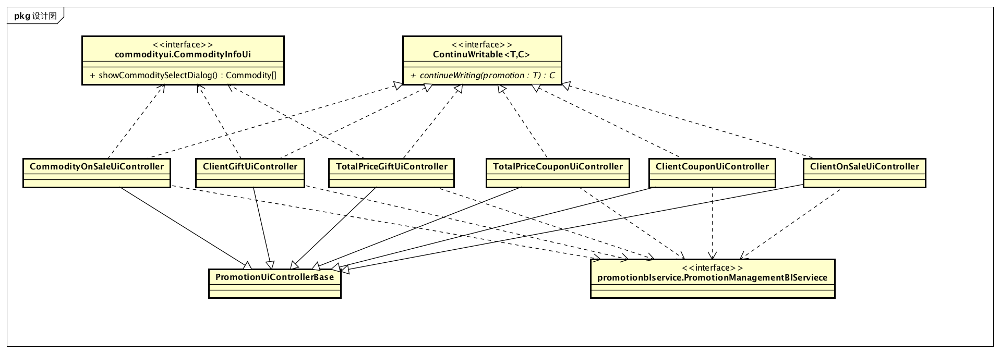

##### 2.1.12.3.2 各个类的职责

| 类名                              | 职责                         |
| ------------------------------- | -------------------------- |
| ComSalePromotionUiController    | 负责管理填写组合商品降价促销策略界面的展示和功能。  |
| TotalPricePromotionUiController | 负责管理填写满额赠送代金券促销策略界面的展示和功能。 |
| ClientPromotionUiController     | 负责管理填写客户赠送代金券促销策略界面的展示和功能。 |

##### 2.1.12.3.3 内部类的接口规范

**ComSalePromotionUiController**

提供的接口

| 接口名称                             | 语法                                       | 前置条件             | 后置条件          |
| -------------------------------- | ---------------------------------------- | ---------------- | ------------- |
| ContinueWritable.continueWriting | `public CommodityOnSaleUiController continueWriting(ComSalePromotionVo promotion);` | 输入有效的用于继续填写促销策略。 | 初始化传入促销策略的内容。 |

需要的接口

| 接口名称                                     | 服务名              |
| ---------------------------------------- | ---------------- |
| `commodityui.CommodityInfoUi.showCommoditySelectDialog()` | 选择商品。            |
| `promotionblservice.ComSalePromotionBlService.submit(ComSalePromotionVo promotion) ` | 提交促销策略。          |
| `promotionblservice.ComSalePromotionBlService.saveAsDraft(CComSalePromotionVo promotion)` | 保存促销策略草稿。        |
| `promotionblservice.ComSalePromotionBlService.queryPromotion(PromotionQueryVO query)` | 根据不同的筛选条件查找促销策略。 |
| `promotionblservice.ComSalePromotionBlService.delete(CommodityOnSaleVo promotion)` | 删除单一持久化对象。       |
| `promotionblservice.ComSalePromotionBlService.getId()` | 获得当前促销策略的ID。     |
| `logbl.LogService.log(LogSeverity severity, String content)` | 记录日志。            |

**TotalPricePromotionUiController**

提供的接口

| 接口名称                             | 语法                                       | 前置条件             | 后置条件          |
| -------------------------------- | ---------------------------------------- | ---------------- | ------------- |
| ContinueWritable.continueWriting | `public TotalPriceCouponUiController continueWriting(TotalPricePromotionVo promotion);` | 输入有效的用于继续填写促销策略。 | 初始化传入促销策略的内容。 |

需要的接口

| 接口名称                                     | 服务名              |
| ---------------------------------------- | ---------------- |
| `promotionblservice.TotalPricePromotionBlService.submit(TotalPricePromotionVo promotion) ` | 提交促销策略。          |
| `promotionblservice.TotalPricePromotionBlService.saveAsDraft(TotalPricePromotionVo promotion)` | 保存促销策略草稿。        |
| `promotionblservice.TotalPricePromotionBlService.queryPromotion(PromotionQueryVO query)` | 根据不同的筛选条件查找促销策略。 |
| `promotionblservice.TotalPricePromotionBlService.delete(TotalPricePromotionVo promotion)` | 删除单一持久化对象。       |
| `promotionblservice.TotalPricePromotionBlService.getId()` | 获得当前促销策略的ID。     |

**ClientPromotionUiController**

提供的接口

| 接口名称                             | 语法                                       | 前置条件             | 后置条件          |
| -------------------------------- | ---------------------------------------- | ---------------- | ------------- |
| ContinueWritable.continueWriting | `public ClientCouponUiController continueWriting(ClientPromotionVo promotion);` | 输入有效的用于继续填写促销策略。 | 初始化传入促销策略的内容。 |

需要的接口

| 接口名称                                     | 服务名              |
| ---------------------------------------- | ---------------- |
| `promotionblservice.ClientPromotionBlService.submit(ClientPromotionVo promotion) ` | 提交促销策略。          |
| `promotionblservice.ClientPromotionBlService.saveAsDraft(ClientPromotionVo promotion)` | 保存促销策略草稿。        |
| `promotionblservice.ClientPromotionBlService.queryPromotion(PromotionQueryVO query)` | 根据不同的筛选条件查找促销策略。 |
| `promotionblservice.ClientPromotionBlService.delete(ClientPromotionVo promotion)` | 删除单一持久化对象。       |
| `promotionblservice.ClientPromotionBlService.getId()` | 获得当前促销策略的ID。     |

### 2.1.13 approvalui包

#### 2.1.13.1 概述

approvalui包负责总经理单据审批用例的UI界面以及响应控制代码。具体功能需求和非功能需求可参见需求规格说明文档和体系结构设计文档。

#### 2.1.13.2 整体架构

此包为展示层的一部分，它负责展示信息以及与用户的交互。它依赖对应的approvalblservice包与bl层进行交互。

#### 2.1.13.3 设计

##### 2.1.13.3.1 设计图

##### 2.1.13.3.2 各个类的职责

| 类名                | 职责                |
| ----------------- | ----------------- |
| AuditUiController | 负责管理审批单据界面的展示和功能。 |

##### 2.2.13.3.3 内部类的接口规范

**AuditUiController**

提供的接口

无

需要的接口

| 接口名称                                     | 服务名     |
| ---------------------------------------- | ------- |
| `approvalblservice.AuditBlService.query(BillQueryVO query)` | 查询单据信息。 |
| `approvalblservice.AuditBlService.reject(BillVO bill)` | 拒绝通过审批。 |
| `approvalblservice.AuditBlService.pass(BillVO bill)` | 通过审批。   |

## 2.2 业务逻辑层的分解

业务逻辑层开发包图、模块职责等请参考体系结构描述文档5.3节。

### 2.2.1 loginbl包

#### 2.2.1.1 概述

loginbl包负责登录功能的业务逻辑实现代码。具体功能需求和非功能需求可参见需求规格说明文档和体系结构设计文档。

#### 2.2.1.2 整体架构

此包为业务逻辑层的一部分，它负责业务逻辑的实现。它实现了loginui包所需要的loginblservice的所有接口，并依赖logindataservice包与data层进行交互。它还需要LogService包来实现记录日志的行为。

#### 2.2.1.3 设计

##### 2.2.1.3.1 设计图

##### 2.2.1.3.2 各个类的职责

| 类名                | 职责         |
| ----------------- | ---------- |
| LoginBlController | 负责处理登录的功能。 |

##### 2.2.1.3.3 内部类的接口规范

**LoginBlController**

提供的接口

| 接口名称                                | 语法                                       | 前置条件 | 后置条件          |
| ----------------------------------- | ---------------------------------------- | ---- | ------------- |
| loginblservice.LoginBlService.login | `public EmployeeVo login(String username, String password);` | 无。   | 系统已经登录或者登录失败。 |
| CurrentUserService.getCurrentUser   | `public EmployeeVo getCurrentUser();`    | 无。   | 返回当前已经登录的用户。  |

需要的接口

| 接口名称                                     | 服务名          |
| ---------------------------------------- | ------------ |
| `logindataservice.LoginDataService.login(String username, String password)` | 登录。          |
| `logbl.LogService.log(LogSeverity severity, String content)` | 记录日志。        |
| `adminbl.RootQueryService.queryRoot(String employeeId)` | 查询用户是否有最高权限。 |

##### 2.2.1.3.4 业务逻辑层的动态模型

下图是登录过程中的顺序图。

### 2.2.2 inventorybl包

#### 2.2.2.1 概述

Inventorybl模块负责实现仓库的管理，对库存进行报损、报溢，报警，对库存进行盘点、查看，完成商品赠送等业务需求。具体功能需求和非功能需求可参见需求规格说明文档和体系结构设计文档。

#### 2.2.2.2 整体架构

此包为业务逻辑层的一部分，它负责展示信息以及与用户的交互。它实现了inventoryui包所需要的inventoryblservice的所有接口，并依赖inventorydataservice包与data层进行交互。它同时公开了inventoryInfo接口用于给其他bl提供银行账户信息。

#### 2.2.2.3 设计

##### 2.2.2.3.1 设计图

##### 2.2.2.3.2 各个类的职责

| 类名                             | 职责                             |
| ------------------------------ | ------------------------------ |
| InventoryCheckBlController     | 负责库存查看功能的实现。                   |
| InventoryGiftBlController      | 负责商品赠送功能的实现。                   |
| InventoryWarningBlController   | 负责库存监控功能的实现。                   |
| InventoryBillInfo              | 负责实现为其他包提供查询获取报损、报溢、报警、赠送单据服务。 |
| PurchaseBillBlController       | 负责实现进货单的填写、修改、提交功能             |
| PurchaseBillRefundBlController | 负责实现进货退货单的填写、修改、提交功能           |

##### 2.2.2.3.3 内部类的接口规范

**InventoryCheckBlController**

提供的接口

| 接口名称                            | 语法                                       | 前置条件        | 后置条件                                     |
| ------------------------------- | ---------------------------------------- | ----------- | ---------------------------------------- |
| InventoryCheckBlService.check   | `public InventoryViewVo check(Date beginTime, Date endTime);` | 日期输入合法。     | 完成在此时间段内的出／入库数量／金额，销售／进货数量／金额，以及库存合计的查看。 |
| InventoryCheckBlService.picture | `public InventoryPictureVo picture();`   | 已经得到当日库存快照。 | 生成截至盘点时间的库存盘点。                           |
| InventoryCheckBlService.export  | `public ResultMessage export(File newfile);` | 已经完成库存盘点。   | 导出Excel到指定位置。                            |

需要的接口

| 接口名称                                     | 服务名         |
| ---------------------------------------- | ----------- |
| `inventorydataservice.InventoryCheckDataService.check(Date beginTime, Date endTime)` | 提供时间段内库存变化。 |
| `inventorydataservice.InventoryCheckDataService.picture(Date time)` | 提供当日库存快照。   |
| `logbl.LogBl.log(LogSeverity severity, String content)` | 记录日志。       |

**InventoryGiftBlController**

提供的接口

| 接口名称                                   | 语法                                       | 前置条件     | 后置条件        |
| -------------------------------------- | ---------------------------------------- | -------- | ----------- |
| InventoryGiftBlService.getGift         | `public InventoryGiftVo getGift(Data time);` | 输入合法。    | 提供符合条件的赠送单。 |
| InventoryGiftBlService.getId           | `public String getId();`                 | 当前存在赠送单。 | 提供当前赠送单ID。  |
| InventoryGiftBlService.getAllCommodity | `public CommodityVo[] getAllCommodity();` | 存在商品。    | 提供商品.       |
| InventoryGiftBlService.submit          | `public ResultMessage submit(InventoryGiftVo bill);` | 输入合法。    | 提交完成的赠送单。   |

需要的接口

| 接口名称                                     | 服务名           |
| ---------------------------------------- | ------------- |
| `inventorydataservice.InventoryGiftDataService.getGift(Date time)` | 提供满足促销条件的赠送单。 |
| `logbl.LogBl.log(LogSeverity severity, String content)` | 记录日志。         |
| `inventorydataservice.InventoryGiftDataService.getGift(Date time)` |               |

**InventoryWarningBlController**

提供的接口

| 接口名称                                     | 语法                                       | 前置条件              | 后置条件                  |
| ---------------------------------------- | ---------------------------------------- | ----------------- | --------------------- |
| InventoryWarningBlService.submit         | `public ResultMessage submit(InventoryBillVo bill);` | 单据所有属性有效。         | 单据已经保存到数据库，持久化信息已经保存。 |
| InventoryWarningBlService.saveAsDraft    | `public ResultMessage saveAsDraft(InventoryBillVo bill);` | 单据信息非空。           | 保存草稿，持久化信息已经保存。       |
| InventoryWarningBlService.modify         | `public ResultMessage modify(CommodityVo commodity，double modifyWarning);` | 该商品存在，且修改警戒值输入合法。 | 修改警戒值，持久化更新涉及的对象的数据。  |
| InventoryWarningBlService.getCurrentBill | `public InventoryBillVo getCurrentBill();` | 现有单据存在。           | 返回现有单据。               |
| InventoryWarningBlService.query          | `public InventoryBillVo []query(InventoryBillQueryVo inventoryBillQueryVo);` | 单据所有属性有效。         | 返回符合条件的单据。            |
| InventoryWarningBlService.getId          | `public String getId();`                 | 现有单据存在。           | 返回现有单据Id。             |
| InventoryWarningBService.getAllCommodity | `public CommodityVo[] getAllCommodity();` | 存在商品。             | 返回商品。                 |

需要的接口

| 接口名称                                     | 服务名       |
| ---------------------------------------- | --------- |
| `inventorydataservice.InventoryWarningDataService.submit(InventoryBillPo bill)` | 提交新单据。    |
| `inventorydataservice.InventoryWarningDataService.modify(CommodityPo commodity，double ModifyWarning)` | 修改警戒值。    |
| ` logbl.LogBl.log(LogSeverity severity, String content)` | 记录日志。     |
| `inventorydataservice.InventoryWarningDataService.query(InventoryBillQueryVo inventoryBillQueryVo)` | 查询符合条件单据。 |
| `commodityblservice.CommodityInfo.queryCommodity(CommodityQueryVo commodityQueryVo)` | 获取商品。     |

**InventoryBillInfo**

提供的接口

| 接口名称                             | 语法                                       | 前置条件       | 后置条件          |
| -------------------------------- | ---------------------------------------- | ---------- | ------------- |
| InventoryInfo.queryInventoryBill | `public InventoryBillVo[] queryInventoryBill(InventoryBillQueryVo inventoryBillQueryVo);` | 其他类需要单据信息。 | 返回所需单据的持久化对象。 |

需要的接口

| 接口名称                                     | 服务名               |
| ---------------------------------------- | ----------------- |
| `inventoryBldataservice.InventoryWarningBlService.query(InventoryBillQueryVo inventoryBillQueryVo)` | 根据ID和/或名称模糊化查询单据。 |

**PurchaseBillBlController**

提供的接口

| 接口名称                                     | 语法                                       | 前置条件          | 后置条件                             |
| ---------------------------------------- | ---------------------------------------- | ------------- | -------------------------------- |
| PurchaseBillBlService.submit             | `public ResultMessage submit(PurchaseBillVO purchaseBill);` | 表单数据输入格式正确。   | 持久化层新增表单信息。                      |
| PurchaseBillBlService.saveAsDraft        | `public ResultMessage saveAsDraft(PurchaseBillVO purchaseBill);` | 表单数据非空。       | 持久化层保存草稿信息。                      |
| PurchaseBillBlService.getId              | `public String getId(); `                | 无。            | 获得新单据的ID。                        |
| PurchaseBillBlService.queryPurchaseBillVo | `public PurchaseBillVo[] queryPurchaseBillVo(PurchaseBillQueryVo query); ` | 无。            | 获得单据信息。                          |
| NotificationActivateService.activate     | `public ResultMessage activate(String id);` | 单据有效且状态为审批通过。 | 系统修改对应客户信息，修改单据状态为已入账，持久化信息已经保存。 |
| NotificationAbandonService.abandon       | `public ResultMessage abandon(String id);` | 单据有效且状态为审批完成。 | 系统修改单据状态为已经废弃，持久化信息已经保存。         |
| DraftDeleteService.deleteDraft           | `public ResultMessage deleteDraft(String id);` | 无。            | 系统删除草稿，持久化信息已经保存。                |
| approvalbl.BillApprovalCompleteService   | `ResultMessage approvalComplete(String billId, BillState state);`|无。|系统修改单据状态，持久化信息已经保存。|

需要的接口

| 接口名称                                     | 服务名       |
| ---------------------------------------- | --------- |
| `inventoryModificationService.modifyInventory(String commodityId, InventoryModificationFlag flag, double delta);` | 无。        |
| `inventorydataservice.PurchaseBillDataService.submit(PurchaseBillPO purchaseBill);` | 提交表单。     |
| `inventorydataservice.PurchaseBillDataService.getId();` | 获得新单据的ID。 |
| `inventorydataservice.PurchaseBillDataService.getPurchaseBill(PurchaseBillQueryPo query);` | 获得指定的进货单。 |
| `inventorydataservice.PurchaseBillDataService.saveAsDraft(PurchaseBillPO purchaseBill);` | 保存草稿。     |
| `inventorydataservice.PurchaseBillDataService.getId();` | 获得新单据的ID。 |
| `inventorydataservice.PurchaseBillDataService.approvalComplete(String billId, BillState state)` | 审批完成，修改单据状态。|
| `logbl.LogService.log(LogSeverity severity, String content)` | 记录日志。     |
| `draftbl.DraftService.saveAsDraft(PurchaseBillPO bill)` | 保存草稿。     |

**PurchaseRefundBillBlController**

提供的接口

| 接口名称                                     | 语法                                       | 前置条件          | 后置条件                             |
| ---------------------------------------- | ---------------------------------------- | ------------- | -------------------------------- |
| PurchaseRefundBillBlService.submit       | `public ResultMessage submit(PurchaseRefundBillVO purchaseRefundBill);` | 表单数据输入格式正确。   | 持久化层新增表单信息。                      |
| PurchaseRefundBillBlService.saveAsDraft  | `public ResultMessage saveAsDraft(PurchaseRefundBillVO purchaseRefundBill);` | 表单数据非空。       | 持久化层保存草稿信息。                      |
| PurchaseRefundBillBlService.getId        | `public String getId(); `                | 无。            | 获得新单据的ID。                        |
| PurchaseRefundBillBlService.queryPurchaseRefundBillVo | `public PurchaseRefundBillVo[] queryPurchaseRefundBillVo(PurchaseRefundBillVo query); ` | 无。            | 获得单据信息。                          |
| NotificationActivateService.activate     | `public ResultMessage activate(String id);` | 单据有效且状态为审批通过。 | 系统修改对应客户信息，修改单据状态为已入账，持久化信息已经保存。 |
| NotificationAbandonService.abandon       | `public ResultMessage abandon(String id);` | 单据有效且状态为审批完成。 | 系统修改单据状态为已经废弃，持久化信息已经保存。         |
| DraftDeleteService.deleteDraft           | `public ResultMessage deleteDraft(String id);` | 无。            | 系统删除草稿，持久化信息已经保存。                |
| approvalbl.BillApprovalCompleteService   | `ResultMessage approvalComplete(String billId, BillState state);`|无。|系统修改单据状态，持久化信息已经保存。|

需要的接口

| 接口名称                                     | 服务名         |
| ---------------------------------------- | ----------- |
| `inventoryModificationService.modifyInventory(String commodityId, InventoryModificationFlag flag, double delta);` | 无。          |
| `inventorydataservice.PurchaseRefundBillDataService.submit(PurchaseRefundBillPO purchaseRefundBill);` | 提交表单。       |
| `inventorydataservice.PurchaseRefundBillDataService.getId();` | 获得新单据的ID。   |
| `inventorydataservice.PurchaseRefundBillDataService.getPurchaseRefundBill(PurchaseRefundBillQueryPo query);` | 获得指定的进货退货单。 |
| `inventorydataservice.PurchaseRefundBillDataService.saveAsDraft(PurchaseRefundBillPO purchaseRefundBill);` | 保存草稿。       |
| `inventorydataservice.PurchaseRefundBillDataService.getId();` | 获得新单据的ID。   |
| `inventorydataservice.PurchaseRefundBillDataService.approvalComplete(String billId, BillState state)` | 审批完成，修改单据状态。|
| `logbl.LogService.log(LogSeverity severity, String content)` | 记录日志。       |
| `draftbl.DraftService.saveAsDraft(PurchaseRefundBillPO bill)` | 保存草稿。       |

**PurchaseBillInfoController**

提供的接口

| 接口名称                                     | 语法                                       | 前置条件 | 后置条件    |
| ---------------------------------------- | ---------------------------------------- | ---- | ------- |
| PurchaseBillBlInfo.queryPurchaseBillVo   | `public PurchaseBillVo[] queryPurchaseBillVo(PurchaseBillQueryVo query); ` | 无。   | 获得单据信息。 |
| PurchaseRefundBillBlInfo.queryPurchaseRefundBillVo | `public PurchaseRefundBillVo[] queryPurchaseRefundBillVo(PurchaseRefundBillVo query); ` | 无。   | 获得单据信息。 |

需要的接口

| 接口名称                                     | 服务名     |
| ---------------------------------------- | ------- |
| `inventoryblservice.queryPurchaseBillVo(PurchaseBillQueryVo query); ` | 获得单据信息。 |
| `inventoryblservice.queryPurchaseRefundBillVo(PurchaseRefundBillQueryVo query); ` | 获得单据信息。 |

##### 2.2.6.3.4  业务逻辑层的动态模型

如下图表示了在进销存系统中，当进货销售人员想要查看所有进货单信息的时候，客户管理业务逻辑处理的相关对象之间的协作

如下图表示了在进销存系统中，当进货销售人员想要查看所有进货退货单信息的时候，客户管理业务逻辑处理的相关对象之间的协作

如下图表示了在进销存系统中，当进货销售人员填写进货单的时候，客户管理业务逻辑处理的相关对象之间的协作

如下图表示了在进销存系统中，当进货销售人员想要将进货单保存为草稿的时候，客户管理业务逻辑处理的相关对象之间的协作

如下图表示了在进销存系统中，当进货销售人员填写进货退货单的时候，客户管理业务逻辑处理的相关对象之间的协作

如下图表示了在进销存系统中，当进货销售人员想要将进货退货单保存为草稿的时候，客户管理业务逻辑处理的相关对象之间的协作

### 2.2.3 salebl包

#### 2.2.3.1 概述

salebl包负责进货销售人员与销售有关的用例（制定销售单、制定销售退货单）的业务逻辑实现代码。具体功能需求和非功能需求可参见需求规格说明文档和体系结构设计文档。

#### 2.2.3.2 整体架构

此包为业务逻辑层层的一部分，它负责展示信息以及与用户的交互。它实现了saleui包所需要的saleblservice的所有接口，并依赖saledataservice包与data层进行交互。

#### 2.2.3.3 设计

##### 2.2.3.3.1 设计图

salebl模块的设计如图

##### 2.2.3.3.2 各个类的职责

| 类名                         | 职责                   |
| -------------------------- | -------------------- |
| SaleBillBlController       | 负责实现销售单的填写、修改、提交功能   |
| SaleRefundBillBlController | 负责实现销售退货单的填写、修改、提交功能 |

##### 2.2.3.3.3 内部类的接口规范

**SaleBillBlController**

提供的接口

| 接口名称                                 | 语法                                       | 前置条件          | 后置条件                             |
| ------------------------------------ | ---------------------------------------- | ------------- | -------------------------------- |
| SaleBillBlService.submit             | `public ResultMessage submit(SaleBillVO saleBill);` | 表单数据输入格式正确。   | 持久化层新增表单信息。                      |
| SaleBillBlService.saveAsDraft        | `public ResultMessage saveAsDraft(SaleBillVO saleBill);` | 用户已经点击保存草稿。   | 持久化层保存草稿信息。                      |
| SaleBillBlService.getId              | `public String getId(); `                | 无。            | 获得新单据的ID。                        |
| SaleBillBlService.getPromotion       | `public Promotion[] getPromotion(SaleBillVo saleBill); ` | 销售单已经填写完。     | 获得可用的销售策略。                       |
| SaleBillBlService.querySaleBill      | `public SaleBillVo[] querySaleBill(SaleBillQueryVo query); ` | 无。            | 获得单据信息。                          |
| NotificationActivateService.activate | `public ResultMessage activate(String id);` | 单据有效且状态为审批通过。 | 系统修改对应客户信息，修改单据状态为已入账，持久化信息已经保存。 |
| NotificationAbandonService.abandon   | `public ResultMessage abandon(String id);` | 单据有效且状态为审批完成。 | 系统修改单据状态为已经废弃，持久化信息已经保存。         |
| DraftDeleteService.deleteDraft       | `public ResultMessage deleteDraft(String id);` | 无。            | 系统删除草稿，持久化信息已经保存。                |
| approvalbl.BillApprovalCompleteService   | `ResultMessage approvalComplete(String billId, BillState state);`|无。|系统修改单据状态，持久化信息已经保存。|

需要的接口

| 接口名称                                     | 服务名             |
| ---------------------------------------- | --------------- |
| `inventoryModificationService.modifyInventory(String commodityId, InventoryModificationFlag flag, double delta);` | 无。              |
| `saledataservice.SaleBillDataService.submit(SaleBillPO saleBill);` | 提交表单。           |
| `saledataservice.SaleBillDataService.getId();` | 获得新单据的ID。       |
| `saledataservice.SaleBillDataService.getSaleBill(SaleBillQueryPo query);` | 获得指定的销售单。       |
| `promotionbl.PromotionInfoBl.queryPromotion(SaleBillVo);` | 根据销售单获得可用的促销策略。 |
| `saledataservice.SaleBillDataService.activate(SaleBillPo bill) ` | 使单据生效。          |
| `saledataservice.SaleBillDataService.abandon(SaleBillPo bill)` | 废弃单据。           |
| `saledataservice.SaleBillDataService.approvalComplete(String billId, BillState state)` | 审批完成，修改单据状态。|
| `logbl.LogService.log(LogSeverity severity, String content)` | 记录日志。           |
| `draftbl.DraftService.saveAsDraft(SaleBillPo bill)` | 保存草稿。           |

**SaleRefundBillBlController**

提供的接口

| 接口名称                                  | 语法                                       | 前置条件          | 后置条件                             |
| ------------------------------------- | ---------------------------------------- | ------------- | -------------------------------- |
| SaleRefundBillBlService.submit        | `public ResultMessage[] submit(SaleRefundBillVO saleRefundBill);` | 表单数据输入格式正确。   | 持久化层新增表单信息。                      |
| SaleRefundBillBlService.saveAsDraft   | `public ResultMessage saveAsDraft(SaleRefundBillVO saleRefundBill);` | 用户已经点击保存草稿。   | 持久化层保存草稿信息。                      |
| SaleRefundBillBlService.getId         | `public String getId(); `                | 无。            | 获得新单据的ID。                        |
| SaleRefundBillBlService.querySaleBill | `public SaleRefundBillVo[] querySaleRefundBill(SaleRefundBillQueryVo query); ` | 无。            | 获得单据信息。                          |
| NotificationActivateService.activate  | `public ResultMessage activate(String id);` | 单据有效且状态为审批通过。 | 系统修改对应客户信息，修改单据状态为已入账，持久化信息已经保存。 |
| NotificationAbandonService.abandon    | `public ResultMessage abandon(String id);` | 单据有效且状态为审批完成。 | 系统修改单据状态为已经废弃，持久化信息已经保存。         |
| DraftDeleteService.deleteDraft        | `public ResultMessage deleteDraft(String id);` | 无。            | 系统删除草稿，持久化信息已经保存。                |
| approvalbl.BillApprovalCompleteService   | `ResultMessage approvalComplete(String billId, BillState state);`|无。|系统修改单据状态，持久化信息已经保存。|

需要的接口

| 接口名称                                     | 服务名         |
| ---------------------------------------- | ----------- |
| `inventoryModificationService.modifyInventory(String commodityId, InventoryModificationFlag flag, double delta);` | 无。          |
| `saledataservice.SaleRefundBillDataService.submit(SaleRefundBillPO saleRefundBill);` | 提交表单。       |
| `saledataservice.SaleRefundBillDataService.getId();` | 获得新单据的ID。   |
| `saledataservice.SaleRefundBillDataService.getSaleRefundBill(SaleRefundBillQueryPo query);` | 获得指定的销售退货单。 |
| `saledataservice.SaleRefundBillDataService.activate(SaleRefundBillPO bill) ` | 使单据生效。      |
| `saledataservice.SaleRefundBillDataService.abandon(SaleRefundBillPO bill)` | 废弃单据。       |
| `saledataservice.SaleRefundBillDataService.approvalComplete(String billId, BillState state)` | 审批完成，修改单据状态。|
| `logbl.LogService.log(LogSeverity severity, String content)` | 记录日志。       |
| `draftbl.DraftService.saveAsDraft(SaleRefundBillPO bill)` | 保存草稿。       |

**SaleBillInfoController**

提供的接口

| 接口名称                                     | 语法                                       | 前置条件 | 后置条件    |
| ---------------------------------------- | ---------------------------------------- | ---- | ------- |
| SaleBillBlInfo.querySaleBillVo           | `public SaleBillVo[] querySaleBillVo(SaleBillQueryVo query); ` | 无。   | 获得单据信息。 |
| SaleRefundBillBlInfo.querySaleRefundBillVo | `public SaleRefundBillVo[] querySaleRefundBillVo(SaleRefundBillVo query); ` | 无。   | 获得单据信息。 |

需要的接口

| 接口名称                                     | 服务名     |
| ---------------------------------------- | ------- |
| `saleblservice.querySaleBillVo(SaleBillQueryVo query); ` | 获得单据信息。 |
| `saleblservice.querySaleRefundBillVo(SaleRefundBillQueryVo query); ` | 获得单据信息。 |

##### 2.2.3.3.4  业务逻辑层的动态模型

如下图表示了在进销存系统中，当进货销售人员想要查看所有销售单信息的时候，客户管理业务逻辑处理的相关对象之间的协作

如下图表示了在进销存系统中，当进货销售人员想要查看所有销售退货单信息的时候，客户管理业务逻辑处理的相关对象之间的协作

如下图表示了在进销存系统中，当进货销售人员填写销售单的时候，客户管理业务逻辑处理的相关对象之间的协作

如下图表示了在进销存系统中，当进货销售人员想要将销售单保存为草稿的时候，客户管理业务逻辑处理的相关对象之间的协作

如下图表示了在进销存系统中，当进货销售人员填写销售退货单的时候，客户管理业务逻辑处理的相关对象之间的协作

如下图表示了在进销存系统中，当进货销售人员想要将销售退货单保存为草稿的时候，客户管理业务逻辑处理的相关对象之间的协作

### 2.2.4 commoditybl包

#### 2.2.4.1 概述

commoditybl包负责库存管理人员商品管理、商品分类管理的业务逻辑实现代码。具体功能需求和非功能需求可参见需求规格说明文档和体系结构设计文档。

#### 2.2.4.2 整体架构

此包为业务逻辑层的一部分，它负责展示信息以及与用户的交互。它实现了commoditybl包所需要的commodityblservice的所有接口，并依赖commoditydataservice包与data层进行交互,它同时公开了CommodityService接口用于给其他bl提供银行账户信息。

#### 2.2.4.3 设计

##### 2.2.4.3.1 设计图

##### 2.2.4.3.2 各个类的职责

| 类名                        | 职责                       |
| ------------------------- | ------------------------ |
| CommodityBlController     | 负责实现商品管理界面的功能实现          |
| CommoditySortBlController | 负责实现商品分类管理界面的功能实现        |
| CommodityService          | 负责实现为其他包提供查询获取商品及分类信息的服务 |

##### 2.2.4.3.3 内部类的接口规范

**CommodityBlController**

提供的接口

| 接口名称                      | 语法                                       | 前置条件        | 后置条件                  |
| ------------------------- | ---------------------------------------- | ----------- | --------------------- |
| CommodityBlService.add    | `public ResultMessage add(CommodityVo newCommodity);` | 商品输入合法。     | 添加新的商品，持久化更新涉及的对象的数据。 |
| CommodityBlService.modify | `public ResultMessage modify(CommodityVo updateCommodity);` | 商品信息修改输入合法。 | 修改商品，持久化更新涉及的对象的数据。   |
| CommodityBlService.query  | `public CommodityVo[] query(CommdoityQueryVo commodityQueryVo);` | 查询输入格式合法。   | 返回符合查询条件的数据。          |
| CommodityBlService.delete | `public ResultMessage delete(CommodityVo commodity);` | 商品信息输入合法。   | 删除该商品，持久化更新涉及的对象的数据。  |

需要的接口

| 接口名称                                     | 服务名                 |
| ---------------------------------------- | ------------------- |
| `commoditydataservice.CommodityDataService.query(CommodityQueryVo commodityQueryVo)` | 根据ID和/或名称查找单一持久化对象。 |
| `commoditydataservice.CommodityDataService.add(CommodityPo commodity)` | 添加单一化持久对象。          |
| `commoditydataservice.CommodityDataService.modify(CommodityPo updateCommodity)` | 修改添加单一化持久对象。        |
| `commoditydataservice.CommodityDataService.delete(CommodityPo commodity)` | 删除单一化持久对象。          |
| `logbl.LogBl.log(LogSeverity severity, String content)` | 记录日志。               |

**CommoditySortBlController**

提供的接口

| 接口名称                           | 语法                                       | 前置条件                 | 后置条件                  |
| ------------------------------ | ---------------------------------------- | -------------------- | --------------------- |
| CommoditySortBlService.add     | `public ResultMessage add(CommoditySortVo newSort,CommoditySortVo parentSort);` | 商品分类信息输入合法，并且父类中无商品。 | 添加新的商品分类，持久化更对象的数据。   |
| CommoditySortBlService.modify  | `public ResultMessage modify(CommoditySortVo sort);` | 商品分类修改信息输入合法。        | 更改商品分类，持久化更新涉及的对象的数据。 |
| CommoditySortBlService.query   | `public CommoditySortVo[] query(CommoditySortQuerVo commoditySortQueryVo);` | 商品分类查询信息输入合法。        | 返回符合查询条件的数据。          |
| CommoditySortBlService.delete  | `public ResultMessage delete(CommoditySortVo sort);` | 商品分类删除信息输入合法。        | 删除商品分类，持久化更新涉及的对象的数据。 |
| CommoditySortBlService.display | `public CommoditySortVo[] display();`    | 已经创建一个CommoditySort。 | 显示所有商品分类。             |
| CommoditySortBlService.display | `public CommoditySortVo[] dispaly(CommoditySortVo commoditySort);` | 该父类存在。               | 显示父类下的所有子类。           |

需要的接口

| 接口名称                                     | 服务名             |
| ---------------------------------------- | --------------- |
| `commoditydataservice.CommoditySortDataService.query(CommoditySortQueryVo commoditySortQueryVo)` | 根据ID和/或名称模糊化查询。 |
| `commoditydataservice.CommoditySortDataService.add(CommodityPo commodity)` | 添加单一持久化对象。      |
| `commoditydataservice.CommoditySortDataService.modify(CommodityPo updateCommodity)` | 修改单一持久化对象。      |
| `commoditydataservice.CommoditySortDataService.delete(CommodityPo commodity)` | 删除单一持久化对象爱那个。   |
| `logbl.LogBl.log(LogSeverity severity, String content)` | 记录日志。           |

**CommodityService**

提供的接口

| 接口名称                                | 语法                                       | 前置条件         | 后置条件          |
| ----------------------------------- | ---------------------------------------- | ------------ | ------------- |
| CommodityService.queryCommodity     | `public CommodityVo[] queryCommodity(CommodityQueryVo commodityQueryVo);` | 其他类需要商品信息。   | 返回所需商品的持久化对象。 |
| CommodityService.queryCommoditySort | `public CommoditySortVo[] queryCommoditySort(CommoditySortQueryVo commoditySortQueryVo);` | 其他类需要商品分类信息。 | 返回所需分类的持久化对象。 |

需要的接口

| 接口名称                                     | 服务名                 |
| ---------------------------------------- | ------------------- |
| `commodityBlService.CommoditySortBlService.query(CommoditySortQuerVo commoditySortQueryVo)` | 根据ID和/或名称模糊化查询商品分类。 |
| `commodityBlSerevice.CommodityBlService.query(CommodityQueryVo commodityQueryVo)` | 根据ID和/或名称模糊化查询商品。   |

### 2.2.5 clientbl包

#### 2.2.5.1 概述

clientbl包负责进货销售人员客户管理用例的业务逻辑实现代码。具体功能需求和非功能需求可参见需求规格说明文档和体系结构设计文档。

#### 2.2.5.2 整体架构

此包为业务逻辑层层的一部分，它负责展示信息以及与用户的交互。它实现了clientui包所需要的clientblservice的所有接口，并依赖clientdataservice包与data层进行交互。

#### 2.2.5.3 设计

##### 2.2.5.3.1 设计图

clientbl模块的设计如图

##### 2.2.5.3.2 各个类的职责

| 类名                 | 职责              |
| ------------------ | --------------- |
| ClientBlController | 负责实现客户信息的增删查改操作 |

##### 2.2.5.3.3 内部类的接口规范

**ClientBlController**

提供的接口

| 接口名称                                   | 语法                                       | 前置条件      | 后置条件                  |
| -------------------------------------- | ---------------------------------------- | --------- | --------------------- |
| ClientBlService.query                  | `public ClientVo[] query(String query);` | 无。        | 数据库给出符合条件的客户信息。       |
| ClientBlService.saveAsDraft            | `public ResultMessage saveAsDraft(ClientVo client);` | 客户信息信息非空。 | 保存草稿，持久化信息已经保存。       |
| ClientBlService.getId                  | `public String getId(); `                | 无。        | 获得新客户的ID。             |
| ClientBlService.add                    | `public ResultMessage add(ClientVo client);` | 客户所有属性有效。 | 客户已经保存到数据库，持久化信息已经保存。 |
| ClientBlService.modify                 | `public ResultMessage modify(ClientVo client);` | 客户所有属性有效。 | 客户已经保存到数据库，持久化信息已经保存。 |
| ClientBlService.delete                 | `public ResultMessage delete(String[] id);` | 客户非空。     | 数据库删除客户信息，持久化信息已经保存。  |
| ClientModificationService.modifyClient | `ResultMessage modifyClient(String clientId, ClientModificationFlag flag, double delta);` | 无。        | 数据库修改用户信息。            |
| ClientQueryService.query                  | `public ClientVo[] query(String query);` | 无。        | 数据库给出符合条件的客户信息。       |

需要的接口

| 接口名称                                     | 服务名           |
| ---------------------------------------- | ------------- |
| `clientdataservice.ClientDataService.query(String query);` | 根据查询条件查询客户信息。 |
| `clientdataservice.ClientDataService.saveAsDraft(ClientPO client);` | 保存客户草稿。       |
| `clientdataservice.ClientDataService.getId();` | 获得新客户的ID。     |
| `clientdataservice.ClientDataService.add(ClientPO client);` | 添加客户。         |
| `clientdataservice.ClientDataService.modify(ClientPO client);` | 修改客户。         |
| `clientdataservice.ClientDataService.delete(String[] id);` | 删除客户。         |
| `draftbl.DraftService.saveAsDraft(ClientVo bill)` | 保存草稿。         |

##### 2.2.5.3.4  业务逻辑层的动态模型

如下图表示了在进销存系统中，当进货销售人员想要查看客户详细信息的时候，客户管理业务逻辑处理的相关对象之间的协作

如下图表示了在进销存系统中，当进货销售人员想要删除客户的时候，客户管理业务逻辑处理的相关对象之间的协作

如下图表示了在进销存系统中，当进货销售人员想要搜索客户的时候，客户管理业务逻辑处理的相关对象之间的协作

如下图表示了在进销存系统中，当进货销售人员在填写客户信息的时候，客户管理业务逻辑处理的相关对象之间的协作

如下图表示了在进销存系统中，当进货销售人员在想要将客户信息保存为草稿的时候，客户管理业务逻辑处理的相关对象之间的协作

### 2.2.6 financebl包

#### 2.2.6.1 概述

financeui包负责财务人员除了银行账户管理外的用例（制定收款单、制定付款单、制定现金费用单、查看经营情况表、查看经营历程表、查看销售情况表、红冲以及期初建账）的业务逻辑实现代码。具体功能需求和非功能需求可参见需求规格说明文档和体系结构设计文档。

#### 2.2.6.2 整体架构

此包为业务逻辑层的一部分，它负责业务逻辑的实现。它实现了financeui包所需要的financeblservice的所有接口，并依赖financedataservice包与data层进行交互。

#### 2.2.6.3 设计

##### 2.2.6.3.1 设计图

##### 2.2.6.3.2 各个类的职责

| 类名                         | 职责                       |
| -------------------------- | ------------------------ |
| PaymentBillBlController    | 负责管理付款单的提交、保存草稿以及激活操作。   |
| ReceivalBillBlController   | 负责管理收款单的提交、保存草稿以及激活操作。   |
| CashBillBlController       | 负责管理现金费用单的提交、保存草稿以及激活操作。 |
| SystemSnapshotBlController | 负责管理期初建账的提交、保存草稿以及激活操作。  |
| SaleDetailBlController     | 负责查看销售明细表的功能实现。          |
| TradeHistoryBlController   | 负责经营历程表的功能实现。            |
| TradeSituationBlController | 负责经营情况表的功能实现。            |

##### 2.2.6.3.3 内部类的接口规范

**PaymentBillBlController**

提供的接口

| 接口名称                             | 语法                                       | 前置条件      | 后置条件                  |
| -------------------------------- | ---------------------------------------- | --------- | --------------------- |
| PaymentBillBlService.submit      | `public ResultMessage submit(PaymentBillVo bill);` | 单据所有属性有效。 | 单据已经保存到数据库，持久化信息已经保存。 |
| PaymentBillBlService.saveAsDraft | `public ResultMessage saveAsDraft(PaymentBillVo bill);` | 单据信息非空。   | 保存草稿，持久化信息已经保存。       |
| PaymentBillBlService.getId       | `public String getId(); `                | 无。            | 获得新单据的ID。                         |
| approvalbl.BillApprovalCompleteService   | `ResultMessage approvalComplete(String billId, BillState state);`|无。|系统修改单据状态，持久化信息已经保存。|
| PaymentBillInfo.query            | `public PaymentBillVo[] query(PaymentBillQueryVo query);` | 查询条件有效。|返回符合条件的单据。|    
| NotificationActivateService.activate  | `public ResultMessage activate(String id);` | 单据有效且状态为审批通过。 | 系统修改对应银行账户和客户信息，修改单据状态为已入账，持久化信息已经保存。 |
| NotificationAbandonService.abandon   | `public ResultMessage abandon(String id);` | 单据有效且状态为审批完成。 | 系统修改单据状态为已经废弃，持久化信息已经保存。              |

需要的接口

| 接口名称                                     | 服务名       |
| ---------------------------------------- | --------- |
| `logbl.LogService.log(LogSeverity severity, String content)` | 记录日志。     |
| `draftbl.DraftService.saveAsDraft(PaymentBillVo bill)` | 保存草稿。     |
| `approvalbl.ApprovalRequest.requestApproval(BillVo bill)` | 提交等待审核。   |
| `clientbl.ClientModificationService.modifyClient(String clientId, ClientModificationFlag flag, double delta)` | 修改用户信息。   |
| `bankaccountbl.BankAccountModificationService.modifyBankAccount(String id, double delta)` | 修改银行账户信息。 |
| `financedataservice.PaymentBillDataService.submit(PaymentBillPo bill)` | 提交新单据。    |
| `financedataservice.PaymentBillDataService.activate(String id) ` | 使单据入账。    |
| `financedataservice.PaymentBillDataService.abandon(String id)` | 废弃单据。     |
| `financedataservice.PaymentBillDataService.getId()` | 获得新单据的ID。 |
| `financedataservice.PaymentBillDataService.query(PaymentBillQueryVo query)` | 查询单据。     |
| `financedataservice.PaymentBillDataService.approvalComplete(String billId, BillState state)` | 审批完成，修改单据状态。|

**ReceivalBillBlController**

提供的接口

| 接口名称                                 | 语法                                       | 前置条件          | 后置条件                                  |
| ------------------------------------ | ---------------------------------------- | ------------- | ------------------------------------- |
| ReceivalBillBlService.submit         | `public ResultMessage submit(ReceivalBillVo bill);` | 单据所有属性有效。     | 单据已经保存到数据库，持久化信息已经保存。                 |
| ReceivalBillBlService.saveAsDraft    | `public ResultMessage saveAsDraft(ReceivalBillVo bill);` | 单据信息非空。       | 保存草稿，持久化信息已经保存。                       |
| ReceivalBillBlService.getId          | `public String getId(); `                | 无。            | 获得新单据的ID。                             |
| ReceivalBillInfo.query               | `public ReceivalBillVo[] query(ReceivalBillQueryVo query);` | 查询条件有效。       | 返回符合条件的单据。                            |
| approvalbl.BillApprovalCompleteService   | `ResultMessage approvalComplete(String billId, BillState state);`|无。|系统修改单据状态，持久化信息已经保存。|
| NotificationActivateService.activate | `public ResultMessage activate(String id);` | 单据有效且状态为审批通过。 | 系统修改对应银行账户和客户信息，修改单据状态为已入账，持久化信息已经保存。 |
| NotificationAbandonService.abandon   | `public ResultMessage abandon(String id);` | 单据有效且状态为审批完成。 | 系统修改单据状态为已经废弃，持久化信息已经保存。              |

需要的接口

| 接口名称                                     | 服务名       |
| ---------------------------------------- | --------- |
| `logbl.LogService.log(LogSeverity severity, String content)` | 记录日志。     |
| `draftbl.DraftService.saveAsDraft(ReceivalBillVo bill)` | 保存草稿。     |
| `approvalbl.ApprovalRequest.requestApproval(BillVo bill)` | 提交等待审核。   |
| `clientbl.ClientModificationService.modifyClient(String clientId, ClientModificationFlag flag, double delta)` | 修改用户信息。   |
| `bankaccountbl.BankAccountModificationService.modifyBankAccount(String id, double delta)` | 修改银行账户信息。 |
| `financedataservice.ReceivalBillDataService.submit(ReceivalBillPo bill)` | 提交新单据。    |
| `financedataservice.ReceivalBillDataService.activate(String id) ` | 使单据入账。    |
| `financedataservice.ReceivalBillDataService.abandon(String id)` | 废弃单据。     |
| `financedataservice.ReceivalBillDataService.getId()` | 获得新单据的ID。 |
| `financedataservice.ReceivalBillDataService.query(ReceivalBillQueryVo query)` | 查询单据。     |
| `financedataservice.ReceivalBillDataService.approvalComplete(String billId, BillState state)` | 审批完成，修改单据状态。|

**CashBillBlController**

提供的接口

| 接口名称                                 | 语法                                       | 前置条件          | 后置条件                                  |
| ------------------------------------ | ---------------------------------------- | ------------- | ------------------------------------- |
| CashBillBlService.submit             | `public ResultMessage submit(CashBillVo bill);` | 单据所有属性有效。     | 单据已经保存到数据库，持久化信息已经保存。                 |
| CashBillBlService.saveAsDraft        | `public ResultMessage saveAsDraft(CashBillVo bill);` | 单据信息非空。       | 保存草稿，持久化信息已经保存。                       |
| CashBillBlService.getId              | `public String getId(); `                | 无。            | 获得新单据的ID。                             |
| CashBillInfo.query                   | `public CashBillVo[] query(CashBillQueryVo query);` | 查询条件有效。       | 返回符合条件的单据。                            |
| approvalbl.BillApprovalCompleteService   | `ResultMessage approvalComplete(String billId, BillState state);`|无。|系统修改单据状态，持久化信息已经保存。|
| NotificationActivateService.activate | `public ResultMessage activate(String id);` | 单据有效且状态为审批通过。 | 系统修改对应银行账户和客户信息，修改单据状态为已入账，持久化信息已经保存。 |
| NotificationAbandonService.abandon   | `public ResultMessage abandon(String id);` | 单据有效且状态为审批完成。 | 系统修改单据状态为已经废弃，持久化信息已经保存。              |

需要的接口

| 接口名称                                     | 服务名   |
| ---------------------------------------- | ----- |
| `logbl.LogService.log(LogSeverity severity, String content)` | 记录日志。 |
| `draftbl.DraftService.saveAsDraft(CashBillVo bill)` | 保存草稿。     
| `clientbl.ClientModificationService.modifyClient(String clientId, ClientModificationFlag flag, double delta)` | 修改用户信息。|
| `bankaccountbl.BankAccountModificationService.modifyBankAccount(String id, double delta)` | 修改银行账户信息。 | 
| `approvalbl.ApprovalRequest.requestApproval(BillVo bill)` | 提交等待审核。   |
| `financedataservice.CashBillDataService.submit(CashBillPo bill)` | 提交新单据。    |
| `financedataservice.CashBillDataService.activate(String id)` | 使单据入账。    |
| `financedataservice.CashBillDataService.abandon(String id)` | 废弃单据。     |
| `financedataservice.CashBillDataService.getId()` | 获得新单据的ID。 |
| `financedataservice.CashBillDataService.query(CashBillQueryVo query)` | 查询单据。|
| `financedataservice.CashBillDataService.approvalComplete(String billId, BillState state)` | 审批完成，修改单据状态。|

**InitialEstablishmentBlController**

提供的接口

| 接口名称                                     | 语法                                       | 前置条件      | 后置条件                  |
| ---------------------------------------- | ---------------------------------------- | --------- | --------------------- |
| InitialEstablishmentBlService.submit     | `public ResultMessage submit(SystemSnapshotVo bill);` | 单据所有属性有效。 | 单据已经保存到数据库，持久化信息已经保存。 |
| InitialEstablishmentBlService.saveAsDraft | `public ResultMessage saveAsDraft(SystemSnapshotVo bill);` | 单据信息非空。   | 保存草稿，持久化信息已经保存。       |
| InitialEstablishmentBlService.autofill   | `public SystemSnapshotVo autofill();`    | 无。        | 返回现有系统信息。             |
| InitialEstablishmentInfo.query           | `public SystemSnapshotVo[] query(SystenSnapshotQueryVo query);` | 无。        | 返回符合条件的单据。            |
| approvalbl.BillApprovalCompleteService   | `ResultMessage approvalComplete(String billId, BillState state);`|无。|系统修改单据状态，持久化信息已经保存。|

需要的接口

| 接口名称                                     | 服务名         |
| ---------------------------------------- | ----------- |
| `logbl.LogService.log(LogSeverity severity, String content)` | 记录日志。       |
| `draftbl.DraftService.saveAsDraft(SystemSnapshotVo bill)` | 保存草稿。       |
| `clientbl.ClientInfo.queryClient(String query)` | 查询客户。       |
| `commoditybl.CommodityInfo.queryCommodity(CommodityQueryVo query)` | 取得所有商品信息。   |
| `commoditybl.CommodityInfo.queryCommoditySort(CommoditySortQueryVo query)` | 取得所有商品分类信息。 |
| `bankaccountbl.BankAccountInfo.queryBankAccount(BankAccountQueryVo query)` | 取得所有银行账户信息。 |
| `financedataservice.InitialEstablishmentDataService.submit(SystemSnapshotPo snapshot)` | 提交新单据。      |
| `financedataservice.InitialEstablishmentDataService.getId()` | 获得新单据的ID。   |
| `financedataservice.InitialEstablishmentDataService.activate(String id)` | 使单据入账。    |
| `financedataservice.InitialEstablishmentDataService.abandon(String id)` | 删除草稿。       |
| `financedataservice.InitialEstablishmentDataService.query(SystemSnapshotQueryVo query)` | 查询单据。       |
| `financedataservice.InitialEstablishmentDataService.approvalComplete(String billId, BillState state)` | 审批完成，修改单据状态。|

**SaleDetailBlController**

提供的接口

| 接口名称                       | 语法                                       | 前置条件                         | 后置条件     |
| -------------------------- | ---------------------------------------- | ---------------------------- | -------- |
| SaleDetailBlService.query  | `public SaleDetailVo query(SaleDetailQueryVo query);` | 输入的query不为空。其中值为null的字段为不限制。 | 返回销售明细表。 |
| SaleDetailBlService.export | `public ResultMessage export(SaleDetailVo detail);` | 表不为空且有效。                     | 导出单据。    |

需要的接口

| 接口名称                                     | 服务名      |
| ---------------------------------------- | -------- |
| `logbl.LogService.log(LogSeverity severity, String content)` | 记录日志。    |
| `salebl.SaleBillInfo.querySaleBill(SaleBillQueryVo query)` | 查询销售单。   |
| `salebl.SaleBillInfo.querySaleRefundBill(SaleBillQueryVo query)` | 查询销售退货单。 |
| `commoditybl.CommodityInfo.queryCommodity(CommodityQueryVo query)` | 取得商品信息。  |

**TradeHistoryBlController**

提供的接口

| 接口名称                         | 语法                                       | 前置条件                         | 后置条件                         |
| ---------------------------- | ---------------------------------------- | ---------------------------- | ---------------------------- |
| TradeHistoryBlService.query  | `public TradeHistoryVo query(TradeHistoryQueryVo query);` | 输入的query不为空。其中值为null字段的为不限制。 | 返回符合条件的单据。                   |
| TradeHistoryBlService.export | `public ResultMessage export(TradeHistoryVo bills);` | bills参数不为空且有效。               | 导出报表。                        |
| FinanceBillInfo.query        | `public FinanceBillVo[] queryFinanceBill(FinanceBillQueryVo query);` | 无。                           | 返回符合条件的财务单据。若某一条目为null则为无限制。 |
| DraftableQueryService.queryDraft | `public Draftable queryDraft(String id)` | 无。 | 查询单据。 |

需要的接口

| 接口名称                                     | 服务名          |
| ---------------------------------------- | ------------ |
| `logbl.LogService.log(LogSeverity severity, String content)` | 记录日志。        |
| `financedataservice.TradeHistoryDataService.query(FinanceBillQueryVo query)` | 根据条件查找财务类单据。 |
| `salebl.SaleBillInfo.querySaleBill(SaleBillQueryVo query)` | 查询销售单。       |
| `salebl.SaleBillInfo.querySaleRefundBill(SaleRefundBillQueryVo query)` | 查询销售退货单。     |
| `inventorybl.PurchaseBillInfo.queryPurchaseBill(PurchaseBillQueryVo query)` | 查询进货单。       |
| `inventorybl.PurchaseBillInfo.queryPurchaseRefundBill(PurchaseRefundBillQueryVo query)` | 查询进货退货单。     |
| `inventorybl.InventoryBillInfo.queryInventoryBill(InventoryBillQueryVo query)` | 查询库存类单据。     |

**TradeSituationBlController**

提供的接口

| 接口名称                           | 语法                                       | 前置条件     | 后置条件         |
| ------------------------------ | ---------------------------------------- | -------- | ------------ |
| TradeSituationBlService.query  | `public TradeSituationVo query(Date start, Date end);` | 输入时间段有效。 | 返回时间段内的经营情况。 |
| TradeSituationBlService.export | `public ResultMessage export(TradeSituationVo situation);` | 选定表格非空。  | 导出报表。        |

需要的接口

| 接口名称                                     | 服务名      |
| ---------------------------------------- | -------- |
| `logbl.LogService.log(LogSeverity severity, String content)` | 记录日志。    |
| `salebl.SaleBillInfo.querySaleBill(SaleBillQueryVo query)` | 查询销售单。   |
| `salebl.SaleBillInfo.querySaleRefundBill(SaleRefundBillQueryVo query)` | 查询销售退货单。 |
| `inventorybl.PurchaseBillInfo.queryPurchaseBill(PurchaseBillQueryVo query)` | 查询进货单。   |
| `inventorybl.PurchaseBillInfo.queryPurchaseRefundBill(PurchaseRefundBillQueryVo query)` | 查询进货退货单。 |
| `inventorybl.InventoryBillInfo.queryInventoryBill(InventoryBillQueryVo query)` | 查询库存类单据。 |

##### 2.2.6.3.4 业务逻辑层的动态模型

下图为填写付款单时的顺序图。

下图为填写付款单时被中断保存草稿的顺序图，其他单据保存草稿同理。

下图为填写收款单时的顺序图。

下图为填写现金费用单时的顺序图。

下图为期初建账时的顺序图。

下图为查看经营历程表的顺序图。

由于本包会对外提供查询财务单据的接口，此用例顺序图如下。

下图为查看销售明细表的顺序图。

下图为查看经营情况表的顺序图。

下面为单据入账的顺序图，丢弃调用NotificationAbandonService同理。

下图为在BL层查询付款单的顺序图，收款单和现金费用单同理。

### 2.2.7 bankaccountbl包

#### 2.2.7.1 概述

bankaccountbl包负责银行账户管理的的业务逻辑实现代码。具体功能需求和非功能需求可参见需求规格说明文档和体系结构设计文档。

#### 2.2.7.2 整体架构

此包为业务逻辑层的一部分，它负责业务逻辑的实现。它实现了bankaccountui包所需要的bankaccountblservice的所有接口，并依赖bankaccountdataservice包与data层进行交互。它同时公开了BankAccountInfo接口用于给其他bl提供银行账户信息，也公开了BankAccountModificationService用于提供修改银行账户的方法。

#### 2.2.7.3 设计

##### 2.2.7.3.1 设计图

##### 2.2.7.3.2 各个类的职责

| 类名                      | 职责               |
| ----------------------- | ---------------- |
| BankAccountBlController | 负责管理银行账户管理功能的实现。 |

##### 2.2.7.3.3 内部类的接口规范

**BankAccountBlController**

提供的接口

| 接口名称                                     | 语法                                       | 前置条件                  | 后置条件                   |
| ---------------------------------------- | ---------------------------------------- | --------------------- | ---------------------- |
| BankAccountManagementBlService.add       | `public ResultMessage add(BankAccountVo newAccount);` | 新账户信息合法且无冲突，用户具有最高权限。 | 新银行账户信息已经添加，持久化信息已经保存。 |
| BankAccountManagementBlService.modify    | `public ResultMessage modify(BankAccountVo newAccount);` | 新账户信息合法且无冲突，用户具有最高权限。 | 银行账户信息已经修改，持久化信息已经保存。  |
| BankAccountManagementBlService.query     | `public BankAccountVo[] query(BankAccountQueryVo query);` | 查询条件合法。               | 返回符合查询条件的数据。           |
| BankAccountManagementBlService.delete    | `public ResultMessage delete(String id);` | 选择的账户合法，用户具有最高权限。     | 选定账户信息已经删除，持久化信息已经保存。  |
| BankAccountInfo.queryBankAccount         | `public BankAccountVo[] queryBankAccount(BankAccoutQueryVo query);` | 无。                    | 返回符合查询条件的数据。           |
| BankAccountModificationService.modifyBankAccount | `public ResultMessage modityBankAccount(String accountId, double delta);` | 新银行账户Vo的ID存在于原数据库。    | 修改银行账户信息。              |

需要的接口

| 接口名称                                     | 服务名            |
| ---------------------------------------- | -------------- |
| `bankaccountdataservice.BankAccountManagementDataService.query(BankAccountQueryVo query);` | 根据ID和/或名称查询账户。 |
| `bankaccountdataservice.BankAccountManagementDataService.add(BankAccountPo account);` | 添加账户。          |
| `bankaccountdataservice.BankAccountManagementDataService.modify(BankAccountPo account);` | 修改账户信息。        |
| `bankaccountdataservice.BankAccountManagementDataService.delete(String id);` | 删除账户信息。        |
| `logbl.LogService.log(LogSeverity severity, String content)` | 记录日志。          |

##### 2.2.7.3.4 业务逻辑层的动态模型

下图为新增银行账户的顺序图。

下图为修改银行账户的顺序图。

下图为删除银行账户的顺序图。

下图为查询银行账户的顺序图。

由于本包会对外提供查询银行账户接口，此功能实现顺序图如下。

对外提供的BankAccountModificationService修改银行账户信息的顺序图如下：

### 2.2.8 draftbl包

#### 2.2.8.1 概述

draftbl包包括了草稿功能的业务逻辑实现代码。具体功能需求和肺功能需求可参见需求规格说明文档和体系结构说明文档。

#### 2.2.8.2 整体架构

此包为业务逻辑层的一个部分，它负责业务逻辑的实现。它实现了draftui包所需要的draftblservice的所有接口，并依赖draftdataservice包与data层进行交互。它还需要LogService来实现记录日志的行为。它还提供DraftService接口以便其他单据类实现保存草稿功能。

#### 2.2.8.3 设计

##### 2.2.8.3.1 设计图

##### 2.2.8.3.2 各个类的职责

| 类名                | 职责           |
| ----------------- | ------------ |
| DraftBlController | 负责草稿实现相关的功能。 |

##### 2.2.8.3.3 内部类的接口规范

**DraftBlController**

提供的接口

| 接口名称                                 | 语法                                       | 前置条件           | 后置条件             |
| ------------------------------------ | ---------------------------------------- | -------------- | ---------------- |
| draftblservice.DraftBlService.update | `public DraftVo[] update();` | 无。             | 获得当前用户已经保存的草稿。   |
| draftblservice.DraftBlService.delete | `public ResultMessage delete(String draftId);` | 选择的单据有效并状态是草稿。 | 将草稿删除，持久化信息已经保存。 |
| draftbl.DraftService.saveAsDraft     | `public ResultMessage saveAsDraft(Draftable bill, String saverId);` | 新增草稿有效。        | 保存草稿，持久化信息已经保存。  |

需要的接口

| 接口名称                                     | 服务名        |
| ---------------------------------------- | ---------- |
| `draftdataservice.DraftDataService.query(DraftQueryVo query)` | 查询草稿。      |
| `draftdataservice.DraftDataService.delete(String draftId)` | 删除草稿。      |
| `draftdataservice.DraftDataService.add(Draftable bill, String saverId)` | 增加草稿。      |
| `loginbl.currentUserService.getCurrentUser()` | 获得当前登录的用户。 |

##### 2.2.8.3.4 业务逻辑层的动态模型

下图是继续填写草稿例子中的顺序图。

下图是保存草稿的接口实现的顺序图。

下图是删除草稿的顺序图。

下图是BL层公开的增加草稿的接口实现的顺序图。

### 2.2.9 logbl包

#### 2.2.9.1 概述

logbl包包括了日志功能的业务逻辑实现代码。具体功能需求和肺功能需求可参见需求规格说明文档和体系结构说明文档。

#### 2.2.9.2 整体架构

此包为业务逻辑层的一个部分，它负责业务逻辑的实现。它实现了logui包所需要的logblservice的所有接口，并依赖logdataservice包与data层进行交互。它提供了LogService接口来实现记录日志的行为。

#### 2.2.9.3 设计

##### 2.2.9.3.1 设计图

##### 2.2.9.3.2 各个类的职责

| 类名              | 职责               |
| --------------- | ---------------- |
| LogBlController | 负责日志相关的业务逻辑实现代码。 |

##### 2.2.9.3.3 内部类的接口规范

**LogBlController**

提供的接口

| 接口名称                               | 语法                                       | 前置条件       | 后置条件            |
| ---------------------------------- | ---------------------------------------- | ---------- | --------------- |
| logbl.LogService.log               | `public ResultMessage log(LogSeverity severity, String content);` | content非空。 | 日志保存，持久化信息已经保存。 |
| logblservice.LogBlService.queryLog | `public LogVo[] query(LogQueryVo query);` | 无。         | 返回符合条件的日志。      |

需要的接口

| 接口名称                                     | 服务名        |
| ---------------------------------------- | ---------- |
| `logdataservice.LogDataService.query(LogQueryVo query)` | 查询日志。      |
| `logdataservice.LogDataService.log(LogSeverity severity, String content)` | 记录日志。      |
| `loginbl.CurrentUserService.getCurrentUser()` | 获得当前登录的用户。 |

##### 2.2.9.3.4 业务逻辑层的动态模型

下图是查看日志的顺序图。

下图是记录日志的接口实现图。

### 2.2.10 notificationbl包

#### 2.2.10.1 概述

notificationbl包负责登录功能的业务逻辑实现代码。具体功能需求和非功能需求可参见需求规格说明文档和体系结构设计文档。

#### 2.2.10.2 整体架构

此包为业务逻辑层的一个部分，它负责业务逻辑的实现。它实现了notificationui包所需要的notificationblservice接口。它还需要NotificationActivation接口以实现单据入账和丢弃的操作，以及LogService进行记录日志的操作。

#### 2.2.10.3 设计

##### 2.2.10.3.1 设计图

##### 2.2.10.3.2 各个类的职责

| 类名                       | 职责               |
| ------------------------ | ---------------- |
| NotificationBlController | 负责通知相关功能的业务逻辑实现。 |

##### 2.2.10.3.3 内部类的接口规范

提供的接口

| 接口名称                                     | 语法                                       | 前置条件                      | 后置条件                         |
| ---------------------------------------- | ---------------------------------------- | ------------------------- | ---------------------------- |
| notificationblservice.NotificationBlService.update | `public NotificationVo[] update(NotificationQueryVo query);` | 无。                        | 返回当前用户已有的通知。                 |
| notificationblservice.NotificationBlService.acknowledge | `public ResultMessage acknowledge(NotificationVo notification);` | 参数notification有效非null。    | 删除已有的通知，进行单据入账的操作，持久化信息已经保存。 |
| notificationblservice.NotificationBlService.abandon | `public ResultMessage abandon(NotificationVo notification);` | notification为已经审批结束的单据通知。 | 单据被标记为废弃，持久化信息已经保存。          |
| NotificationService.addNotification      | `public ResultMessage addNotification(NotificationVo notification)` | notification有效。           | 增加通知。                        |

需要的接口

| 接口名称                                     | 服务名        |
| ---------------------------------------- | ---------- |
| `notificationdataservice.NotificationDataService.query(NotificationQueryVo query)` | 查找通知。      |
| `notificationdataservice.NotificationDataService.add(NotificationVo notification)` | 增加通知。      |
| `notificationdataservice.NotificationDataService.acknowledge(NotificationPo notification)` | 已读通知。      |
| `logbl.LogService.log(LogSeverity severity, String content)` | 记录日志。      |
| `NotificationActivateService.activate(BillVo bill)` | 入账单据。      |
| `NotificationAbandonService.abandon(BillVo bill)` | 丢弃单据。      |
| `loginbl.CurrentUserService.getCurrentUser()` | 获得当前登录的用户。 |

##### 2.2.10.3.4 业务逻辑层的动态模型

下图是已读通知的顺序图。

下图是丢弃单据的顺序图。

下图是修改单据的顺序图。

### 2.2.11 adminbl包

#### 2.2.11.1 概述

adminbl包负责管理员管理用户的用例的业务逻辑实现代码。具体功能需求和非功能需求可参见需求规格说明文档和体系结构设计文档。

#### 2.2.11.2 整体架构

此包为业务逻辑层的一部分，它负责展示信息以及与用户的交互。它实现了adminui包所需要的adminblservice的所有接口，并依赖admindataservice包与data层进行交互。

#### 2.2.11.3 设计

##### 2.2.11.3.1 设计图

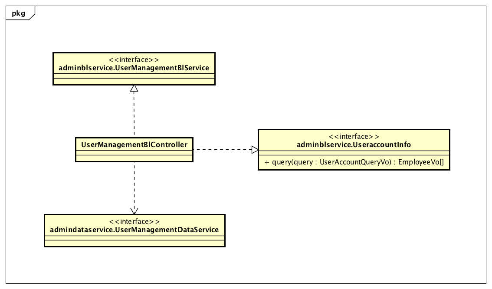

##### 2.2.11.3.2 各个类的职责

| 类名                        | 职责           |
| ------------------------- | ------------ |
| UserMangementBlController | 负责职员账户的增删改查。 |

##### 2.2.11.3.3 内部类的接口规范

**UserManagementBlController**

提供的接口

| 接口名称                           | 语法                                       | 前置条件                  | 后置条件                  |
| ------------------------------ | ---------------------------------------- | --------------------- | --------------------- |
| UserManagementBlService.add    | `public ResultMessage add(EmployeeVO newAccount);` | 新账户信息合法且无冲突，用户具有最高权限。 | 新账户信息已经添加，持久化信息已经保存。  |
| UserManagementBlService.modify | `public ResultMessage modify(EmployeeVO newAccount);` | 新账户信息合法且无冲突，用户具有最高权限。 | 账户信息已经修改，持久化信息已经保存。   |
| UserManagementBlService.query  | `public EmployeeVO[] query(UserAccoutQueryVO query);` | 查询条件合法。               | 返回符合查询条件的数据。          |
| UserManagementBlService.delete | `public ResultMessage delete(EmployeeVO account);` | 选择的账户合法，用户具有最高权限      | 选定账户信息已经删除，持久化信息已经保存。 |
| UserManagementBlService.getId  | `public String getId();`                 | 新建一个账户。               | 返回当前账户的ID。            |

需要的接口

| 接口名称                                     | 服务名            |
| ---------------------------------------- | -------------- |
| `admindataservice.UserManagementDataServicec.query(EmployeeQueryVo query)` | 根据ID和/或名称查询账户。 |
| `admindataservice.UserManagementDataService.add(EmployeetPO account)` | 添加账户。          |
| `admindataservice.UserManagementDataService.modify(EmployeePO account)` | 修改账户信息。        |
| `admindataservice.UserManagementDataService.delete(EmployeePO account)` | 删除账户信息。        |
| `admindataservice.UserManagementDataService.getId();` | 返回当前账户的ID。     |
| `logbl.LogService.log(LogSeverity severity, String content);` | 记录日志           |

##### 2.2.11.3.4 业务逻辑层的动态模型

下图为增加用户账户顺序图

下图为删除用户账户顺序图

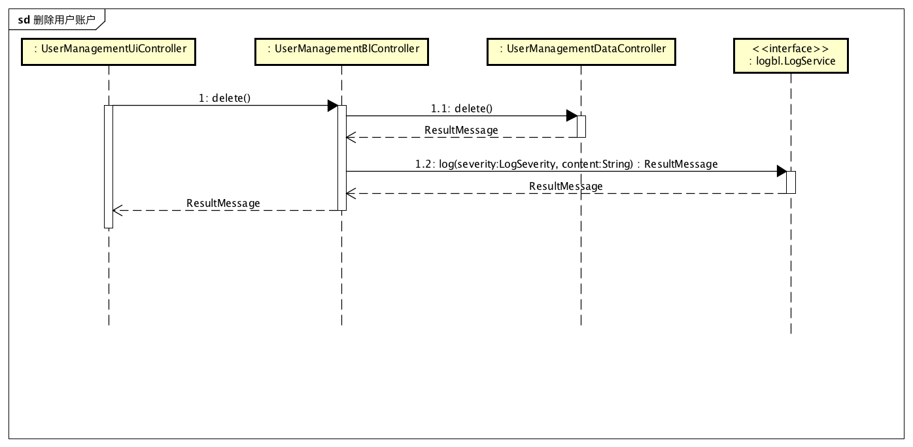

下图为查询用户账户顺序图

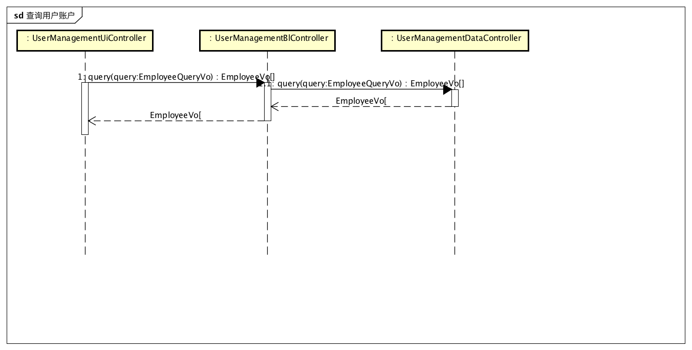

由于此包对外提供选择职员的接口，此功能实现顺序图如下

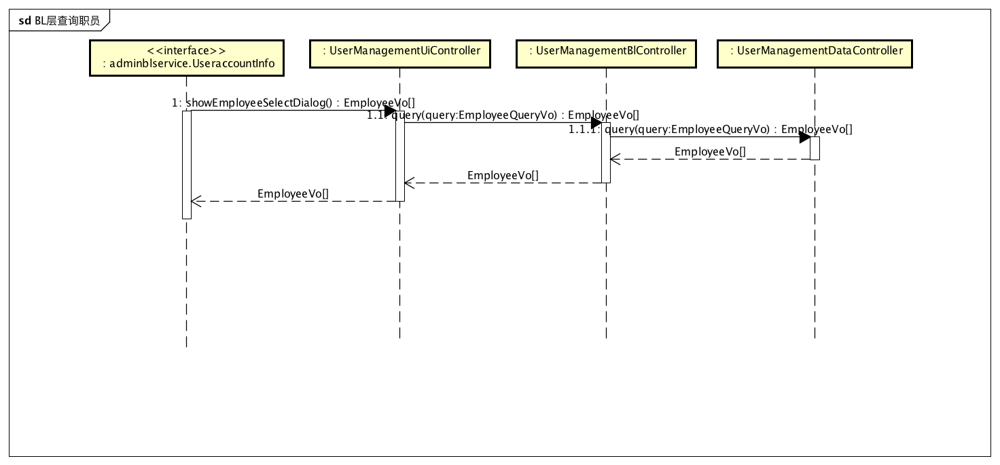

### 2.2.12 promotionbl包

#### 2.2.12.1 概述

promtionbl包负责总经理制定促销策略（包括组合商品降价、满额促销策略（赠送商品或者代金券）、客户促销策略（赠送礼品或者代金券或者价格这让））用例的业务逻辑实现代码。具体功能需求和非功能需求可参见需求规格说明文档和体系结构设计文档。

#### 2.2.12.2 整体架构

此包为业务逻辑层的一部分，它负责业务逻辑的实现。它实现了promtionui包所需要的promotionblservice所有接口，并依赖对应的promotiondataservice包与data层进行交互。由于销售行为需要依赖促销策略，它还需要实现PromotionInfo接口。

#### 2.2.12.3 设计

##### 2.2.12.3.1 设计图

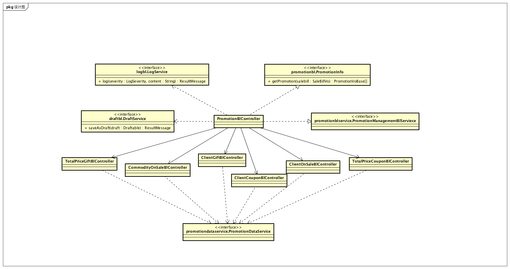

##### 2.2.12.3.2 各个类的职责

| 类名                              | 职责                                 |
| ------------------------------- | ---------------------------------- |
| PromotionInfoController         | 负责管理salebill查询可用促销策略的功能实现。         |
| ComSalePromotionBlController    | 负责管理填写组合商品降价促销策略的功能实现。             |
| TotalPricePromotionBlController | 负责管理填写满额促销策略（赠送礼品或者代金券）的功能实现。      |
| ClientPromotionBlController     | 负责管理填写客户促销策略（赠送礼品或者代金券或价格折让）的功能实现。 |

##### 2.2.12.3.3 内部类的接口规范

**PromotionInfoController**

提供的接口

| 接口名称                      | 语法                                       | 前置条件    | 后置条件           |
| ------------------------- | ---------------------------------------- | ------- | -------------- |
| promotionbl.PromotionInfo | `public PromotionVoBase[] getPromotion(SaleBillVo saleBill);` | 产生销售行为。 | 返回当前销售可用的促销策略。 |

需要的接口

| 接口名称                                     | 服务名         |
| ---------------------------------------- | ----------- |
| `promotiondataservice.ComSalePromotionDataService.queryPromotion(PromotionQueryVo query)` | 查找组合降价促销策略。 |
| `promotiondataservice.TotalPricePromotionDataService.queryPromotion(PromotionQueryVo query)` | 查找满额促销策略。   |
| `promotiondataservice.TotalPricePromotionDataService.queryPromotion(PromotionQueryVo query)` | 查找客户促销策略。   |

**ComSalePromotionBlController**

提供的接口

| 接口名称                                     | 语法                                       | 前置条件        | 后置条件                    |
| ---------------------------------------- | ---------------------------------------- | ----------- | ----------------------- |
| ComSalePromotionBlService.submit         | `public ResultMessage submit(ComSalePromotionVo promotion);` | 促销策略所有属性有效。 | 持久化促销策略信息已经保存。          |
| ComSalePromotionBlService.saveAsDraft    | `public ResultMessage saveAsDraft(ComSalePromotionVo promotion);` | 促销策略信息非空。   | 保存草稿，持久化信息已经保存。         |
| ComSalePromotionBlService.queryPromotion | `public ComSalePromotionVo[] queryPromotion(PromotionQueryVo query);` | 查询条件有效。     | 返回符合条件的促销策略。            |
| ComSalePromotionBlService.delete         | `public ResultMessage delete(ComSalePromotionVo promotion);` | 选择删除促销策略。   | 返回删除是否成功，持久化更新涉及的对象的数据。 |
| ComSalePromotionBlService.getId          | `public String getId();`                 | 无。          | 返回当前促销策略的ID。            |
| draftbl.DraftDeleteService               | `public ResultMessage deleteDraft(String id);` | 删除草稿。       | 返回删除结果。                 |

需要的接口

| 接口名称                                     | 服务名         |
| ---------------------------------------- | ----------- |
| `promotiondataservice.ComSalePromotionDataService.submit(ComSalePromotionVo promotion)` | 提交新促销策略。    |
| `promotiondataservice.ComSalePromotionDataService.queryPromotion(PromotionQueryVo query)` | 查找促销策略。     |
| `promotiondataservice.ComSalePromotionDataService.delete(ComSalePromotionVo promotion)` | 删除单一持久化对象。  |
| `promotiondataservice.ComSalePromotionDataService.getId()` | 返回当前促销策略ID。 |
| `draftbl.DraftService.saveAsDraft(ComSalePromotionVo promotion)` | 保存草稿。       |
| `logbl.LogService.log(LogSeverity severity, String content)` | 记录日志。       |

**TotalPricePromotionBlController**

提供的接口

| 接口名称                                     | 语法                                       | 前置条件        | 后置条件                |
| ---------------------------------------- | ---------------------------------------- | ----------- | ------------------- |
| TotalPricePromotionBlService.submit      | `public ResultMessage submit(TotalPricePromotionVo promotion);` | 促销策略所有属性有效。 | 持久化促销策略信息已经保存。      |
| TotalPricePromotionBlService.saveAsDraft | `public ResultMessage saveAsDraft(TotalPricePromotionVo promotion);` | 促销策略信息非空。   | 保存草稿，持久化信息已经保存。     |
| TotalPricePromotionBlService.queryPromotion | `public TotalPricePromotionVo[] queryPromotion(PromotionQueryVo query);` | 查询条件有效。     | 返回符合条件的促销策略。        |
| TotalPricePromotionBlService.delete      | `public ResultMessage delete(TotalPricePromotionVo promotion);` | 选择删除促销策略。   | 返回删除是否成功，持久化信息已经保存。 |
| TotalPricePromotionBlService.getId       | `public String getId();`                 | 无。          | 返回当前促销策略的ID。        |
| draftbl.DraftDeleteService               | `public ResultMessage deleteDraft(String id);` | 删除草稿。       | 返回删除结果。             |

需要的接口

| 接口名称                                     | 服务名        |
| ---------------------------------------- | ---------- |
| `promotiondataservice.TotalPricePromotionDataService.submit(TotalPricePromotionVo promotion)` | 提交新促销策略。   |
| `promotiondataservice.TotalPricePromotionDataService.queryPromotion(PromotionQueryVo query)` | 查找促销策略。    |
| `promotiondataservice.TotalPricePromotionDataService.delete(TotalPricePromotionVo promotion)` | 删除单一持久化对象。 |
| `promotiondataservice.TotalPricePromotionDataService.getId()` | 返回当前促销策略ID |
| `draftbl.DraftService.saveAsDraft(TotalPricePromotionVo promotion)` | 保存草稿。      |
| `logbl.LogService.log(LogSeverity severity, String content)` | 记录日志。      |

**ClientPromotionBlController**

提供的接口

| 接口名称                                    | 语法                                       | 前置条件        | 后置条件                |
| --------------------------------------- | ---------------------------------------- | ----------- | ------------------- |
| ClientPromotionBlService.submit         | `public ResultMessage submit(ClientPromotionVo promotion);` | 促销策略所有属性有效。 | 持久化促销策略信息已经保存。      |
| ClientPromotionBlService.saveAsDraft    | `public ResultMessage saveAsDraft(ClientPromotionVo promotion);` | 促销策略信息非空。   | 保存草稿，持久化信息已经保存。     |
| ClientPromotionBlService.queryPromotion | `public ClientPromotionVo[] queryPromotion(PromotionQueryVo query);` | 查询条件有效。     | 返回符合条件的促销策略。        |
| ClientPromotionBlService.delete         | `public ResultMessage delete(ClientPromotionVo promotion);` | 选择删除促销策略。   | 返回删除是否成功，持久化信息已经保存。 |
| ClientPromotionBlService.getId          | `public String getId();`                 | 无。          | 返回当前促销策略的ID。        |
| draftbl.DraftDeleteService              | `public ResultMessage deleteDraft(String id);` | 删除草稿。       | 返回删除结果。             |

需要的接口

| 接口名称                                     | 服务名        |
| ---------------------------------------- | ---------- |
| `promotiondataservice.ClientPromotionDataService.submit(ClientPromotionVo promotion)` | 提交新促销策略。   |
| `promotiondataservice.ClientPromotionDataService.queryPromotion(PromotionQueryVo query)` | 查找促销策略。    |
| `promotiondataservice.ClientPromotionDataService.delete(ClientPromotionVo promotion)` | 删除单一持久化对象。 |
| `promotiondataservice.ClientPromotionDataService.getId()` | 返回当前促销策略ID |
| `draftbl.DraftService.saveAsDraft(ClientPromotionVo promotion)` | 保存草稿。      |
| `logbl.LogService.log(LogSeverity severity, String content)` | 记录日志。      |

##### 2.2.12.3.4 业务逻辑层的动态模型

下图为填写组合降价促销策略时的顺序图，满额以及客户促销策略的顺序图参见此图。

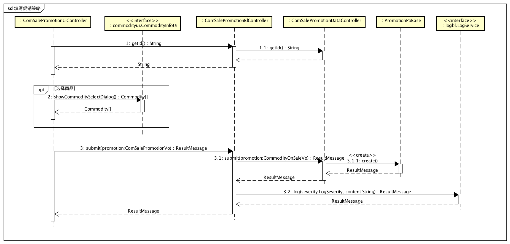

下图为填写组合商品降价促销策略时被中断保存草稿的顺序图，其他促销策略顺序图参见此图。

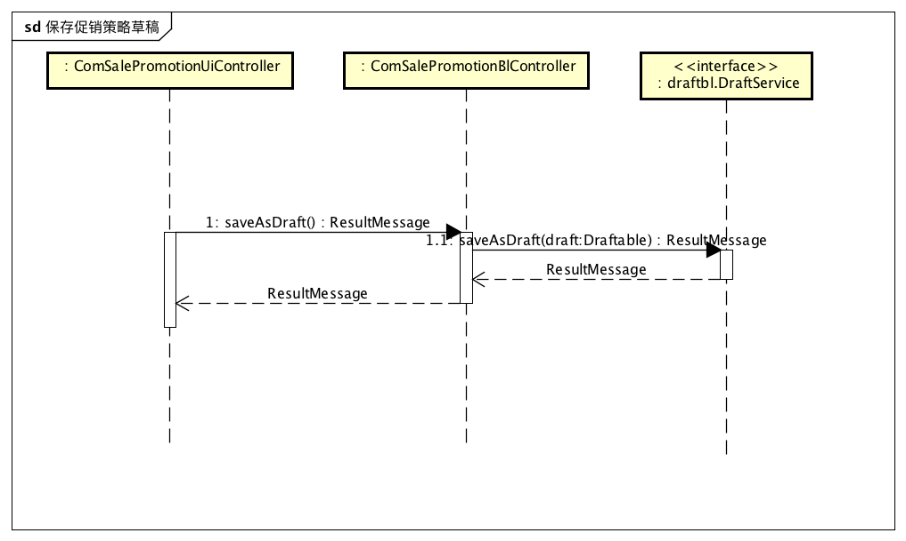

下图是查询（筛选）组合商品降价促销策略的顺序图，其他促销策略顺序图参见此图。

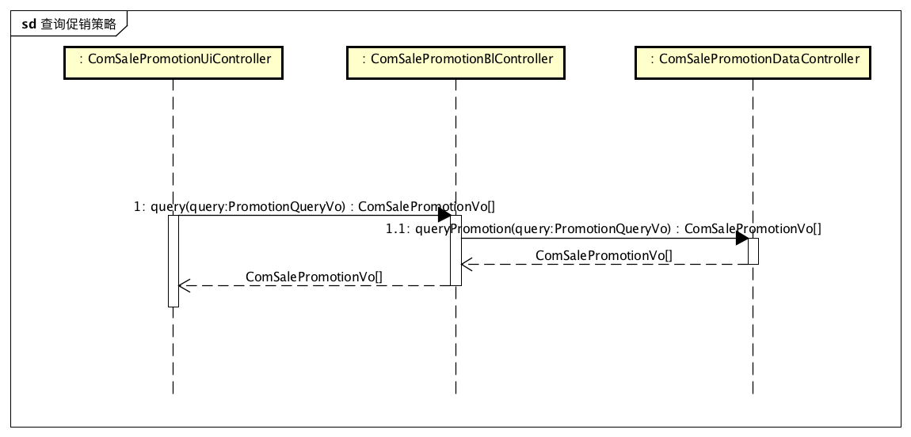

下图是删除组合商品降价促销策略的顺序图，其他促销策略顺序图参见此图。

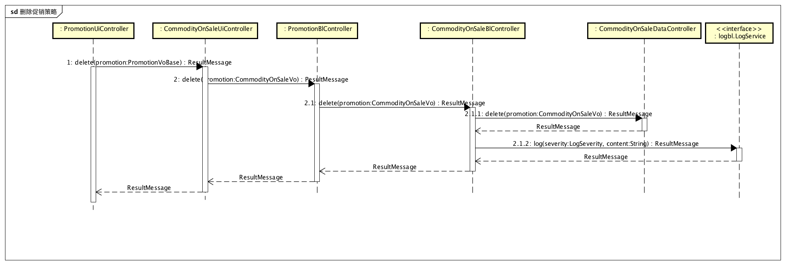

由于本包会对销售行为提供查询销售可用的促销策略接口，此功能实现顺序图如下

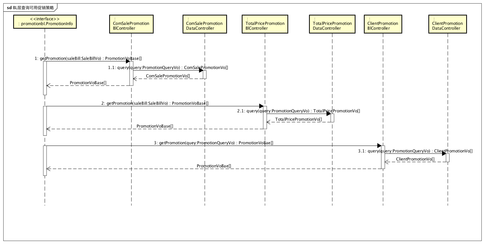

### 2.2.13 approvalbl包

#### 2.2.13.1 概述

approvalbl包负责总经理审批单据用例的业务逻辑实现代码。具体功能需求和非功能需求可参见需求规格说明文档和体系结构设计文档。

#### 2.2.13.2 整体架构

此包为业务逻辑层的一部分，它负责业务逻辑的实现。它实现了approvalui包所需要的approvalblservice的所有接口，并依赖approvaldataservice包与data层进行交互。

#### 2.2.13.3 设计

##### 2.2.13.3.1 设计图

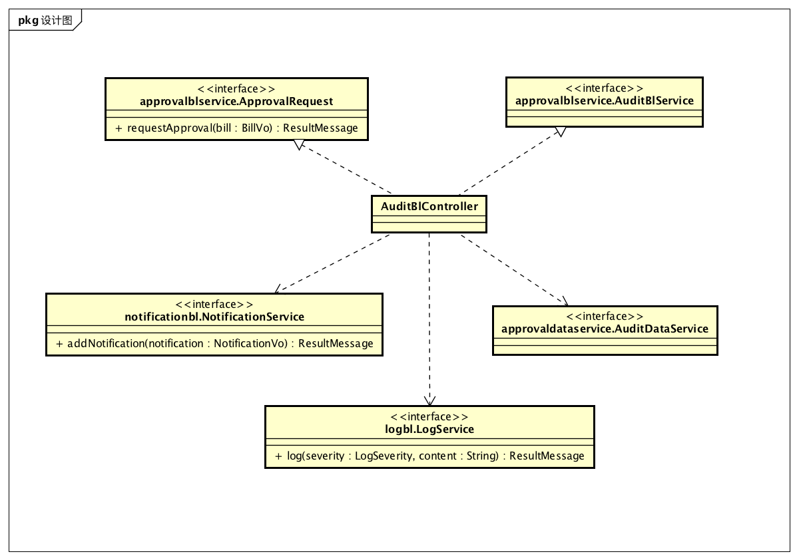

##### 2.2.13.3.2 各个类的职责

| 类名                | 职责                |
| ----------------- | ----------------- |
| AuditBlController | 负责管理审批单据界面的展示和功能。 |

##### 2.2.13.3.3 内部类的接口规范

**AuditBlController**

提供的接口

| 接口名称                           | 语法                                       | 前置条件          | 后置条件                  |
| ------------------------------ | ---------------------------------------- | ------------- | --------------------- |
| AuditBlService.query           | `public ResultMessage query (BillQueryVO query);` | 有处于提交状态的单据单据。 | 返回符合条件的单据。            |
| AuditBlService.reject          | `public ResultMessage reject(BillVO bill);` | 用户已经查看了单据内容。  | 拒绝通过审批，持久化更新涉及的对象的数据。 |
| AuditBlService.pass            | `public ResultMessage pass(BillVO bill);` | 用户已经查看了单据内容。  | 通过审批，持久化更新涉及的对象的数据。   |
| ApprovalRequest.requestMessage | `public ResultMessage requestMessage(BillVo bill);` | 用户提交了单据。      | 保存单据并返回保存结果。          |

需要的接口

| 接口名称                                     | 服务名          |
| ---------------------------------------- | ------------ |
| `approvaldataservice.AuditDataService.query(BillQueryVo query)` | 得到待审批的持久化对象。 |
| `approvaldataservice.AuditDataService.reject(BillVo bill)` | 拒绝通过审批。      |
| `approvaldataservice.AuditDataService.pass(BillVo bill)` | 通过审批。        |
| `approvaldataservice.ApprovalRequest(BillVo bill)` | 保存提交的单据。     |
| `notificationbl.NotificationService.addNotification(NotificationVo notification);` | 新增一条通知。      |
| `logbl.LogService.log(LogSeverity severity, String content)` | 记录日志。        |

##### 2.2.13.3.4 业务逻辑层的动态模型

下图是审批通过的顺序图

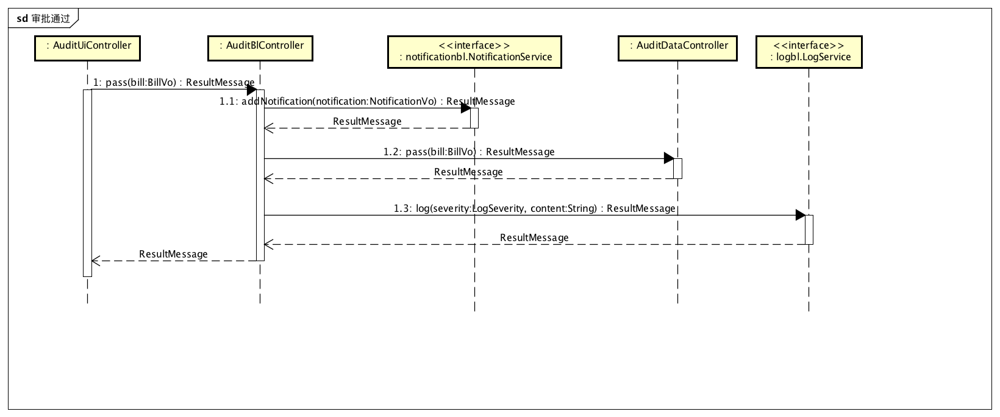

下图是审批不通过的顺序图

由于本包对外提供申请提交接口，此功能实现顺序图如下

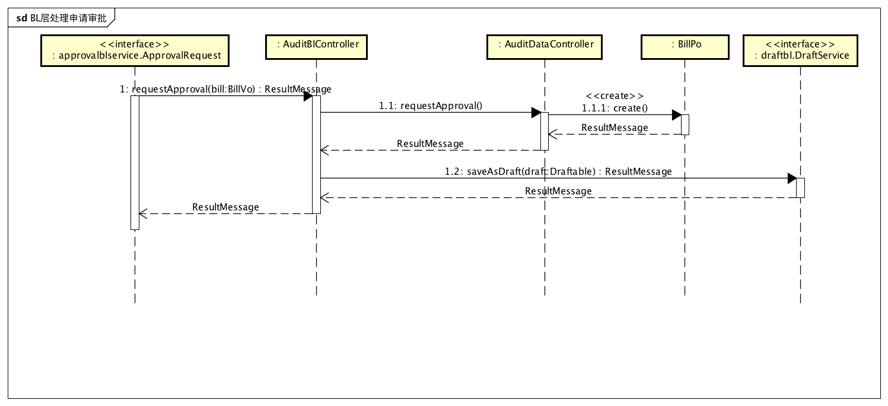

## 2.3 数据层的分解

数据层开发包图、模块职责等请参考体系结构描述文档5.3节。

### 2.3.1 logindata包

#### 2.3.1.1 概述

logindata包负责登录相关的数据操作。具体功能需求和非功能需求可参见需求规格说明文档和体系结构设计文档。

#### 2.3.1.2 整体架构

此包为数据层的一部分，负责登录的数据操作。它实现了logindataservice的所有接口。

#### 2.3.1.3 设计

##### 2.3.1.3.1 设计图

##### 2.3.1.3.2 各个类的职责

| 类名                  | 职责           |
| ------------------- | ------------ |
| LoginDataController | 负责登录相关的数据操作。 |

##### 2.3.1.3.3 内部类的接口规范

提供的接口

| 接口名称                                    | 语法                                       | 前置条件 | 后置条件          |
| --------------------------------------- | ---------------------------------------- | ---- | ------------- |
| logindataservice.LoginDataService.login | `public String login(String username, String password);` | 无。   | 系统已经登录或者登录失败，返回用户登录的ID。 |

### 2.3.2 inventorydata包

#### 2.3.2.1 概述

Inventorydata包负责库存的数据操作。具体功能需求和非功能需求可参见需求规格说明文档和体系结构设计文档。

#### 2.3.2.2 整体架构

此包为数据层的一个部分，负责库存管理的数据操作。它实现了dataservice层的所有接口。

#### 2.3.2.3 设计

##### 2.3.2.3.1 设计图

##### 2.3.2.3.2 各个类的职责

| 类名                               | 职责                         |
| -------------------------------- | -------------------------- |
| InventoryCheckDataController     | 负责库存查看功能的实现。               |
| InventoryGiftDataController      | 负责商品赠送功能的实现。               |
| InventoryWarningDataController   | 负责库存监控功能的实现。               |
| PurchaseBillDataController       | 负责实现进货单的提交、修改、增加、删除的数据操作   |
| PurchaseRefundBillDataController | 负责实现进货退货单的提交、修改、增加、删除的数据操作 |

##### 2.3.2.3.3 内部类的接口规范

**InventoryCheckDataController**

提供的接口

| 接口名称                              | 语法                                       | 前置条件          | 后置条件                         |
| --------------------------------- | ---------------------------------------- | ------------- | ---------------------------- |
| InventoryCheckDataService.check   | `public InventoryViewPo submit(Date beginTime, Date endTime);` | 当天有库存进出且输入有效。 | 返回对应的InventoryViewPo。        |
| InventoryCheckDataService.picture | `public InventoryPicturePo submit(Date time);` | 当天有库存快照。      | 返回对应的库存快照InventoryPicturePo。 |
| InventoryCheckDataService.init    | `public void init(); `                   | 无。            | 初始化持久数据。                     |

**InventoryGiftDataController**

提供的接口

| 接口名称                             | 语法                                       | 前置条件  | 后置条件                                 |
| -------------------------------- | ---------------------------------------- | ----- | ------------------------------------ |
| InventoryGiftDataService.getGift | `public InventoryGiftPo getGift(Date time);` | 输入有效。 | 若存在则返回符合条件的InventoryGiftPo，否则返回NULL。 |
| InventoryGiftDataService.init    | `public void init();`                    | 无。    | 初始化持久数据。                             |
| InventoryGiftDataService.submit  | `public ResultMessage submit(InventoryGiftPo inventoryGiftpo);` | 输入有效。 | 完成赠送单，返回完成是否成功。                      |

**InventoryWarningDataController**

提供的接口

| 接口名称                                    | 语法                                       | 前置条件         | 后置条件                                     |
| --------------------------------------- | ---------------------------------------- | ------------ | ---------------------------------------- |
| InventoryWarningDataService.submit      | `public ResultMessage submit(InventoryBillPo bill);` | 单据属性有效。      | 提交新单据，返回提交是否成功。                          |
| InventoryWarningDataService.modify      | `public ResultMessage modify(CommodityPo commodity，double ModifyWarning);` | 同样的po在数据中存在。 | 更新po,修改警戒值。                              |
| InventoryWarningDataService.getAlarm    | `public InventoryBillPo[] getAlarmByIds(String... ids);` | 输入有效。        | 返回InventoryBillPo对象集合，若ID为空或者null，返回空数组。 |
| InventoryWarningDataService.getOverflow | `public InventoryBillPo[] getOverflowByids(String... ids);	` | 输入有效。        | 返回InventoryBillPo对象集合，若ID为空或者null，返回空数组。 |
| InventoryWarningDataService.getLoss     | `public InventoryBillPo[] getLossByids(String... ids);` | 输入有效。        | 返回InventoryBillPo对象集合，若ID为空或者null，返回空数组。 |
| InventoryWarningDataService.init        | `public void init();`                    | 无。           | 初始化持久数据。                                 |

**PurchaseBillDataController**

提供的接口

| 接口名称                                | 语法                                       | 前置条件        | 后置条件          |
| ----------------------------------- | ---------------------------------------- | ----------- | ------------- |
| PurchaseBillDataService.activate | `public ResultMessage activate(String id);` | 单据有效且状态为审批通过。    | 系统修改对应库存信息和客户信息，修改单据状态为已入账，持久化信息已经保存。 |
| PurchaseBillDataService.abandon  | `public ResultMessage abandon(String id);` | 单据有效且状态为审批完成。    | 系统修改单据状态为已经废弃，持久化信息已经保存。              |
| PurchaseBillDataService.query    | `public PurchaseBillPo[] query(PurchaseBillQueryVo query);` | 输入查询条件有效。        | 返回符合筛选条件的进货单。                         |
| PurchaseBillDataService.submit      | `public ResultMessage submit(PurchaseBillPo purchaseBill);` | 表单数据输入格式正确。 | 持久化层新增表单信息。   |
| PurchaseBillDataService.getId       | `public String getId();`                 | 无。          | 持久化层新单据的ID。   |

**PurchaseRefundBillDataController**

提供的接口

| 接口名称                                     | 语法                                       | 前置条件        | 后置条件          |
| ---------------------------------------- | ---------------------------------------- | ----------- | ------------- |
| PurchaseRefundBillDataService.activate | `public ResultMessage activate(String id);` | 单据有效且状态为审批通过。    | 系统修改对应库存信息和客户信息，修改单据状态为已入账，持久化信息已经保存。 |
| PurchaseRefundBillDataService.abandon  | `public ResultMessage abandon(String id);` | 单据有效且状态为审批完成。    | 系统修改单据状态为已经废弃，持久化信息已经保存。              |
| PurchaseRefundBillDataService.query    | `public PurchaseRefundBillPo[] query(PurchaseRefundBillQueryVo query);` | 输入查询条件有效。        | 返回符合筛选条件的进货退货单。                         |
| PurchaseRefundBillDataService.submit     | `public ResultMessage submit(PurchaseRefundBillPo purchaseRefundBill);` | 表单数据输入格式正确。 | 持久化层新增表单信息。   |
| PurchaseRefundBillDataService.getId      | `public String getId();`                 | 无。          | 持久化层新单据的ID。   |

### 2.2.3 saledata包

#### 2.2.3.1 概述

saledata包负责提供进货销售人员与销售有关的服务（制定销售单、销售退货单）。具体功能需求和非功能需求可参见需求规格说明文档和体系结构设计文档。

#### 2.2.3.2 整体架构

此包为数据层的一部分，负责进货销售人员人员关于与销售有关的用例的数据操作（制定销售单、销售退货单）。它实现了saledataservice的所有接口。

#### 2.2.3.3 设计

##### 2.2.3.3.1 设计图

saledata模块的设计如图

##### 2.2.3.3.2 各个类的职责

| 类名                           | 职责                         |
| ---------------------------- | -------------------------- |
| SaleBillDataController       | 负责实现销售单的提交、修改、增加、删除的数据操作   |
| SaleRefundBillDataController | 负责实现销售退货单的提交、修改、增加、删除的数据操作 |

##### 2.2.3.3.3 内部类的接口规范

**SaleBillDataController**

提供的接口

| 接口名称                            | 语法                                       | 前置条件        | 后置条件          |
| ------------------------------- | ---------------------------------------- | ----------- | ------------- |
| SaleBillDataService.activate | `public ResultMessage activate(String id);` | 单据有效且状态为审批通过。    | 系统修改对应库存信息和客户信息，修改单据状态为已入账，持久化信息已经保存。 |
| SaleBillDataService.abandon  | `public ResultMessage abandon(String id);` | 单据有效且状态为审批完成。    | 系统修改单据状态为已经废弃，持久化信息已经保存。              |
| SaleBillDataService.query    | `public SaleBillPo[] query(SaleBillQueryVo query);` | 输入查询条件有效。        | 返回符合筛选条件的销售单。                         |
| SaleBillDataService.submit      | `public ResultMessage submit(SaleBillPo saleBill);` | 表单数据输入格式正确。 | 持久化层新增表单信息。   |
| SaleBillDataService.getId       | `public String getId();`                 | 无。          | 持久化层新单据的ID。   |

**SaleRefundBillDataController**

提供的接口

| 接口名称                                  | 语法                                       | 前置条件        | 后置条件          |
| ------------------------------------- | ---------------------------------------- | ----------- | ------------- |
| SaleRefundBillDataService.activate | `public ResultMessage activate(String id);` | 单据有效且状态为审批通过。    | 系统修改对应库存信息和客户信息，修改单据状态为已入账，持久化信息已经保存。 |
| SaleRefundBillDataService.abandon  | `public ResultMessage abandon(String id);` | 单据有效且状态为审批完成。    | 系统修改单据状态为已经废弃，持久化信息已经保存。              |
| SaleRefundBillDataService.query    | `public SaleRefundBillDataService[] query(SaleRefundBillQueryVo query);` | 输入查询条件有效。        | 返回符合筛选条件的销售退货单。                         |
| SaleRefundBillDataService.submit      | `public ResultMessage submit(SaleRefundBillPo saleRefundBill);` | 表单数据输入格式正确。 | 持久化层新增表单信息。   |
| SaleRefundBillDataService.getId       | `public String getId();`                 | 无。          | 持久化层新单据的ID。   |

### 2.3.4 commoditydata包

#### 2.3.4.1 概述

commoditydata包负责库存管理人员商品管理、商品分类管理的业务逻辑实现代码。具体功能需求和非功能需求可参见需求规格说明文档和体系结构设计文档。

#### 2.3.4.2 整体架构

此包为数据层的一部分，负责负责库存管理人员商品管理、商品分类管理的数据操作。它实现了commoditydataservice的所有接口。

#### 2.3.4.3 设计

##### 2.3.4.3.1 设计图

##### 2.3.4.3.2 各个类的职责

| 类名                          | 职责                |
| --------------------------- | ----------------- |
| CommodityDataController     | 负责实现商品管理界面的功能实现   |
| CommoditySortDataController | 负责实现商品分类管理界面的功能实现 |

##### 2.3.4.3.3 各个类的内部接口

**CommodityDataController**

提供的接口

| 接口名称                        | 语法                                       | 前置条件          | 后置条件         |
| --------------------------- | ---------------------------------------- | ------------- | ------------ |
| CommodityDataService.add    | `public ResultMessage add(CommodityPo newCommodity);` | 同样的po在数据中不存在。 | 增加一条po数据。    |
| CommodityDataService.modify | `public ResultMessage modify(CommodityPo updateCommodity);` | 同样的po在数据中存。   | 更新po。        |
| CommodityDataService.query  | `public CommodityPo[] query(CommodityQueryVo query;` | 查询输入格式合法。     | 返回符合查询条件的数据。 |
| CommodityDataService.delete | `public ResultMessage delete(CommodityPo commodity);` | 同样的po在数据中存在。  | 删除po。        |
| CommodityDataService.init   | `public void init();`                    | 无。            | 初始化持久数据。     |

**CommoditySortDataController**

提供的接口

| 接口名称                             | 语法                                       | 前置条件          | 后置条件         |
| -------------------------------- | ---------------------------------------- | ------------- | ------------ |
| CommoditySortDataService.add     | `public ResultMessage add(CommoditySortPo newCSort,CommoditySortPo parentSort);` | 同样的po在数据中不存在。 | 增加一条po数据。    |
| CommoditySortDataService.modify  | `public ResultMessage modify(CommoditySortPo  CSort);` | 同样的po在数据中存。   | 更新po。        |
| CommoditySortDataService.query   | `public CommoditySortPo[] query(CommoditySortQueryVo,commoditySortQueryVo);` | 查询输入格式合法。     | 返回符合查询条件的数据。 |
| CommoditySortDataService.delete  | `public ResultMessage delete(CommoditySortPo  CSort);` | 同样的po在数据中存在。  | 删除po。        |
| CommoditySortDataService.display | `public CommoditySortPo[] display();`    | 无。	返回所有商品分类。  |              |
| CommoditySortDataService.display | `public CommoditySortPo[] dispaly(CommoditySortPo commoditySort);` | 同样的po在数据中存在。  | 返回父类下的所有子类。  |
| CommoditySortDataService.init    | `public void init();`                    | 无。            | 初始化持久数据。     |

### 2.2.5 clientdata包

#### 2.2.5.1 概述

clientdata包负责提供客户信息的增删改查服务。具体功能需求和非功能需求可参见需求规格说明文档和体系结构设计文档。

#### 2.2.5.2 整体架构

此包为数据层的一部分，负责进货销售人员人员关于管理客户的用例的数据操作。它实现了clientdataservice的所有接口。

#### 2.2.5.3 设计

##### 2.2.5.3.1 设计图

clientdata模块的设计如图

##### 2.2.5.3.2 各个类的职责

| 类名                   | 职责                 |
| -------------------- | ------------------ |
| ClientDataController | 负责实现客户信息的增删查改的数据操作 |

##### 2.2.5.3.3 内部类的接口规范

**ClientDataController**

提供的接口

| 接口名称                          | 语法                                       | 前置条件        | 后置条件         |
| ----------------------------- | ---------------------------------------- | ----------- | ------------ |
| ClientDataService.query       | `public ClientPO[] query(String query);` | 查询条件合法。     | 返回符合条件的用户信息。 |
| ClientDataService.getId       | `public String getId();`                 | 无。          | 返回新的客户ID。    |
| ClientDataService.saveAsDraft | `public ResultMessage saveAsDraft(ClientPO client);` | 客户数据非空。     | 持久化层保存草稿信息。  |
| ClientDataService.modify      | `public ResultMessage modify(ClientPO client);` | 表单数据输入格式正确。 | 持久化层更新客户信息。  |
| ClientDataService.add         | `public ResultMessage add(ClientPO client);` | 表单数据输入格式正确。 | 持久化层新增客户信息。  |
| ClientDataService.delete      | `public ResultMessage delete(String[] id);` | 删除列表非空。     | 持久化层更新客户信息。  |

### 2.3.6 financedata包

#### 2.3.6.1 概述

financedata包负责财务人员除了银行账户管理外的用例（制定收款单、制定付款单、制定现金费用单、查看经营情况表、查看经营历程表、查看销售情况表、红冲以及期初建账）的数据操作。具体功能需求和非功能需求可参见需求规格说明文档和体系结构设计文档。

#### 2.3.6.2 整体架构

此包为数据层的一部分，负责财务人员除了银行账户管理外的用例（制定收款单、制定付款单、制定现金费用单、查看经营情况表、查看经营历程表、查看销售情况表、红冲以及期初建账）的数据操作。它实现了financedataservice的所有接口。

#### 2.3.6.3 设计

##### 2.3.6.3.1 设计图

##### 2.3.6.3.2 各个类的职责

| 类名                                 | 职责            |
| ---------------------------------- | ------------- |
| PaymentBillDataController          | 负责付款单的数据管理。   |
| ReceivalBillDataController         | 负责收款单的数据管理。   |
| CashBillDataController             | 负责现金费用单的数据管理。 |
| InitialEstablishmentDataController | 负责期初账的数据管理。   |

##### 2.3.6.3.3 各个类的内部接口

**PaymentBillDataController**

提供的接口

| 接口名称                            | 语法                                       | 前置条件             | 后置条件                                  |
| ------------------------------- | ---------------------------------------- | ---------------- | ------------------------------------- |
| PaymentBillDataService.submit   | `public ResultMessage submit(PaymentBillPo bill);` | 用户已经登录，单据所有属性有效。 | 提交新单据。                                |
| PaymentBillDataService.activate | `public ResultMessage activate(String id);` | 单据有效且状态为审批通过。    | 系统修改对应银行账户和客户信息，修改单据状态为已入账，持久化信息已经保存。 |
| PaymentBillDataService.abandon  | `public ResultMessage abandon(String id);` | 单据有效且状态为审批完成。    | 系统修改单据状态为已经废弃，持久化信息已经保存。              |
| PaymentBillDataService.query    | `public PaymentBillPo[] query(PaymentBillQueryVo query);` | 输入查询条件有效。        | 返回符合筛选条件的收款单。                         |
| PaymentBillDataService.getId    | `public String getId();`                 | 无。               | 返回下一张单据的ID。                           |
| PaymentBillDataService.approvalComplete | `public ResultMessage approvalComplete(String billId, BillState billState) ` | bill id有效，状态有效。 | 改变单据状态，持久化信息已经保存。|

**ReceivalBillDataController**

提供的接口

| 接口名称                             | 语法                                       | 前置条件             | 后置条件                                  |
| -------------------------------- | ---------------------------------------- | ---------------- | ------------------------------------- |
| ReceivalBillDataService.submit   | `public ResultMessage submit(ReceivalBillPo bill);` | 用户已经登录，单据所有属性有效。 | 提交新单据。                                |
| ReceivalBillDataService.activate | `public ResultMessage activate(String id);` | 单据有效且状态为审批通过。    | 系统修改对应银行账户和客户信息，修改单据状态为已入账，持久化信息已经保存。 |
| ReceivalBillDataService.abandon  | `public ResultMessage abandon(String id);` | 单据有效且状态为审批完成。    | 系统修改单据状态为已经废弃，持久化信息已经保存。              |
| ReceivalBillDataService.query    | `public ReceivalBillPo[] query(ReceivalBillQueryVo query);` | 输入查询条件有效。        | 返回符合筛选条件的付款单。                         |
| ReceivalBillDataService.getId    | `public String getId();`                 | 无。               | 返回下一张单据的ID。                           |
| ReceivalBillDataService.approvalComplete | `public ResultMessage approvalComplete(String billId, BillState billState) ` | bill id有效，状态有效。 | 改变单据状态，持久化信息已经保存。|

**CashBillDataController**

提供的接口

| 接口名称                         | 语法                                       | 前置条件             | 后置条件                                  |
| ---------------------------- | ---------------------------------------- | ---------------- | ------------------------------------- |
| CashBillDataService.submit   | `public ResultMessage submit(CashBillPo bill);` | 用户已经登录，单据所有属性有效。 | 提交新单据。                                |
| CashBillDataService.activate | `public ResultMessage activate(String id);` | 单据有效且状态为审批通过。    | 系统修改对应银行账户和客户信息，修改单据状态为已入账，持久化信息已经保存。 |
| CashBillDataService.abandon  | `public ResultMessage abandon(String id);` | 单据有效且状态为审批完成。    | 系统修改单据状态为已经废弃，持久化信息已经保存。              |
| CashBillDataService.query    | `public CashBillPo[] query(CashBillQueryVo query);` | 输入查询条件有效。        | 返回符合筛选条件的现金费用单。                       |
| CashBillDataService.getId    | `public String getId();`                 | 无。               | 返回下一张单据的ID。                           |
| CashBillDataService.approvalComplete | `public ResultMessage approvalComplete(String billId, BillState billState) ` | bill id有效，状态有效。 | 改变单据状态，持久化信息已经保存。|

**InitialEstablishmentDataController**

提供的接口

| 接口名称                                    | 语法                                       | 前置条件         | 后置条件             |
| --------------------------------------- | ---------------------------------------- | ------------ | ---------------- |
| InitialEstablishmentDataService.submit  | `public ResultMessage submit(SystemSnapshotPo snapshot);` | 账有效且状态为审批通过。 | 账单独被保存，持久化数据已保存。 |
| InitialEstablishmentDataService.activate | `public ResultMessage activate(String id);` | 单据有效且状态为审批通过。    | 系统修改对应银行账户和客户信息，修改单据状态为已入账，持久化信息已经保存。 |
| InitialEstablishmentDataService.abandon | `public ResultMessage abandon(String id);` | 账有效且状态为草稿。   | 系统记录需要继续填写账。     |
| InitialEstablishmentDataService.getId   | `public String getId();`                 | 无。           | 返回下一个单据的ID。      |
| InitialEstablishmentDataService.query   | `public SystemSnapshotVo[] query(SystemSnapshotQueryVo query)` | 无。           | 返回符合条件的单据。       |
| InitialEstablishmentDataService.approvalComplete | `public ResultMessage approvalComplete(String billId, BillState billState) ` | bill id有效，状态有效。 | 改变单据状态，持久化信息已经保存。|

### 2.3.7 bankaccountdata包

#### 2.3.7.1 概述

backaccountdata包负责银行账户管理的数据操作。具体功能需求和非功能需求可参见需求规格说明文档和体系结构设计文档。

#### 2.3.7.2 整体架构

此包为数据层的一个部分，负责银行账户管理的数据操作。它实现了dataservice层的所有接口。

#### 2.3.7.3 设计

##### 2.3.7.3.1 设计图

##### 2.3.7.3.2 各个类的职责

| 类名                        | 职责              |
| ------------------------- | --------------- |
| BankAccountDataController | 负责实管理银行账户的数据操作。 |

##### 2.3.7.3.3 内部类的接口规范

**BankAccountDataController**

提供的接口

| 接口名称                                    | 语法                                       | 前置条件         | 后置条件                             |
| --------------------------------------- | ---------------------------------------- | ------------ | -------------------------------- |
| BankAccountManagementDataService.query  | `public BankAccountPo[] query(BankAccountQueryVo query);` | 查询条件合法。      | 返回满足条件的银行账户Po。某一项为null的意思是此项无限制。 |
| BankAccountManagementDataService.add    | `public ResultMessage add(BankAccountPo account);` | 新账户信息合法且无冲突。 | 新银行账户信息已经添加，持久化信息已经保存。           |
| BankAccountManagementDataService.modify | `public ResultMessage modify(BankAccountPo account); ` | 新账户信息合法且无冲突。 | 银行账户信息已经修改，持久化信息已经保存。            |
| BankAccountManagementDataService.delete | `public ResultMessage delete(String id);` | 新账户信息合法且无冲突。 | 选定账户信息已经删除，持久化信息已经保存。            |

### 2.3.8 draftdata包

#### 2.3.8.1 概述

draftdata包负责草稿相关的数据操作。具体功能需求和非功能需求可参见需求规格说明文档和体系结构设计文档。

#### 2.3.8.2 整体架构

此包为数据层的一部分，负责草稿相关的数据操作。它实现了draftdataservice的所有接口。

#### 2.3.8.3 设计

##### 2.3.8.3.1 设计图

##### 2.3.8.3.2 各个类的职责

| 类名                  | 职责           |
| ------------------- | ------------ |
| DraftDataController | 负责草稿相关的数据操作。 |

##### 2.3.8.3.3 内部类的接口规范

提供的接口
| 接口名称                                     | 语法                                       | 前置条件           | 后置条件             |
| ---------------------------------------- | ---------------------------------------- | -------------- | ---------------- |
| draftdataservice.DraftDataService.query | `public DraftPo[] query(DraftQueryVo query);` | 无。             | 获得当前用户已经保存的草稿。   |
| draftdataservice.DraftDataService.delete | `public ResultMessage delete(String draftId);` | 选择的单据有效并状态是草稿。 | 将草稿删除，持久化信息已经保存。 |
| draftdataservice.DraftDataService.addDraft | `public ResultMessage add(Draftable draft, String saverId);` | 单据有效。          | 存储草稿信息。          |

### 2.3.9 logdata包

#### 2.3.9.1 概述

logdata包负责日志相关的数据操作。具体功能需求和非功能需求可参见需求规格说明文档和体系结构设计文档。

#### 2.3.9.2 整体架构

此包为数据层的一部分，负责日志相关的数据操作。它实现了logdataservice的所有接口。

#### 2.3.9.3 设计

##### 2.3.9.3.1 设计图

##### 2.3.9.3.2 各个类的职责

| 类名                | 职责           |
| ----------------- | ------------ |
| LogDataController | 负责日志相关的数据操作。 |

##### 2.3.9.3.3 内部类的接口规范

提供的接口

| 接口名称                                | 语法                                       | 前置条件       | 后置条件            |
| ----------------------------------- | ---------------------------------------- | ---------- | --------------- |
| logdataservice.LogDataService.query | `public LogPo[] query(LogQueryVo query);` | 无。         | 返回符合条件的日志。      |
| logdataservice.LogDataService.log   | `public ResultMessage log(LogSeverity severity, String content);` | content非空。 | 日志保存，持久化信息已经保存。 |

### 2.3.10 notificationdata包

#### 2.3.10.1 概述

notificationdata包负责通知相关的数据操作。具体功能需求和非功能需求可参见需求规格说明文档和体系结构设计文档。

#### 2.3.10.2 整体架构

此包为数据层的一部分，负责通知相关的数据操作。它实现了notificationdataservice的所有接口。

#### 2.3.10.3 设计

##### 2.3.10.3.1 设计图

##### 2.3.10.3.2 各个类的职责

| 类名                        | 职责           |
| ------------------------- | ------------ |
| NotificatioDataController | 负责日志相关的数据操作。 |

##### 2.3.10.3.3 内部类的接口规范

提供的接口

| 接口名称                                     | 语法                                       | 前置条件                   | 后置条件               |
| ---------------------------------------- | ---------------------------------------- | ---------------------- | ------------------ |
| notificationdataservice.NotificationDataService.add | `public ResultMessage addNotification(NotificationVo notification);` | notification有效。        | 将新通知写入数据库。         |
| notificationdataservice.NotificationDataService.query | `public NotificationPo[] query(NotificationQueryVo query);` | 无。                     | 返回符合条件已有的通知。       |
| notificationdataservice.NotificationDataService.acknowledge | `public ResultMessage acknowledge(NotificationPo notification);` | 参数notification有效非null。 | 删除已有的通知，持久化信息已经保存。 |

### 2.3.11 admindata包

#### 2.3.11.1 概述

admindata包负责保存管理员管理用户的用例的数据操作。具体功能需求和非功能需求可参见需求规格说明文档和体系结构设计文档。

#### 2.3.11.2 整体架构

admindata包为数据层的一部分，它负责数据的存储以及与bl层的交互。它实现所有adminbl包需要的接口。

#### 2.3.11.3 设计

##### 2.3.11.3.1 设计图

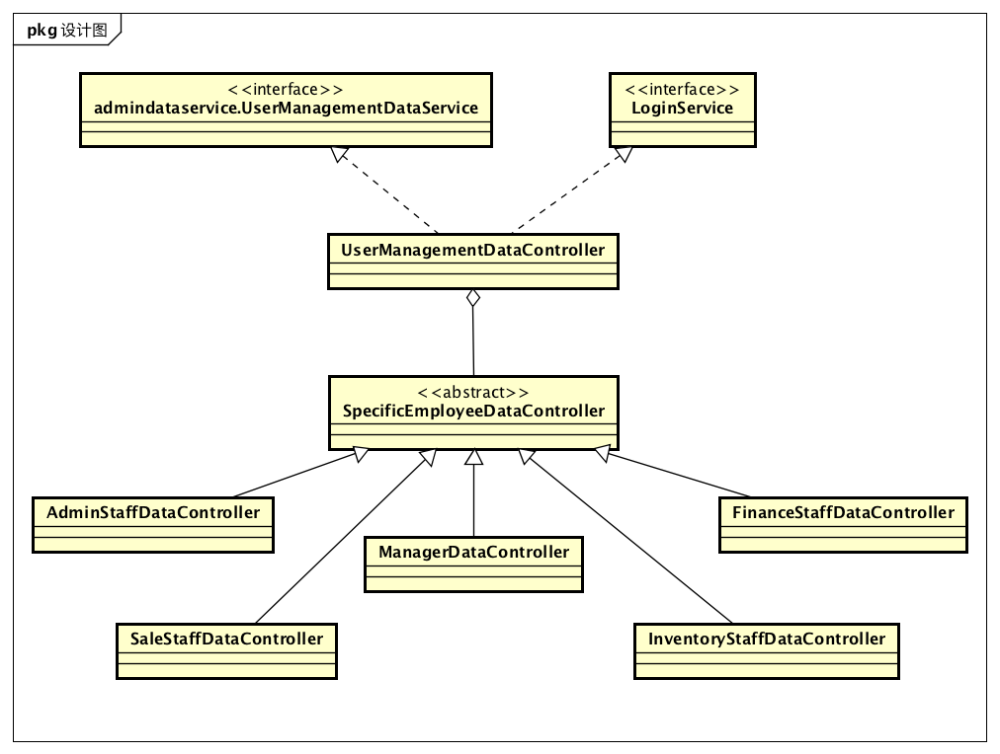

##### 2.3.11.3.2 各个类的职责

| 类名                           | 职责               |
| ---------------------------- | ---------------- |
| UserManagementDataConteoller | 负责保存管理职员信息操作的数据。 |

##### 2.3.11.3.3 内部类的接口规范

**UserManagementDataController**

提供的接口

| 接口名称                             | 语法                                       | 前置条件         | 后置条件                           |
| -------------------------------- | ---------------------------------------- | ------------ | ------------------------------ |
| UserManagementDataService.query  | `public EmployeePo[] query(UserAccountQueryVo query);` | 查询条件合法。      | 返回满足条件的账户PO。某一项为null的意思是此项无限制。 |
| UserManagementDataService.add    | `public ResultMessage add(EmployeePo account);` | 新账户信息合法且无冲突。 | 新账户信息已经添加，持久化信息已经保存。           |
| UserManagementDataService.modify | `public ResultMessage modify(EmployeePo account); ` | 新账户信息合法且无冲突。 | 账户信息已经修改，持久化信息已经保存。            |
| UserManagementDataService.delete | `public ResultMessage delete(EmployeePo account);` | 新账户信息合法且无冲突。 | 选定账户信息已经删除，持久化信息已经保存。          |
| UserManagementDataService.getId  | `public String getId();`                 | 无。           | 返回当前账户的ID。                     |

### 2.3.12 promotiondata包

#### 2.3.12.1 概述

promtiondata包负责总经理制定促销策略（包括组合商品降价、满额促销策略（赠送商品或者代金券）、客户促销策略（赠送礼品或者代金券或者价格这让））用例的数据操作。具体功能需求和非功能需求可参见需求规格说明文档和体系结构设计文档。

#### 2.3.12.2 整体结构

此包为数据层的一部分，它负责数据存储以及与bl层的交互。它依赖对应的promotiondataservice包与bl层进行交互。

#### 2.3.12.3 设计

##### 2.3.12.3.1 设计图

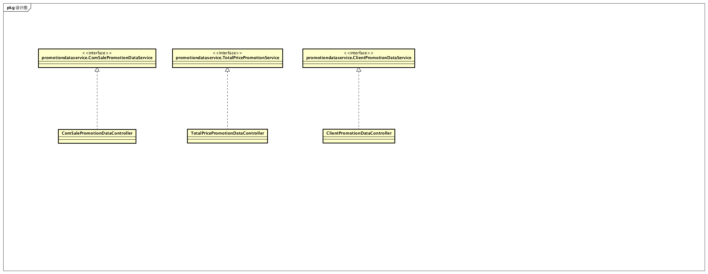

##### 2.3.12.3.2 各个类的职责

| 类名                                | 职责                                 |
| --------------------------------- | ---------------------------------- |
| ComSalePromotionDataController    | 负责管理填写组合商品降价促销策略的数据操作。             |
| TotalPricePromotionDataController | 负责管理填写满额促销策略（赠送礼品或者代金券）的数据操作。      |
| ClientPromotionDataController     | 负责管理填写客户促销策略（赠送礼品或者代金券或价格折让）的数据操作。 |

##### 2.3.12.3.3 内部类的接口规范

**ComSalePromotionDataController**

提供的接口

| 接口名称                                     | 语法                                       | 前置条件                     | 后置条件                    |
| ---------------------------------------- | ---------------------------------------- | ------------------------ | ----------------------- |
| ComSalePromotionDataService.submit       | `public ResultMessage submit(ComSalePromotionVo promotion);` | 促销策略所有属性有效，与已有促销策略不产生冲突。 | 保存组合商品降价促销策略持久化对象数据。    |
| ComSalePromotionDataService.queryPromotion; | `public ComSalePromotionPo[] queryPromotion(PromotionQueryVo query);` | 输入有效，其中值为null的字段表示无限制。   | 返回符合筛选条件的Promotion对象数组。 |
| ComSalePromotionDataService.delete       | `public ResultMessage delete(ComSalePromotionVo promotion);` | 无。                       | 系统修改促销策略状态，更新并保存持久化信息。  |
| ComSalePromotionDataService.getId        | `public String getId();`                 | 无。                       | 返回当前促销策略对象的ID。          |

**TotalPricePromotionDataController**

| 接口名称                                     | 语法                                       | 前置条件                     | 后置条件                    |
| ---------------------------------------- | ---------------------------------------- | ------------------------ | ----------------------- |
| TotalPricePromotionDataService.submit    | `public ResultMessage submit(TotalPricePromotionVo promotion);` | 促销策略所有属性有效，与已有促销策略不产生冲突。 | 保存组合商品降价促销策略持久化对象数据。    |
| TotalPricePromotionDataService.queryPromotion | `public TotalPricePromotionPo[] queryPromotion(PromotionQueryVo query);` | 输入有效，其中值为null的字段表示无限制。   | 返回符合筛选条件的Promotion对象数组。 |
| TotalPricePromotionDataService.delete    | `public ResultMessage delete(TotalPricePromotionVo promotion);` | 无。                       | 系统修改促销策略状态，更新并保存持久化信息。  |
| TotalPricePromotionDataService.getId     | `public String getId();`                 | 无。                       | 返回当前促销策略对象的ID。          |

**ClientPromotionDataController**

提供的接口

| 接口名称                                     | 语法                                       | 前置条件                     | 后置条件                    |
| ---------------------------------------- | ---------------------------------------- | ------------------------ | ----------------------- |
| ClientPromotionDataService.submit        | `public ResultMessage submit(ClientPromotionVo promotion);` | 促销策略所有属性有效，与已有促销策略不产生冲突。 | 保存组合商品降价促销策略持久化对象数据。    |
| ClientPromotionDataService.queryPromotion | `public ClientPromotionPo[] queryPromotion(PromotionQueryVO query);` | 输入有效，其中值为null的字段表示无限制。   | 返回符合筛选条件的Promotion对象数组。 |
| ClientPromotionDataService.delete        | `public ResultMessage delete(ClientPromotionVo promotion);` | 无。                       | 系统修改促销策略状态，更新并保存持久化信息。  |
| ClientPromotionDataService.getId         | `public String getId();`                 | 无。                       | 返回当前促销策略对象的ID。          |

### 2.3.13 approvaldata包

#### 2.3.13.1 概述

approvaldata包负责总经理审批单据用例的数据操作。具体功能需求和非功能需求可参见需求规格说明文档和体系结构设计文档。

#### 2.3.13.2 整体架构

此包为数据层的一部分，负责总经理审批单据时的数据操作。它实现了approvalblservice的所有接口。

#### 2.3.13.3 设计

##### 2.3.13.3.1 设计图

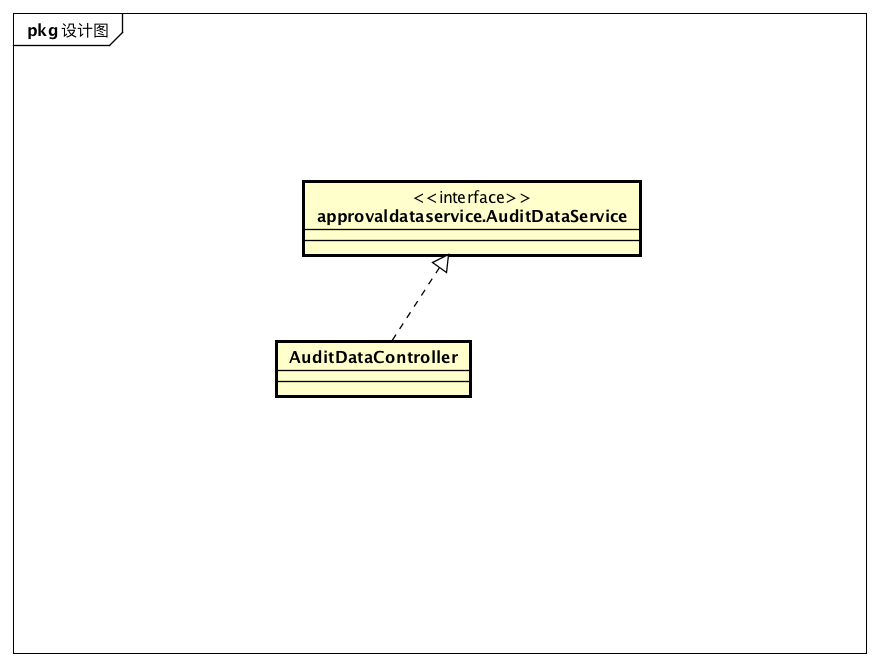

##### 2.3.13.3.2 各个类的职责

| 类名                  | 职责           |
| ------------------- | ------------ |
| AuditDataController | 负责管理审批单据的数据。 |

##### 2.3.13.3.3 内部类的接口规范

**AuditDataController**

提供的接口

| 接口名称                                | 语法                                       | 前置条件              | 后置条件            |
| ----------------------------------- | ---------------------------------------- | ----------------- | --------------- |
| ApprovalDataService.query           | `public BillVO[] query(BillQueryVo query)` | po中存在处于提交状态的单据数据。 | 返回待审批单据。        |
| ApprovalDataService.reject          | `public ResultMessage reject(BillVO bill);` | 无。                | 修改并保存单据持久化对象数据。 |
| ApprovalDataService.pass            | `public ResultMessage pass(BillVO bill);` | 无。                | 修改并保存单据持久化对象数据。 |
| ApprovalDataService.requestApproval | `public ResultMessage requestApproval(BillVo bill);` | 有单据被提交。           | 返回保存结果。         |

### 2.3.14 data.util.serverlogservice包

#### 2.3.14.1 概述

data.util.serverlogservice包提供了在服务器打印操作日志的操作。这个操作没有在其他文档中出现，它是为了调试而产生，没有实现任何业务需求。

#### 2.3.14.2 整体架构

此包为数据层的一部分，提供ServerLogService接口、ServerLogServiceController实现。

#### 2.3.14.3 设计

##### 2.3.14.3.1 设计图

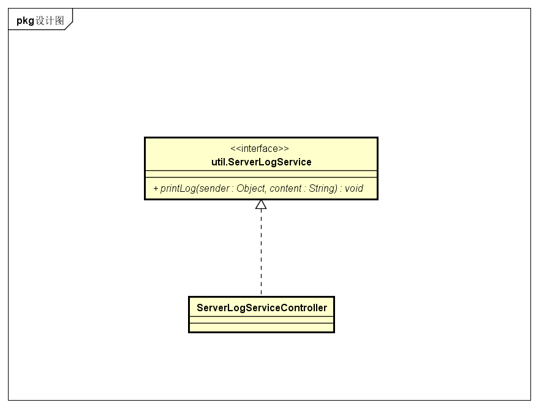

##### 2.3.14.3.2 各个类的职责

| 类名                  | 职责           |
| ------------------- | ------------ |
| ServerLogServiceController | 负责在服务器打印操作日志。 |

##### 2.3.14.3.3 内部类的接口规范

**ServerLogServiceController**

提供的接口

| 接口名称                                | 语法                                       | 前置条件              | 后置条件            |
| ----------------------------------- | ---------------------------------------- | ----------------- | --------------- |
| ServerLogService.printLog            | `public void printLog(Object sender, String content);` | 产生了需要打印日志的操作。 | 打印日志。|

##### 2.3.14.3.4 数据层的动态模型

以下为服务器端打印日志时的顺序图。

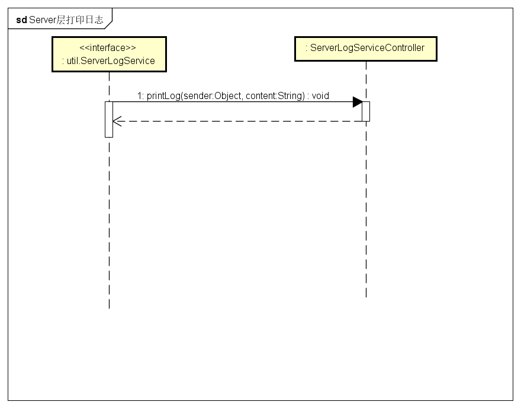

# 3. 依赖视角

下图是客户端和服务器端各自的包之间的依赖关系。

客户端

服务器端

